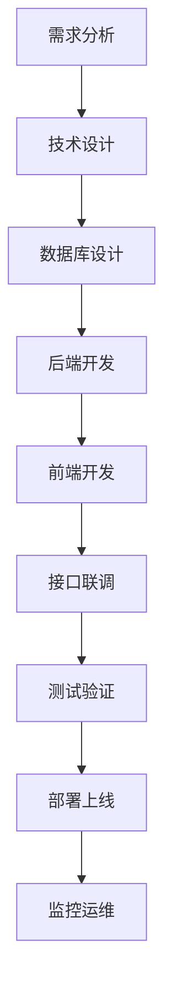

# 开发工作流

## 概述

本文档详细描述了litemall项目从需求分析到生产部署的完整开发工作流程，包括各阶段的任务分工、交付标准和最佳实践。

## 工作流总览



## 详细工作流

### 阶段1：需求分析

#### 任务清单
- [ ] 需求文档评审
- [ ] 技术可行性分析
- [ ] 工作量评估
- [ ] 技术方案设计

#### 交付物
- 需求规格说明书
- 技术方案文档
- 工作量评估报告
- 风险评估报告

#### 参与角色
- 产品经理：需求澄清
- 技术负责人：技术方案设计
- 开发团队：工作量评估

### 阶段2：技术设计

#### 2.1 架构设计
```
设计原则：
- 模块化设计
- 接口优先
- 数据驱动
- 安全优先
```

#### 2.2 数据库设计
1. **实体关系设计**
   - 分析业务实体
   - 设计表结构
   - 定义字段规范
   - 设置索引策略

2. **数据字典**
   - 表结构设计文档
   - 字段说明文档
   - 索引设计文档

#### 2.3 API设计
1. **接口规范**
   - RESTful设计原则
   - 统一响应格式
   - 错误码规范
   - 分页查询规范

2. **接口文档**
   - Swagger注解
   - 接口说明
   - 参数说明
   - 返回示例

### 阶段3：数据库开发

#### 3.1 数据库脚本管理
```
sql/
├── litemall_schema.sql    # 表结构
├── litemall_data.sql      # 初始化数据
├── litemall_test_data.sql # 测试数据
└── upgrade/               # 升级脚本
    ├── v0.1.0_to_v0.2.0.sql
    └── v0.2.0_to_v0.3.0.sql
```

#### 3.2 开发流程
1. **表结构设计**
   ```sql
   -- 示例：商品表设计
   CREATE TABLE `litemall_goods` (
     `id` int NOT NULL AUTO_INCREMENT,
     `goods_sn` varchar(63) NOT NULL DEFAULT '',
     `name` varchar(127) NOT NULL DEFAULT '',
     `category_id` int NOT NULL DEFAULT '0',
     `brand_id` int NOT NULL DEFAULT '0',
     `gallery` varchar(1023) DEFAULT NULL,
     `keywords` varchar(255) DEFAULT NULL,
     `brief` varchar(255) DEFAULT NULL,
     `is_on_sale` tinyint(1) DEFAULT '1',
     `sort_order` smallint DEFAULT '100',
     `pic_url` varchar(255) DEFAULT NULL,
     `share_url` varchar(255) DEFAULT NULL,
     `is_new` tinyint(1) DEFAULT '0',
     `is_hot` tinyint(1) DEFAULT '0',
     `unit` varchar(31) DEFAULT '’件'',
     `counter_price` decimal(10,2) DEFAULT '0.00',
     `retail_price` decimal(10,2) DEFAULT '0.00',
     `detail` text,
     `add_time` datetime DEFAULT NULL,
     `update_time` datetime DEFAULT NULL,
     `deleted` tinyint(1) DEFAULT '0',
     PRIMARY KEY (`id`),
     KEY `category_id` (`category_id`),
     KEY `brand_id` (`brand_id`)
   ) ENGINE=InnoDB DEFAULT CHARSET=utf8mb4;
   ```

2. **代码生成**
   ```bash
   # 使用MyBatis Generator生成代码
   cd litemall-db
   mvn mybatis-generator:generate
   ```

3. **自定义SQL优化**
   - 复杂查询手动优化
   - 索引优化
   - 分页查询优化

### 阶段4：后端开发

#### 4.1 开发规范

##### 包结构规范
```
com.example.litemall.module/
├── annotation/     # 自定义注解
├── config/         # 配置类
├── constant/       # 常量定义
├── controller/     # 控制器
├── dto/           # 数据传输对象
├── entity/        # 实体类
├── exception/     # 异常处理
├── service/       # 业务接口
├── service/impl/  # 业务实现
├── util/          # 工具类
└── vo/            # 视图对象
```

##### 编码规范
1. **命名规范**
   - 类名：UpperCamelCase
   - 方法名：lowerCamelCase
   - 常量：UPPER_SNAKE_CASE
   - 包名：全小写，域名反写

2. **注释规范**
   ```java
   /**
    * 商品服务接口
    * 
    * @author linlinjava
    * @since 1.0.0
    */
   public interface LitemallGoodsService {
       
       /**
        * 查询商品列表
        * 
        * @param page 页码
        * @param limit 每页条数
        * @param sort 排序字段
        * @param order 排序方式
        * @return 商品列表
        */
       List<LitemallGoods> querySelective(Integer page, Integer limit, String sort, String order);
   }
   ```

#### 4.2 开发流程

##### 4.2.1 Entity开发
```java
@Entity
@Table(name = "litemall_goods")
public class LitemallGoods {
    @Id
    @GeneratedValue(strategy = GenerationType.IDENTITY)
    private Integer id;
    
    @Column(name = "goods_sn")
    private String goodsSn;
    
    @NotEmpty(message = "商品名称不能为空")
    private String name;
    
    // getter/setter省略
}
```

##### 4.2.2 Service开发
```java
@Service
public class LitemallGoodsServiceImpl implements LitemallGoodsService {
    
    @Autowired
    private LitemallGoodsMapper goodsMapper;
    
    @Override
    public List<LitemallGoods> querySelective(Integer page, Integer limit, String sort, String order) {
        LitemallGoodsExample example = new LitemallGoodsExample();
        example.setOrderByClause(sort + " " + order);
        
        PageHelper.startPage(page, limit);
        return goodsMapper.selectByExampleSelective(example, columns);
    }
}
```

##### 4.2.3 Controller开发
```java
@RestController
@RequestMapping("/wx/goods")
@Validated
public class WxGoodsController {
    
    @Autowired
    private LitemallGoodsService goodsService;
    
    @GetMapping("list")
    public Object list(@RequestParam(defaultValue = "1") Integer page,
                      @RequestParam(defaultValue = "10") Integer limit,
                      @Sort @RequestParam(defaultValue = "add_time") String sort,
                      @Order @RequestParam(defaultValue = "desc") String order) {
        
        List<LitemallGoods> goodsList = goodsService.querySelective(page, limit, sort, order);
        return ResponseUtil.okList(goodsList);
    }
}
```

##### 4.2.4 异常处理
```java
@RestControllerAdvice
public class GlobalExceptionHandler {
    
    @ExceptionHandler(BindException.class)
    public Object bindException(BindException e) {
        String message = e.getAllErrors().stream()
            .map(DefaultMessageSourceResolvable::getDefaultMessage)
            .collect(Collectors.joining(";"));
        return ResponseUtil.fail(502, message);
    }
    
    @ExceptionHandler(Exception.class)
    public Object exception(Exception e) {
        logger.error("系统异常", e);
        return ResponseUtil.fail(500, "系统内部错误");
    }
}
```

### 阶段5：前端开发

#### 5.1 管理后台开发

##### 技术栈
- Vue.js 2.6.x
- Element UI 2.15.x
- Vuex 3.x
- Vue Router 3.x
- Axios
- ES6+

##### 开发规范
1. **目录结构**
   ```
   src/
   ├── api/           # API接口
   ├── assets/        # 静态资源
   ├── components/    # 公共组件
   ├── icons/         # 图标
   ├── router/        # 路由配置
   ├── store/         # 状态管理
   ├── styles/        # 样式文件
   ├── utils/         # 工具函数
   └── views/         # 页面组件
   ```

2. **组件开发规范**
   ```vue
   <template>
     <div class="goods-list">
       <el-table :data="list" border>
         <el-table-column prop="name" label="商品名称" />
         <el-table-column prop="price" label="价格" />
       </el-table>
     </div>
   </template>
   
   <script>
   import { fetchList } from '@/api/goods'
   
   export default {
     name: 'GoodsList',
     data() {
       return {
         list: [],
         loading: false
       }
     },
     created() {
       this.getList()
     },
     methods: {
       async getList() {
         this.loading = true
         try {
           const response = await fetchList()
           this.list = response.data.list
         } finally {
           this.loading = false
         }
       }
     }
   }
   </script>
   
   <style scoped>
   .goods-list {
     padding: 20px;
   }
   </style>
   ```

#### 5.2 微信小程序开发

##### 项目结构
```
litemall-wx/
├── pages/           # 页面
├── components/      # 组件
├── utils/           # 工具
├── lib/             # 第三方库
├── static/          # 静态资源
├── config/          # 配置
└── app.js           # 应用入口
```

##### 页面开发规范
```javascript
// pages/goods/list.js
Page({
  data: {
    goodsList: [],
    page: 1,
    limit: 10,
    hasMore: true
  },
  
  onLoad(options) {
    this.getGoodsList()
  },
  
  onReachBottom() {
    if (this.data.hasMore) {
      this.getGoodsList()
    }
  },
  
  getGoodsList() {
    wx.request({
      url: `${config.apiUrl}/wx/goods/list`,
      data: {
        page: this.data.page,
        limit: this.data.limit
      },
      success: (res) => {
        const newList = res.data.data.list
        this.setData({
          goodsList: [...this.data.goodsList, ...newList],
          page: this.data.page + 1,
          hasMore: newList.length === this.data.limit
        })
      }
    })
  }
})
```

### 阶段6：接口联调

#### 6.1 接口文档
使用Swagger自动生成API文档：
- 管理后台：http://localhost:8080/doc.html
- 小程序：http://localhost:8080/swagger-ui.html

#### 6.2 联调流程
1. **环境准备**
   - 启动后端服务
   - 配置前端API地址
   - 准备测试数据

2. **接口测试**
   - 使用Postman测试API
   - 验证响应格式
   - 检查错误处理

3. **前端对接**
   - 配置API基础地址
   - 实现数据请求
   - 处理响应数据
   - 错误处理

#### 6.3 调试工具
1. **后端调试**
   - 日志查看：tail -f logs/litemall.log
   - 断点调试：IDEA Debug模式
   - 数据库监控：Druid监控页面

2. **前端调试**
   - 浏览器开发者工具
   - Vue DevTools
   - 小程序开发者工具

### 阶段7：测试验证

#### 7.1 测试类型

##### 单元测试
```java
@SpringBootTest
public class LitemallGoodsServiceTest {
    
    @Autowired
    private LitemallGoodsService goodsService;
    
    @Test
    public void testQuerySelective() {
        List<LitemallGoods> goodsList = goodsService.querySelective(1, 10, "add_time", "desc");
        assertNotNull(goodsList);
        assertTrue(goodsList.size() <= 10);
    }
}
```

##### 集成测试
- API接口测试
- 数据库集成测试
- 第三方服务集成测试

##### 前端测试
- 单元测试：Jest
- 端到端测试：Cypress
- 小程序测试：小程序测试框架

#### 7.2 测试环境
```
测试环境配置：
- 数据库：测试数据库
- Redis：测试Redis实例
- 第三方服务：沙箱环境
- 日志级别：DEBUG
```

### 阶段8：部署上线

#### 8.1 环境配置

##### 开发环境
```yaml
# application-dev.yml
spring:
  datasource:
    url: jdbc:mysql://localhost:3306/litemall_dev?useSSL=false&serverTimezone=UTC
    username: root
    password: 123456
logging:
  level:
    org.linlinjava.litemall: DEBUG
```

##### 测试环境
```yaml
# application-test.yml
spring:
  datasource:
    url: jdbc:mysql://test-db:3306/litemall_test?useSSL=false&serverTimezone=UTC
    username: test
    password: ${TEST_DB_PASSWORD}
```

##### 生产环境
```yaml
# application-prod.yml
spring:
  datasource:
    url: jdbc:mysql://prod-db:3306/litemall_prod?useSSL=true&serverTimezone=UTC
    username: ${PROD_DB_USERNAME}
    password: ${PROD_DB_PASSWORD}
logging:
  level:
    root: WARN
    org.linlinjava.litemall: INFO
```

#### 8.2 部署脚本

##### 后端部署
```bash
#!/bin/bash
# deploy.sh

# 1. 编译打包
mvn clean package -DskipTests

# 2. 停止旧服务
PID=$(pgrep -f litemall-all.jar)
if [ -n "$PID" ]; then
    kill -15 $PID
    sleep 10
fi

# 3. 启动新服务
nohup java -jar -Dspring.profiles.active=prod litemall-all.jar > logs/app.log 2>&1 &
```

##### 前端部署
```bash
#!/bin/bash
# deploy-front.sh

# 1. 构建生产版本
npm run build:prod

# 2. 上传到服务器
scp -r dist/* user@server:/var/www/html/

# 3. 重启Nginx
ssh user@server "sudo systemctl restart nginx"
```

### 阶段9：监控运维

#### 9.1 监控指标

##### 应用监控
- 服务可用性
- 响应时间
- 错误率
- 并发用户数

##### 数据库监控
- 连接数
- 查询性能
- 慢查询日志
- 表空间使用

##### 系统监控
- CPU使用率
- 内存使用率
- 磁盘使用率
- 网络流量

#### 9.2 告警配置

##### 告警规则
```yaml
# 示例告警规则
alerts:
  - name: service_down
    condition: service_up == 0
    duration: 1m
    severity: critical
    
  - name: high_response_time
    condition: response_time > 1000ms
    duration: 5m
    severity: warning
```

#### 9.3 日志管理

##### 日志级别
- ERROR：系统错误
- WARN：警告信息
- INFO：业务信息
- DEBUG：调试信息

##### 日志轮转
```xml
<!-- logback-spring.xml -->
<appender name="FILE" class="ch.qos.logback.core.rolling.RollingFileAppender">
    <file>logs/litemall.log</file>
    <rollingPolicy class="ch.qos.logback.core.rolling.TimeBasedRollingPolicy">
        <fileNamePattern>logs/litemall.%d{yyyy-MM-dd}.log</fileNamePattern>
        <maxHistory>30</maxHistory>
    </rollingPolicy>
</appender>
```

## 最佳实践

### 1. 代码规范
- 遵循阿里巴巴Java开发规范
- 使用Checkstyle进行代码检查
- 统一代码格式化工具

### 2. 分支管理
- 主分支：master（生产环境）
- 开发分支：develop（集成测试）
- 功能分支：feature/xxx（功能开发）
- 修复分支：hotfix/xxx（紧急修复）

### 3. 版本管理
- 使用语义化版本号（SemVer）
- 版本格式：MAJOR.MINOR.PATCH
- 发布流程：测试 → 预发布 → 生产

### 4. 文档管理
- API文档：Swagger自动生成
- 技术文档：Markdown格式
- 用户文档：GitBook发布

### 5. 安全实践
- 敏感信息加密存储
- API接口权限控制
- SQL注入防护
- XSS攻击防护
- CSRF攻击防护

## 问题排查指南

### 常见问题
1. **数据库连接失败**
   - 检查数据库配置
   - 检查网络连接
   - 检查用户权限

2. **接口404错误**
   - 检查URL路径
   - 检查控制器映射
   - 检查Nginx配置

3. **跨域问题**
   - 检查CORS配置
   - 检查Nginx代理
   - 检查前端配置

### 排查工具
- 日志分析：ELK Stack
- 性能监控：Spring Boot Actuator
- 数据库监控：Druid监控
- 网络监控：tcpdump、Wireshark

## 持续改进

### 1. 技术债务管理
- 定期代码审查
- 技术债务跟踪
- 重构计划制定

### 2. 性能优化
- 数据库查询优化
- 缓存策略优化
- 前端性能优化
- 图片资源优化

### 3. 自动化流程
- CI/CD流程优化
- 自动化测试
- 自动化部署
- 自动化监控

通过遵循这个完整的工作流，开发团队可以高效地协作，确保项目质量和交付效率。