# 系统架构图

## 整体架构图

### 1. 系统架构总览

### 2. 模块依赖关系图

### 3. 数据流架构图

### 4. 部署架构图

#### 4.1 单体部署架构

#### 4.2 分布式部署架构

### 5. 微服务架构演进图

### 6. 安全架构图

### 7. 缓存架构图

### 8. 监控架构图

### 9. 容器化部署架构

### 10. 灾备架构图

```mermaid
graph TB
    subgraph "主数据中心"
        Master[主应用集群]
        MasterDB[(主数据库)]
        MasterCache[(主Redis)]
    end
    
    subgraph "备份数据中心"
        Backup[备份应用集群]
        BackupDB[(备份数据库)]
        BackupCache[(备份Redis)]
    end
    
    subgraph "数据同步"
        Sync[实时数据同步]
        BackupJob[定时备份任务]
        Restore[灾难恢复机制]
    end
    
    subgraph "监控告警"
        Monitor[健康监控]
        Alert[故障告警]
        Switch[自动切换]
    end
    
    Master --> MasterDB
    Master --> MasterCache
    
    MasterDB -.同步.-> BackupDB
    MasterCache -.同步.-> BackupCache
    
    Backup --> BackupDB
    Backup --> BackupCache
    
    Monitor --> Master
    Monitor --> Backup
    Alert --> Switch
    Switch --> Backup
```

## 架构演进路线

### 当前架构（单体架构）
- **特点**：简单、易部署、开发效率高
- **适用场景**：中小型项目、团队规模较小
- **技术栈**：Spring Boot单体应用

### 阶段一：垂直拆分
- **目标**：按业务领域拆分
- **拆分方式**：小程序API、管理后台API、聚合服务
- **预期收益**：提高可维护性、降低耦合度

### 阶段二：微服务架构
- **目标**：服务化改造
- **拆分方式**：用户服务、商品服务、订单服务、支付服务
- **预期收益**：独立部署、弹性伸缩、技术栈多样化

### 阶段三：云原生架构
- **目标**：容器化、服务网格
- **技术栈**：Kubernetes、Service Mesh、Serverless
- **预期收益**：自动扩缩容、高可用、成本优化

## 架构决策记录

### ADR-001：技术栈选择
- **决策**：Spring Boot + MyBatis + MySQL
- **理由**：
  - 团队熟悉度高
  - 社区支持好
  - 生态丰富
  - 学习成本低

### ADR-002：数据库选择
- **决策**：MySQL 8.x
- **理由**：
  - 开源免费
  - 性能优秀
  - 主从复制成熟
  - 云厂商支持好

### ADR-003：缓存策略
- **决策**：Redis + 本地缓存
- **理由**：
  - 读写性能高
  - 支持多种数据结构
  - 持久化支持
  - 集群方案成熟

### ADR-004：部署策略
- **决策**：单体优先，支持分布式
- **理由**：
  - 快速交付
  - 运维简单
  - 成本可控
  - 易于扩展

这些架构图展示了litemall项目从单体应用到分布式系统的完整技术架构，为项目的演进和扩展提供了清晰的路线图。