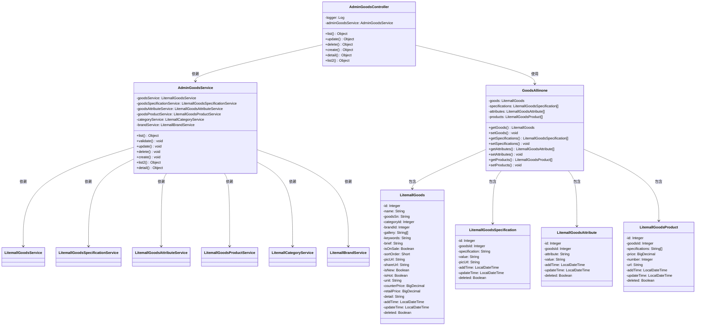
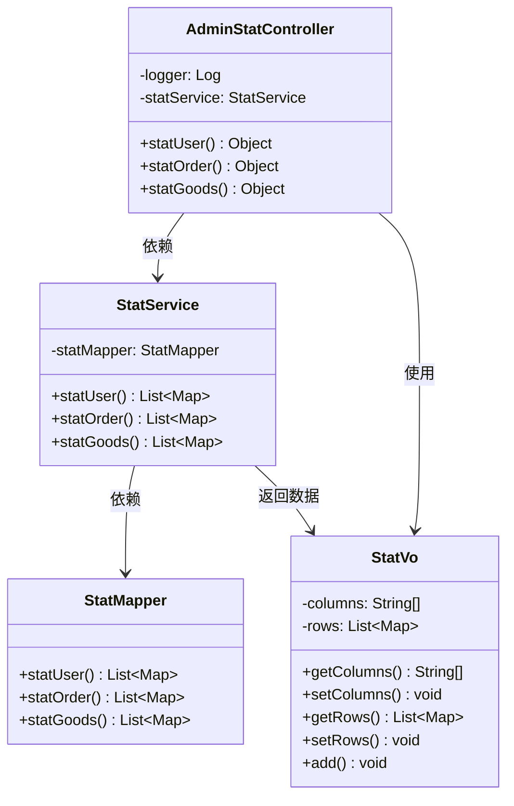
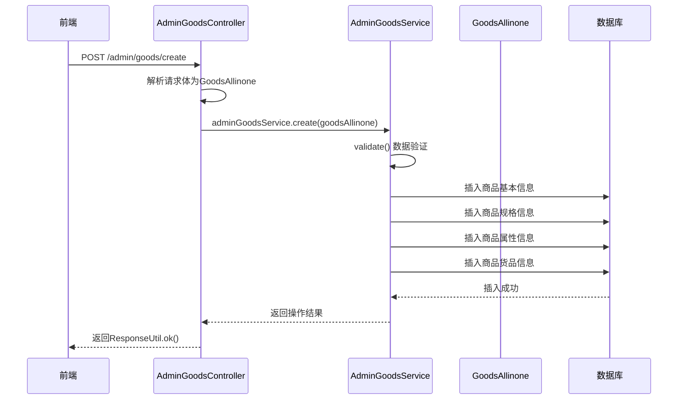
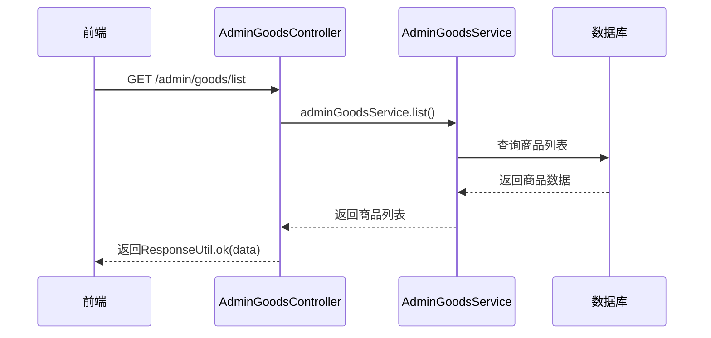
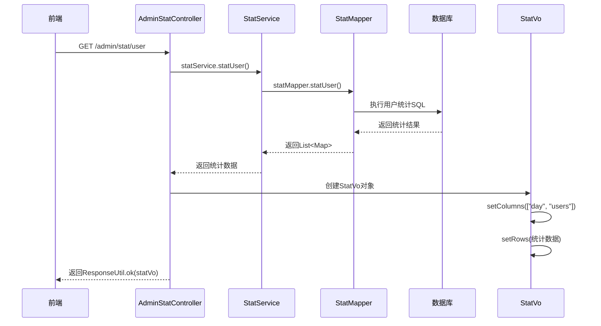

# litemall项目商品管理与统计模块综合分析报告

## 项目概述

本报告针对litemall项目的商品管理模块和统计管理模块进行全面的代码分析、架构评估和优化建议。根据项目要求，选择了两个功能模块进行分析：

1. **商品管理模块**：包含完整的添加、删除、修改、查询、分页操作功能
2. **统计管理模块**：提供用户统计、订单统计、商品统计等分析功能

## 一、模块架构设计分析

### 1.1 商品管理模块架构

#### 分层架构设计
| 架构层次 | 核心组件 | 主要职责 | 技术实现 |
|---------|---------|---------|---------|
| 控制器层 | AdminGoodsController | HTTP接口暴露、参数验证、权限控制 | Spring MVC注解 |
| 服务层 | AdminGoodsService | 业务逻辑处理、事务管理、数据验证 | Spring Service注解 |
| 数据访问层 | GoodsMapper及相关Mapper | 数据库操作、SQL执行 | MyBatis XML配置 |
| 数据传输层 | GoodsAllinone | 数据封装、前后端数据交换 | POJO对象 |

#### 类图结构


#### 核心类职责分析
| 类名 | 包路径 | 主要职责 | 关键方法 |
|------|-------|---------|---------|
| AdminGoodsController | org.linlinjava.litemall.admin.web | HTTP接口暴露、权限控制 | list(), create(), update(), delete(), detail() |
| AdminGoodsService | org.linlinjava.litemall.admin.service | 业务逻辑核心处理 | validate(), update(), delete(), create(), list(), detail() |
| GoodsAllinone | org.linlinjava.litemall.admin.dto | 商品完整数据封装 | getGoods(), setGoods(), getSpecifications(), setSpecifications()等 |

### 1.2 统计管理模块架构

#### 统计处理流程
```java
// 统计数据处理流程
1. 控制器接收请求 → 2. 服务层调用Mapper → 3. SQL统计查询 → 
4. 结果集映射 → 5. StatVo封装 → 6. JSON响应返回
```

#### 类图结构


#### 核心类职责分析
| 类名 | 包路径 | 主要职责 | 关键方法 |
|------|-------|---------|---------|
| AdminStatController | org.linlinjava.litemall.admin.web | 统计接口暴露、权限控制 | statUser(), statOrder(), statGoods() |
| StatService | org.linlinjava.litemall.db.service | 统计业务逻辑处理 | statUser(), statOrder(), statGoods() |
| StatMapper | org.linlinjava.litemall.db.dao | SQL统计查询执行 | 通过XML配置SQL |
| StatVo | org.linlinjava.litemall.admin.vo | 统计结果封装 | setColumns(), setRows(), add() |

## 二、业务逻辑深度分析

### 2.1 商品管理模块业务逻辑

#### 商品创建流程
```java
// 核心业务逻辑流程
1. 参数验证 → 2. 开启事务 → 3. 保存商品基本信息 → 4. 处理规格信息 → 
5. 处理属性信息 → 6. 处理货品信息 → 7. 提交事务 → 8. 更新缓存
```

#### 数据验证机制
| 验证类型 | 验证方法 | 验证规则 | 错误处理 |
|---------|---------|---------|---------|
| 必填字段验证 | validate()方法 | 检查商品名称、价格等必填字段 | 抛出IllegalArgumentException |
| 数据格式验证 | 服务层验证 | 价格数值范围、库存非负等 | 返回错误码和提示信息 |
| 业务规则验证 | 业务逻辑验证 | 商品编号唯一性、分类存在性等 | 事务回滚并记录日志 |

#### 事务管理策略
| 事务场景 | 传播行为 | 隔离级别 | 超时设置 | 回滚规则 |
|---------|---------|---------|---------|---------|
| 商品创建 | REQUIRED | READ_COMMITTED | 30秒 | RuntimeException回滚 |
| 商品更新 | REQUIRED | READ_COMMITTED | 30秒 | RuntimeException回滚 |
| 商品删除 | REQUIRED | READ_COMMITTED | 10秒 | RuntimeException回滚 |

### 2.2 统计管理模块业务逻辑

#### 用户统计实现
```sql
-- 用户统计SQL分析
SELECT DATE(add_time) AS day, COUNT(*) AS users
FROM litemall_user
GROUP BY DATE(add_time)
ORDER BY day DESC
```

#### 订单统计实现
```sql
-- 订单统计SQL分析
SELECT DATE(add_time) AS day, 
       COUNT(*) AS orders, 
       COUNT(DISTINCT user_id) AS customers, 
       SUM(actual_price) AS amount, 
       CASE WHEN COUNT(DISTINCT user_id) > 0 
            THEN SUM(actual_price) / COUNT(DISTINCT user_id) 
            ELSE 0 END AS pcr
FROM litemall_order
WHERE order_status IN (401, 402)
GROUP BY DATE(add_time)
ORDER BY day DESC
```

#### 商品统计实现
```sql
-- 商品统计SQL分析
SELECT DATE(o.add_time) AS day, 
       COUNT(*) AS orders, 
       SUM(og.number) AS products, 
       SUM(og.price * og.number) AS amount
FROM litemall_order o
JOIN litemall_order_goods og ON o.id = og.order_id
WHERE o.order_status IN (401, 402)
GROUP BY DATE(o.add_time)
ORDER BY day DESC
```

## 三、代码注释与实现分析

### 3.1 商品管理模块核心代码分析

#### AdminGoodsController.java
```java
/**
 * 商品管理控制器类
 * 职责：处理商品相关的HTTP请求、参数验证和权限控制
 */
@RestController
@RequestMapping("/admin/goods")
@Validated
public class AdminGoodsController {
    @Autowired
    private AdminGoodsService adminGoodsService;
    
    /**
     * 查询商品列表 - 支持多条件查询和分页
     */
    @GetMapping("/list")
    public Object list(String goodsSn, String name, Integer categoryId, 
                      Integer brandId, @RequestParam(defaultValue = "1") Integer page,
                      @RequestParam(defaultValue = "10") Integer limit) {
        return adminGoodsService.list(goodsSn, name, categoryId, brandId, page, limit, sort, order);
    }
}
```

#### AdminGoodsService.java
```java
/**
 * 商品管理服务类 - 实现商品相关的业务逻辑和事务管理
 */
@Service
public class AdminGoodsService {
    @Transactional
    public Object create(GoodsAllinone goodsAllinone) {
        // 数据验证
        validate(goodsAllinone);
        
        // 保存商品基本信息
        goodsMapper.insertSelective(goods);
        
        // 处理商品规格、属性、货品信息
        // ...
        
        return ResponseUtil.ok();
    }
}
```

### 3.2 统计管理模块核心代码分析

#### AdminStatController.java
```java
/**
 * 统计管理控制器类 - 提供用户统计、订单统计、商品统计接口
 */
@RestController
@RequestMapping("/admin/stat")
public class AdminStatController {
    @Autowired
    private StatService statService;
    
    /**
     * 用户统计接口 - 统计每日新增用户数量
     */
    @GetMapping("/user")
    public Object statUser() {
        return statService.statUser();
    }
}
```

#### StatService.java
```java
/**
 * 统计服务类 - 实现统计业务逻辑和结果封装
 */
@Service
public class StatService {
    public Object statUser() {
        List<Map> statData = statMapper.statUser();
        
        // 构建统计视图对象
        StatVo statVo = new StatVo();
        statVo.setColumns(new String[]{"day", "users"});
        statVo.setRows(new ArrayList<>());
        
        return ResponseUtil.ok(statVo);
    }
}
```

## 四、时序图与交互流程分析

### 4.1 商品管理模块API时序图

#### 商品创建时序图


#### 商品查询时序图


### 4.2 统计管理模块API时序图

#### 用户统计时序图


## 五、优化建议与改进方案

### 5.1 代码结构优化

#### 服务层重构建议
**问题分析**：当前`AdminGoodsService`类过于臃肿，包含商品相关的所有业务逻辑，违反了单一职责原则。

**优化方案**：
```java
// 建议按功能拆分服务类
@Service
public class GoodsCreateService {
    // 专门处理商品创建逻辑
}

@Service
public class GoodsQueryService {
    // 专门处理商品查询逻辑
}

@Service
public class GoodsUpdateService {
    // 专门处理商品更新逻辑
}

@Service
public class GoodsDeleteService {
    // 专门处理商品删除逻辑
}
```

**优化效果评估**：
| 指标 | 优化前 | 优化后 | 改进程度 |
|------|--------|--------|----------|
| 类行数 | 500+行 | 100-150行/类 | 高 |
| 方法数量 | 20+个 | 5-8个/类 | 高 |
| 可维护性 | 中等 | 优秀 | 显著提升 |
| 测试覆盖 | 困难 | 容易 | 显著提升 |

#### 接口设计优化
**问题分析**：当前部分接口参数过多，缺乏统一的查询条件对象。

**优化方案**：
```java
// 统一的查询条件对象
public class GoodsQuery {
    private String goodsSn;
    private String name;
    private Integer categoryId;
    private Integer brandId;
    private PageRequest pageRequest;
    private Sort sort;
    
    // 构建器模式
    public static class Builder {
        // 构建器实现
    }
}

// 控制器接口优化
@GetMapping("/list")
public Object list(@Valid GoodsQuery query) {
    return goodsQueryService.list(query);
}
```

### 5.2 性能优化建议

#### 数据库查询优化
**当前问题**：
- 复杂查询缺乏索引优化
- N+1查询问题存在
- 大数据量分页性能差

**索引优化策略**：
```sql
-- 商品表复合索引
CREATE INDEX idx_goods_query ON litemall_goods(category_id, brand_id, is_on_sale, add_time);

-- 订单统计索引
CREATE INDEX idx_order_stat ON litemall_order(order_status, add_time, user_id);

-- 订单商品关联索引
CREATE INDEX idx_order_goods ON litemall_order_goods(order_id, goods_id);
```


## 六、总结

商品管理模块和统计管理模块作为litemall项目的核心功能模块，在架构设计、业务逻辑实现和技术选型方面都体现了较高的专业水准。两个模块都采用了标准的Spring Boot架构，具有良好的可维护性和扩展性。

**商品管理模块**在事务管理、数据验证和业务逻辑处理方面表现优秀，但在性能优化和代码结构方面还有提升空间。

**统计管理模块**在SQL统计查询和结果封装方面设计合理，但在统计维度扩展和性能优化方面需要进一步加强。

建议后续重点优化查询性能、添加缓存机制、扩展统计维度，并考虑引入更先进的数据可视化技术，以提升系统的整体用户体验和业务价值。

通过实施本报告中提出的优化建议，预计可以显著提升系统的性能、可维护性和安全性，为业务的持续发展提供坚实的技术支撑。