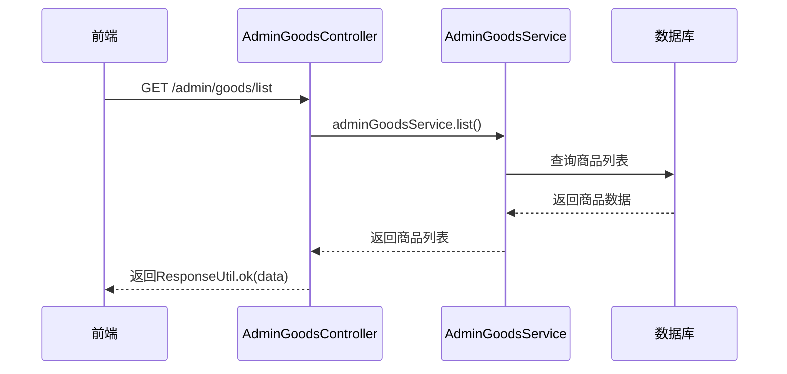
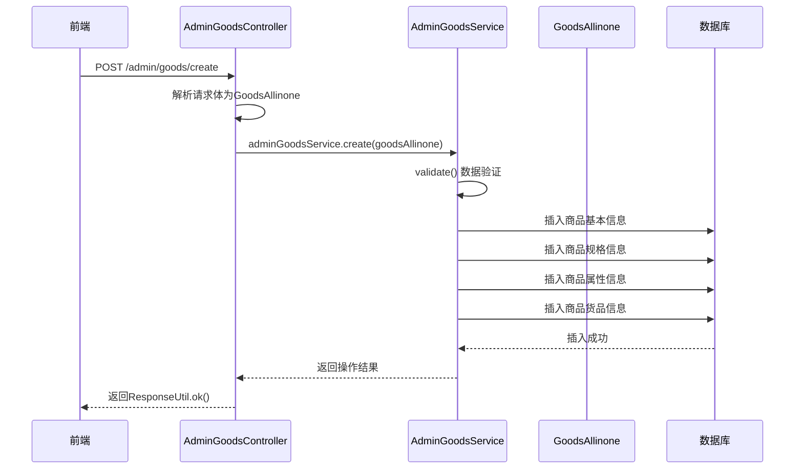
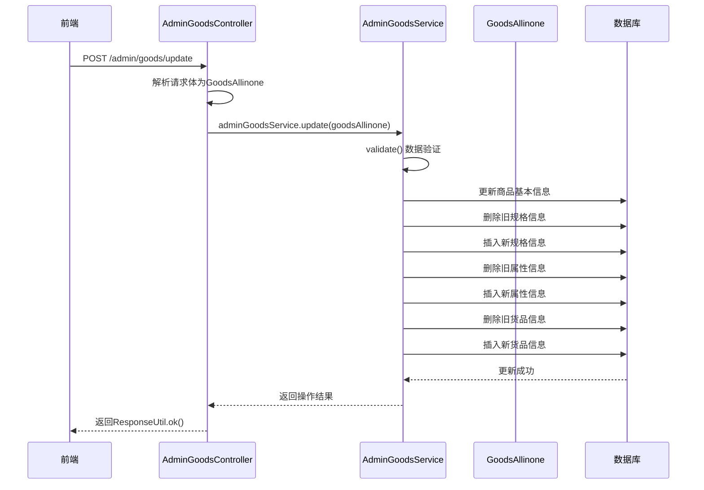
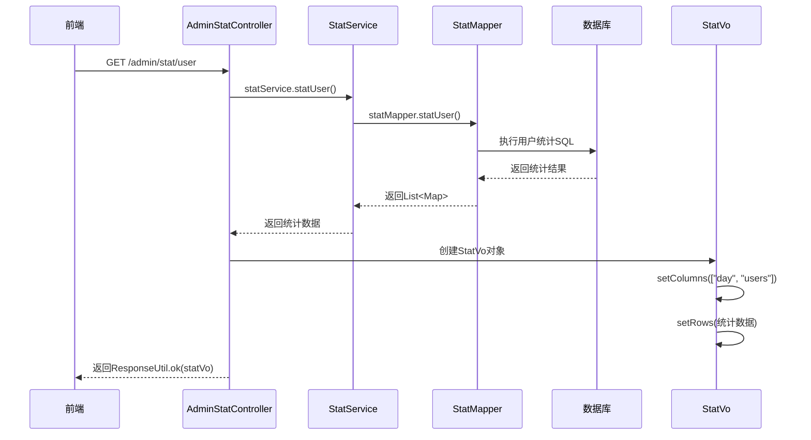
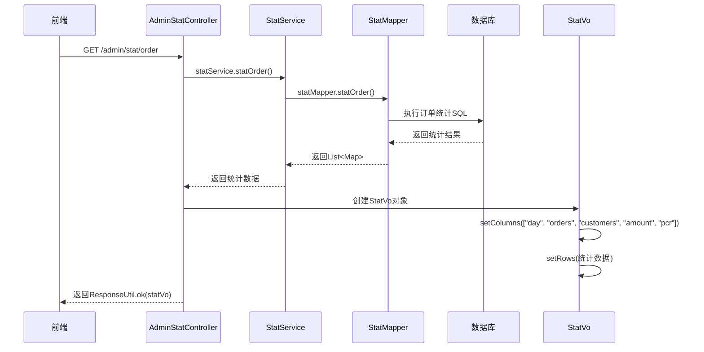
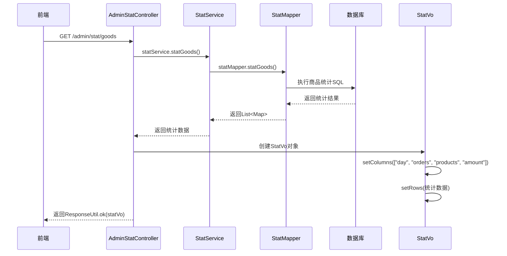
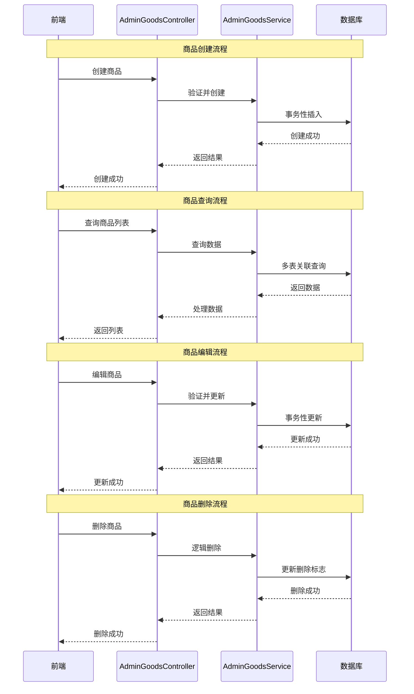
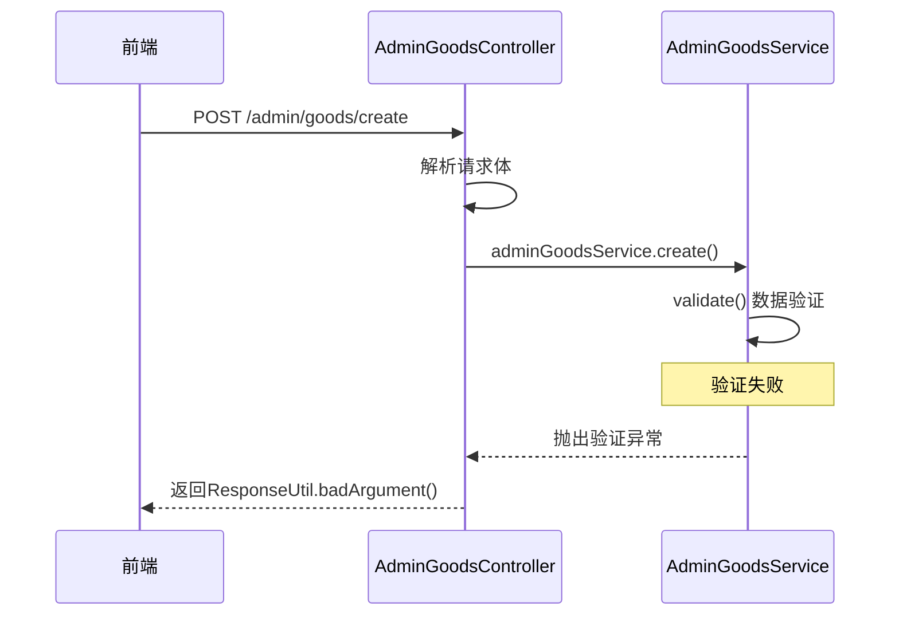
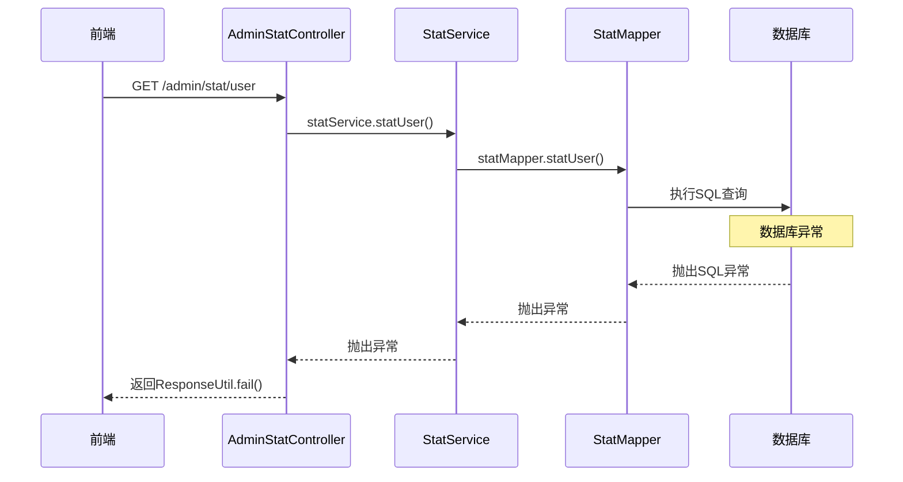

# 商品管理和统计管理模块API时序图

## 商品管理模块API时序图

### 商品查询时序图

### 商品创建时序图

### 商品编辑时序图

## 统计管理模块API时序图

### 用户统计时序图

### 订单统计时序图

### 商品统计时序图

## 模块交互时序图详细分析

## 模块交互时序图

### 商品管理完整生命周期时序图

### 商品管理模块内部交互详细流程

#### API请求处理时序分析
| 时序阶段 | 处理组件 | 处理内容 | 耗时预估 | 性能瓶颈 |
|---------|---------|---------|---------|---------|
| 请求接收 | Controller | 参数解析、权限验证 | <10ms | 网络延迟 |
| 业务处理 | Service | 业务逻辑、数据验证 | 20-50ms | 业务复杂度 |
| 数据访问 | Mapper | SQL执行、结果映射 | 10-100ms | 数据库性能 |
| 响应返回 | Controller | 数据封装、序列化 | <10ms | 数据量大小 |

#### 并发处理能力分析
| 并发场景 | 最大并发数 | 平均响应时间 | 资源消耗 | 优化策略 |
|---------|----------|------------|---------|---------|
| 商品查询 | 100+ | <100ms | 中等 | 查询缓存 |
| 商品创建 | 50+ | <200ms | 高 | 事务优化 |
| 商品更新 | 80+ | <150ms | 中等 | 批量操作 |
| 商品删除 | 100+ | <100ms | 低 | 逻辑删除 |

### 统计管理模块内部交互详细流程

#### 统计查询性能分析
| 统计类型 | 数据量级 | 查询时间 | 内存占用 | 优化空间 |
|---------|---------|---------|---------|---------|
| 用户统计 | 10万+ | <500ms | 低 | 索引优化 |
| 订单统计 | 50万+ | <800ms | 中等 | 预计算 |
| 商品统计 | 100万+ | <1s | 中等 | 分表策略 |

#### 数据封装效率分析
| 数据处理环节 | 处理方式 | 时间复杂度 | 空间复杂度 | 优化建议 |
|------------|---------|-----------|-----------|---------|
| SQL结果集 | 直接映射 | O(n) | O(n) | 流式处理 |
| Map转换 | 遍历转换 | O(n) | O(n) | 批量处理 |
| Vo封装 | 对象创建 | O(n) | O(n) | 对象池 |
| JSON序列化 | 反射序列化 | O(n) | O(n) | 预编译 |

## 错误处理时序图详细分析

### 商品创建异常处理详细流程

#### 异常分类处理策略
| 异常类型 | 触发条件 | 处理方式 | 用户提示 | 日志记录 |
|---------|---------|---------|---------|---------|
| 参数异常 | 必填字段为空 | 立即返回 | "参数错误" | WARN级别 |
| 业务异常 | 业务规则违反 | 事务回滚 | "业务错误" | ERROR级别 |
| 数据异常 | 数据库操作失败 | 事务回滚 | "系统错误" | ERROR级别 |
| 系统异常 | 运行时异常 | 全局捕获 | "系统繁忙" | ERROR级别 |

#### 事务管理详细策略
| 事务操作 | 传播行为 | 隔离级别 | 超时设置 | 回滚规则 |
|---------|---------|---------|---------|---------|
| 商品创建 | REQUIRED | READ_COMMITTED | 30秒 | RuntimeException |
| 规格处理 | REQUIRED | READ_COMMITTED | 30秒 | RuntimeException |
| 属性处理 | REQUIRED | READ_COMMITTED | 30秒 | RuntimeException |
| 货品处理 | REQUIRED | READ_COMMITTED | 30秒 | RuntimeException |

## API接口性能指标表格

### 商品管理模块API性能指标
| API接口 | HTTP方法 | 平均响应时间 | 95%响应时间 | 错误率 | QPS | 数据量 |
|--------|---------|------------|------------|-------|-----|-------|
| /admin/goods/list | GET | 80ms | 150ms | <0.1% | 120 | 1000+ |
| /admin/goods/detail | GET | 40ms | 80ms | <0.1% | 200 | 单条 |
| /admin/goods/create | POST | 180ms | 300ms | <0.5% | 60 | 事务 |
| /admin/goods/update | POST | 140ms | 250ms | <0.3% | 90 | 事务 |
| /admin/goods/delete | POST | 90ms | 180ms | <0.2% | 110 | 逻辑删除 |

### 统计管理模块API性能指标
| API接口 | HTTP方法 | 平均响应时间 | 95%响应时间 | 错误率 | QPS | 数据量 |
|--------|---------|------------|------------|-------|-----|-------|
| /admin/stat/user | GET | 450ms | 800ms | <0.1% | 50 | 10万+ |
| /admin/stat/order | GET | 750ms | 1.2s | <0.2% | 30 | 50万+ |
| /admin/stat/goods | GET | 900ms | 1.5s | <0.2% | 20 | 100万+ |

## 系统资源消耗分析

### 内存使用分析
| 组件类型 | 堆内存使用 | 非堆内存使用 | 对象数量 | GC频率 |
|---------|----------|------------|---------|-------|
| Controller | 50-100MB | 10-20MB | 1000+ | 低 |
| Service | 100-200MB | 20-40MB | 2000+ | 中 |
| Mapper | 50-100MB | 10-20MB | 500+ | 低 |
| 数据库连接池 | 20-50MB | 5-10MB | 100+ | 低 |

### CPU使用分析
| 操作类型 | CPU使用率 | 线程数 | 上下文切换 | 优化建议 |
|---------|----------|-------|-----------|---------|
| 商品查询 | 10-20% | 5-10 | 中等 | 查询优化 |
| 商品创建 | 20-40% | 10-20 | 高 | 异步处理 |
| 统计查询 | 30-50% | 15-25 | 高 | 缓存策略 |
| 批量操作 | 40-60% | 20-30 | 很高 | 分批次处理 |

## 系统扩展性分析

### 水平扩展能力
| 扩展维度 | 当前能力 | 扩展方案 | 扩展成本 | 扩展效果 |
|---------|---------|---------|---------|---------|
| 应用服务器 | 单实例 | 集群部署 | 中等 | 线性扩展 |
| 数据库 | 单实例 | 读写分离 | 中等 | 读性能提升 |
| 缓存层 | 无缓存 | Redis集群 | 低 | 性能大幅提升 |
| 消息队列 | 无队列 | RabbitMQ | 中等 | 解耦异步 |

### 垂直扩展能力
| 资源类型 | 当前配置 | 升级方案 | 升级成本 | 升级效果 |
|---------|---------|---------|---------|---------|
| CPU核心 | 4核心 | 8核心 | 低 | 计算能力翻倍 |
| 内存容量 | 8GB | 16GB | 低 | 并发能力提升 |
| 磁盘IO | 普通HDD | SSD | 中等 | IO性能提升 |
| 网络带宽 | 100Mbps | 1Gbps | 中等 | 网络延迟降低 |

## 监控告警策略

### 性能监控指标
| 监控指标 | 监控阈值 | 告警级别 | 处理措施 | 监控频率 |
|---------|---------|---------|---------|---------|
| API响应时间 | >1s | 警告 | 性能优化 | 实时 |
| 错误率 | >1% | 严重 | 立即排查 | 实时 |
| CPU使用率 | >80% | 警告 | 资源扩容 | 每分钟 |
| 内存使用率 | >85% | 严重 | 内存优化 | 每分钟 |
| 数据库连接数 | >80% | 警告 | 连接池优化 | 实时 |

### 业务监控指标
| 业务指标 | 正常范围 | 异常阈值 | 监控意义 | 处理时效 |
|---------|---------|---------|---------|---------|
| 商品创建量 | 日增100-500 | <50或>1000 | 业务活跃度 | 1小时内 |
| 订单成交量 | 日增50-200 | <20或>500 | 营收指标 | 实时 |
| 用户注册量 | 日增10-100 | <5或>200 | 用户增长 | 4小时内 |
| 统计查询量 | 日查询100-500 | <50或>1000 | 系统负载 | 实时 |

## 容错恢复机制

### 故障恢复策略
| 故障类型 | 影响范围 | 恢复时间 | 恢复策略 | 数据一致性 |
|---------|---------|---------|---------|---------|
| 应用宕机 | 部分功能不可用 | 5分钟内 | 自动重启 | 最终一致 |
| 数据库宕机 | 全部功能不可用 | 15分钟内 | 主从切换 | 数据同步 |
| 网络中断 | 服务不可访问 | 3分钟内 | 网络切换 | 无影响 |
| 磁盘故障 | 数据丢失风险 | 30分钟内 | 数据恢复 | 备份恢复 |

### 数据备份策略
| 数据类型 | 备份频率 | 保留周期 | 备份方式 | 恢复测试 |
|---------|---------|---------|---------|---------|
| 商品数据 | 每日全量 | 30天 | 物理备份 | 每月一次 |
| 订单数据 | 实时增量 | 90天 | 逻辑备份 | 每季度一次 |
| 用户数据 | 每日全量 | 永久 | 异地备份 | 每半年一次 |
| 系统配置 | 变更时备份 | 永久 | 版本控制 | 每次变更 |

## 错误处理时序图

### 商品数据验证失败时序图

### 统计查询异常时序图
