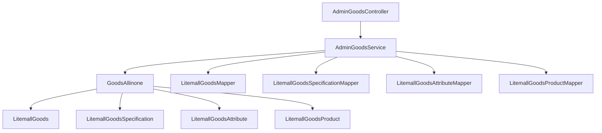
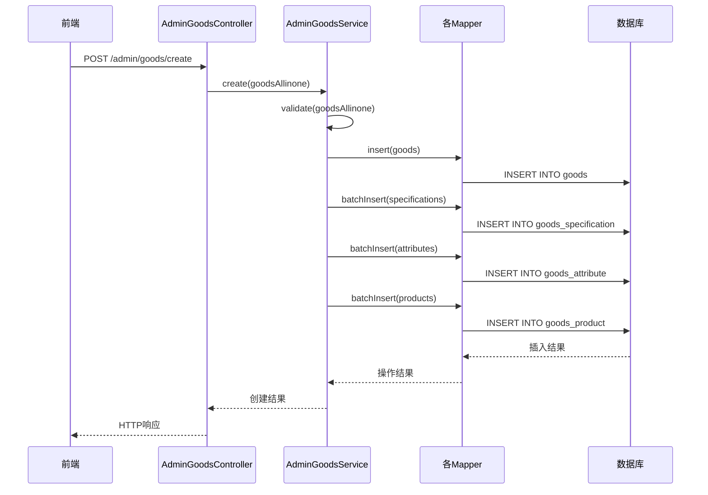

## 商品管理模块类设计

### 核心类结构

#### AdminGoodsController 类设计
```java
/**
 * 商品管理控制器类
 * 职责：处理商品相关的HTTP请求，包括CRUD操作和列表查询
 */
@RestController
@RequestMapping("/admin/goods")
@Validated
public class AdminGoodsController {
    
    // 依赖注入
    @Autowired
    private AdminGoodsService adminGoodsService;
    
    // 核心方法设计
    @GetMapping("/list")
    public Object list(String goodsSn, String name, ...) {
        // 参数验证 → 服务调用 → 结果返回
    }
    
    @PostMapping("/create")
    public Object create(@RequestBody GoodsAllinone goodsAllinone) {
        // 数据验证 → 业务处理 → 事务管理
    }
}
```

**设计特点：**
- **单一职责原则**：专注于HTTP请求处理
- **依赖注入**：通过@Autowired注入服务层依赖
- **注解驱动**：使用Spring MVC注解定义API端点

#### AdminGoodsService 类设计
```java
/**
 * 商品管理服务类
 * 职责：实现商品相关的业务逻辑，包括验证、事务管理和数据处理
 */
@Service
public class AdminGoodsService {
    
    // 数据访问层依赖
    @Autowired
    private LitemallGoodsMapper goodsMapper;
    @Autowired
    private LitemallGoodsSpecificationMapper goodsSpecificationMapper;
    // ... 其他Mapper依赖
    
    // 业务逻辑方法
    @Transactional
    public void create(GoodsAllinone goodsAllinone) {
        // 数据验证 → 事务开始 → 多表操作 → 事务提交
    }
    
    public Object list(String goodsSn, String name, ...) {
        // 查询条件构建 → 分页处理 → 结果封装
    }
}
```

**设计特点：**
- **事务管理**：使用@Transactional注解管理数据库事务
- **业务封装**：将复杂业务逻辑封装在服务层
- **异常处理**：统一的异常处理机制

#### GoodsAllinone 类设计
```java
/**
 * 商品完整信息数据传输对象
 * 职责：封装商品相关的所有数据，用于前后端数据交换
 */
public class GoodsAllinone {
    
    // 核心数据字段
    private LitemallGoods goods;                    // 商品基本信息
    private List<LitemallGoodsSpecification> specifications; // 商品规格
    private List<LitemallGoodsAttribute> attributes;        // 商品属性
    private List<LitemallGoodsProduct> products;            // 商品货品
    
    // Getter/Setter方法
    // 数据验证方法
}
```

**设计特点：**
- **数据聚合**：聚合多个相关实体数据
- **数据传输**：简化前后端数据交换
- **数据验证**：内置数据验证逻辑

### 类间关系分析

#### 依赖关系图


#### 调用关系分析
| 调用方 | 被调用方 | 调用方式 | 调用频率 | 数据流向 |
|--------|----------|----------|----------|----------|
| AdminGoodsController | AdminGoodsService | 方法调用 | 高频 | 请求参数 → 业务结果 |
| AdminGoodsService | GoodsAllinone | 对象操作 | 中频 | 数据封装/解析 |
| AdminGoodsService | 各Mapper接口 | 接口调用 | 高频 | 业务数据 → 数据库操作 |

### 设计模式应用

#### 工厂模式 - 商品对象创建
```java
// 商品对象创建工厂
public class GoodsFactory {
    public static LitemallGoods createGoods(String name, String goodsSn, ...) {
        LitemallGoods goods = new LitemallGoods();
        goods.setName(name);
        goods.setGoodsSn(goodsSn);
        // ... 其他属性设置
        return goods;
    }
}
```

#### 建造者模式 - 复杂查询条件构建
```java
// 查询条件建造者
public class GoodsQueryBuilder {
    private String goodsSn;
    private String name;
    // ... 其他查询条件
    
    public GoodsQueryBuilder setGoodsSn(String goodsSn) {
        this.goodsSn = goodsSn;
        return this;
    }
    
    public GoodsQueryBuilder setName(String name) {
        this.name = name;
        return this;
    }
    
    public Map<String, Object> build() {
        Map<String, Object> query = new HashMap<>();
        if (goodsSn != null) query.put("goodsSn", goodsSn);
        if (name != null) query.put("name", name);
        return query;
    }
}
```

#### 策略模式 - 不同商品类型的处理策略
```java
// 商品处理策略接口
public interface GoodsProcessStrategy {
    void validate(GoodsAllinone goodsAllinone);
    void process(GoodsAllinone goodsAllinone);
}

// 实物商品处理策略
@Component
public class PhysicalGoodsStrategy implements GoodsProcessStrategy {
    @Override
    public void validate(GoodsAllinone goodsAllinone) {
        // 实物商品特有验证逻辑
    }
    
    @Override
    public void process(GoodsAllinone goodsAllinone) {
        // 实物商品特有处理逻辑
    }
}
```

## 模块间调用关系

### 跨模块调用分析

| 调用场景 | 目标模块 | 调用方式 | 数据依赖 | 耦合度 |
|----------|----------|----------|----------|--------|
| 商品分类验证 | 分类管理模块 | 服务调用 | 分类ID存在性验证 | 中等 |
| 品牌信息获取 | 品牌管理模块 | 服务调用 | 品牌基本信息 | 低 |
| 库存管理 | 库存管理模块 | 消息队列 | 库存变更通知 | 低 |

### 调用时序分析

