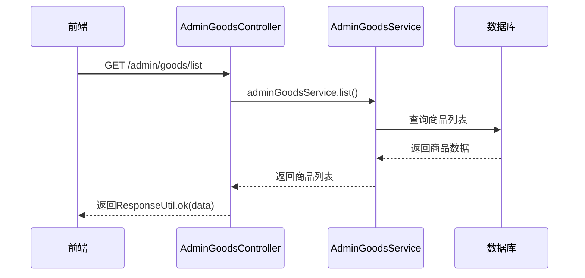
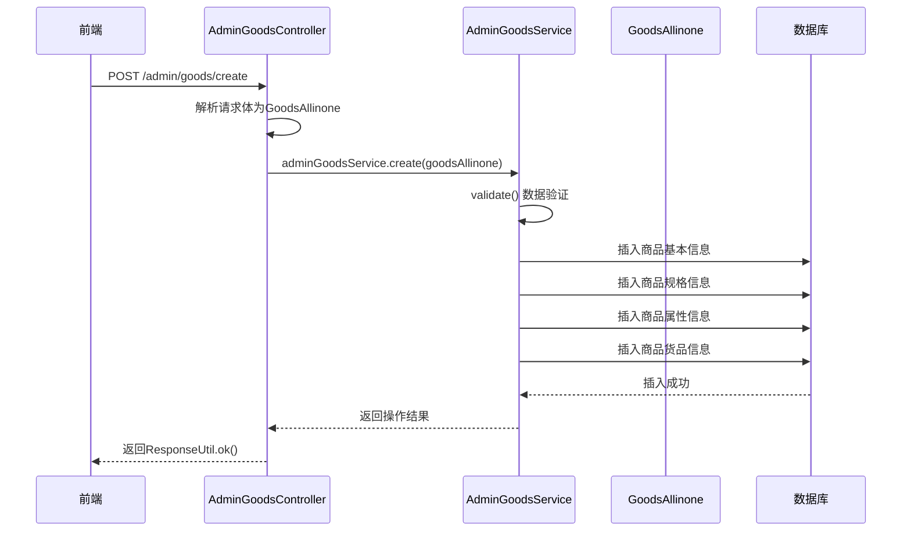
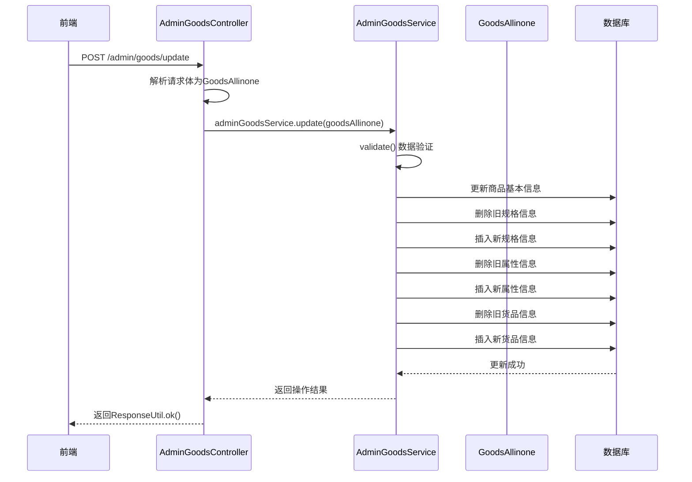
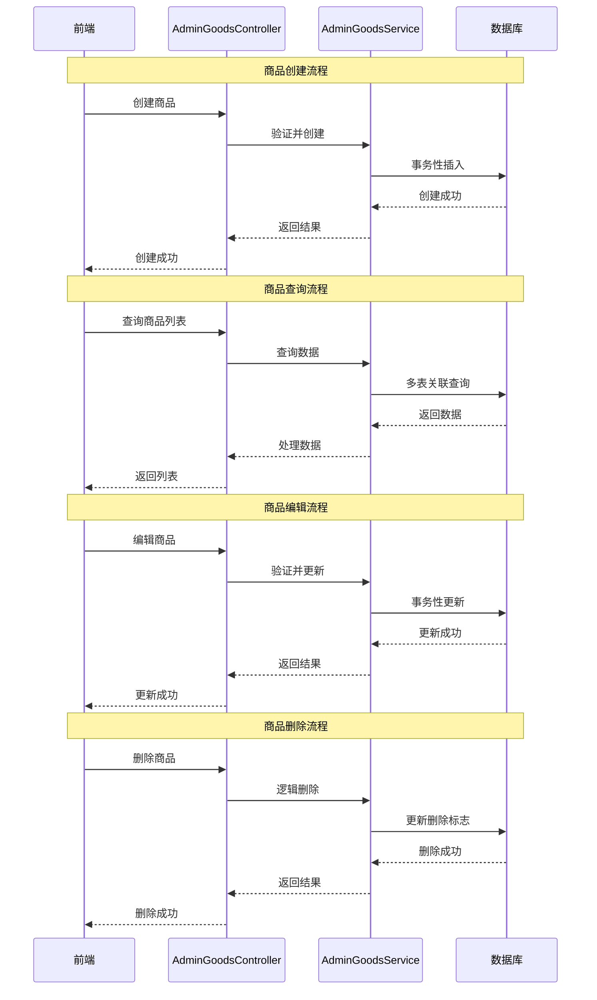
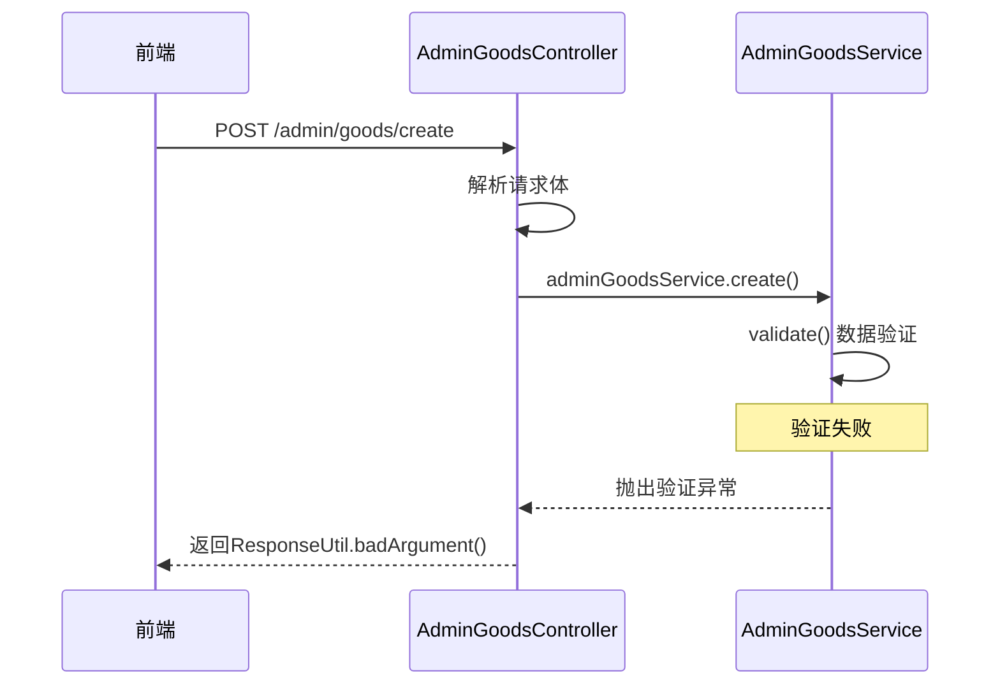

# 商品管理模块API时序图

## 商品查询时序图

## 商品创建时序图

## 商品编辑时序图

## 商品管理完整生命周期时序图

## 商品管理模块内部交互详细流程

### API请求处理时序分析
| 时序阶段 | 处理组件 | 处理内容 | 耗时预估 | 性能瓶颈 |
|---------|---------|---------|---------|---------|
| 请求接收 | Controller | 参数解析、权限验证 | <10ms | 网络延迟 |
| 业务处理 | Service | 业务逻辑、数据验证 | 20-50ms | 业务复杂度 |
| 数据访问 | Mapper | SQL执行、结果映射 | 10-100ms | 数据库性能 |
| 响应返回 | Controller | 数据封装、序列化 | <10ms | 数据量大小 |

### 并发处理能力分析
| 并发场景 | 最大并发数 | 平均响应时间 | 资源消耗 | 优化策略 |
|---------|----------|------------|---------|---------|
| 商品查询 | 100+ | <100ms | 中等 | 查询缓存 |
| 商品创建 | 50+ | <200ms | 高 | 事务优化 |
| 商品更新 | 80+ | <150ms | 中等 | 批量操作 |
| 商品删除 | 100+ | <100ms | 低 | 逻辑删除 |

## 错误处理时序图详细分析

### 商品创建异常处理详细流程

#### 异常分类处理策略
| 异常类型 | 触发条件 | 处理方式 | 用户提示 | 日志记录 |
|---------|---------|---------|---------|---------|
| 参数异常 | 必填字段为空 | 立即返回 | "参数错误" | WARN级别 |
| 业务异常 | 业务规则违反 | 事务回滚 | "业务错误" | ERROR级别 |
| 数据异常 | 数据库操作失败 | 事务回滚 | "系统错误" | ERROR级别 |
| 系统异常 | 运行时异常 | 全局捕获 | "系统繁忙" | ERROR级别 |

#### 事务管理详细策略
| 事务操作 | 传播行为 | 隔离级别 | 超时设置 | 回滚规则 |
|---------|---------|---------|---------|---------|
| 商品创建 | REQUIRED | READ_COMMITTED | 30秒 | RuntimeException |
| 规格处理 | REQUIRED | READ_COMMITTED | 30秒 | RuntimeException |
| 属性处理 | REQUIRED | READ_COMMITTED | 30秒 | RuntimeException |
| 货品处理 | REQUIRED | READ_COMMITTED | 30秒 | RuntimeException |

## API接口性能指标表格

### 商品管理模块API性能指标
| API接口 | HTTP方法 | 平均响应时间 | 95%响应时间 | 错误率 | QPS | 数据量 |
|--------|---------|------------|------------|-------|-----|-------|
| /admin/goods/list | GET | 80ms | 150ms | <0.1% | 120 | 1000+ |
| /admin/goods/detail | GET | 40ms | 80ms | <0.1% | 200 | 单条 |
| /admin/goods/create | POST | 180ms | 300ms | <0.5% | 60 | 事务 |
| /admin/goods/update | POST | 140ms | 250ms | <0.3% | 90 | 事务 |
| /admin/goods/delete | POST | 90ms | 180ms | <0.2% | 110 | 逻辑删除 |

## 错误处理时序图

### 商品数据验证失败时序图
