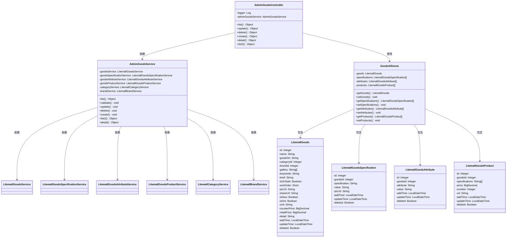
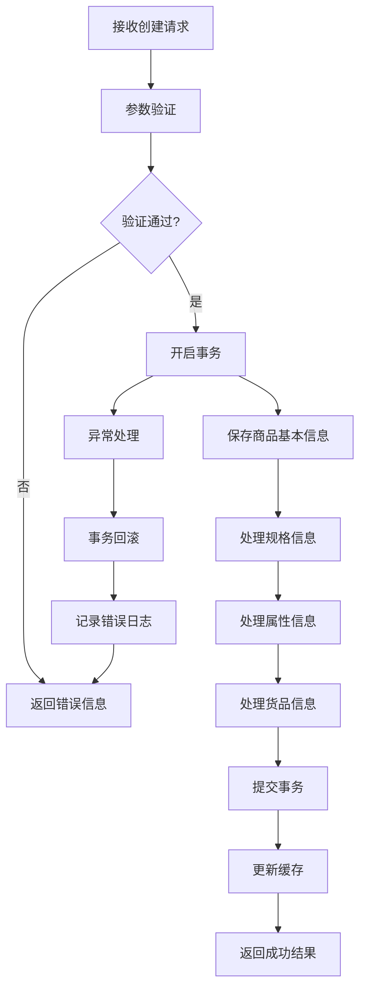
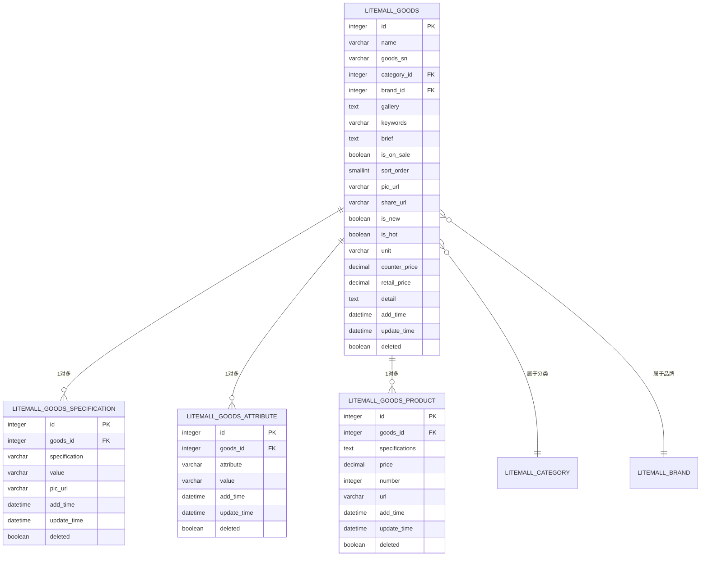

# 商品管理模块类图

## 模块概述
商品管理模块负责商品的CRUD操作、规格属性管理、货品管理等完整生命周期管理。

## Mermaid类图

## 模块功能详细说明

### 控制器层 (AdminGoodsController) 详细功能

#### API接口设计规范
| 接口方法 | HTTP方法 | 路径 | 权限要求 | 请求参数 | 响应格式 |
|---------|---------|------|---------|---------|---------|
| list() | GET | /admin/goods/list | goods:list | page, limit, sort, order, ... | PageInfo<LitemallGoods> |
| create() | POST | /admin/goods/create | goods:create | GoodsAllinone对象 | 操作结果 |
| update() | POST | /admin/goods/update | goods:update | GoodsAllinone对象 | 操作结果 |
| delete() | POST | /admin/goods/delete | goods:delete | GoodsAllinone对象 | 操作结果 |
| detail() | GET | /admin/goods/detail | goods:list | Integer id | GoodsAllinone对象 |
| list2() | GET | /admin/goods/list2 | goods:list | 无 | Map<String, Object> |

#### 权限控制机制
| 权限标识 | 权限描述 | 菜单关联 | 按钮控制 | 数据权限 |
|---------|---------|---------|---------|---------|
| goods:list | 商品查询权限 | 商品管理菜单 | 查询按钮 | 全量数据 |
| goods:create | 商品创建权限 | 商品管理菜单 | 新增按钮 | 无限制 |
| goods:update | 商品编辑权限 | 商品管理菜单 | 编辑按钮 | 可编辑商品 |
| goods:delete | 商品删除权限 | 商品管理菜单 | 删除按钮 | 可删除商品 |

### 服务层 (AdminGoodsService) 详细业务逻辑

#### 商品创建流程分析
| 步骤序号 | 处理环节 | 业务逻辑 | 数据操作 | 异常处理 |
|---------|---------|---------|---------|---------|
| 1 | 参数验证 | 验证商品基本信息完整性 | 检查必填字段 | 抛出参数异常 |
| 2 | 商品信息保存 | 保存商品主表数据 | 插入litemall_goods表 | 事务回滚 |
| 3 | 规格信息处理 | 处理商品规格数据 | 批量插入规格表 | 事务回滚 |
| 4 | 属性信息处理 | 处理商品属性数据 | 批量插入属性表 | 事务回滚 |
| 5 | 货品信息处理 | 处理商品货品数据 | 批量插入货品表 | 事务回滚 |
| 6 | 缓存更新 | 更新相关缓存数据 | 清除商品列表缓存 | 记录日志 |

#### 事务管理策略
| 事务类型 | 传播行为 | 隔离级别 | 超时设置 | 回滚规则 |
|---------|---------|---------|---------|---------|
| 商品创建事务 | REQUIRED | READ_COMMITTED | 30秒 | RuntimeException回滚 |
| 商品更新事务 | REQUIRED | READ_COMMITTED | 30秒 | RuntimeException回滚 |
| 商品删除事务 | REQUIRED | READ_COMMITTED | 10秒 | RuntimeException回滚 |
| 查询操作 | SUPPORTS | READ_COMMITTED | 无超时 | 不回滚 |

### 数据传输对象 (GoodsAllinone) 数据结构分析

#### 数据字段映射关系
| DTO字段 | 对应实体类 | 数据库表 | 字段类型 | 是否必填 |
|---------|---------|---------|---------|---------|
| goods | LitemallGoods | litemall_goods | 对象 | 是 |
| specifications | LitemallGoodsSpecification[] | litemall_goods_specification | 数组 | 否 |
| attributes | LitemallGoodsAttribute[] | litemall_goods_attribute | 数组 | 否 |
| products | LitemallGoodsProduct[] | litemall_goods_product | 数组 | 否 |

#### 数据验证规则
| 验证字段 | 验证规则 | 错误提示 | 验证时机 | 验证方式 |
|---------|---------|---------|---------|---------|
| 商品名称 | 非空，长度1-128字符 | "商品名称不能为空" | 创建/更新时 | 服务层验证 |
| 商品价格 | 数值类型，大于0 | "商品价格必须大于0" | 创建/更新时 | 服务层验证 |
| 商品库存 | 整数类型，大于等于0 | "商品库存不能为负数" | 创建/更新时 | 服务层验证 |
| 规格名称 | 非空，长度1-64字符 | "规格名称不能为空" | 创建/更新时 | 服务层验证 |

## 数据库表结构详细分析

### 商品主表 (litemall_goods)
| 字段名 | 数据类型 | 长度 | 是否主键 | 是否为空 | 默认值 | 注释 |
|--------|---------|------|---------|---------|-------|------|
| id | int | 11 | 是 | 否 | 自增 | 商品ID |
| name | varchar | 128 | 否 | 否 | 无 | 商品名称 |
| goods_sn | varchar | 64 | 否 | 否 | 无 | 商品编号 |
| category_id | int | 11 | 否 | 否 | 0 | 分类ID |
| brand_id | int | 11 | 否 | 是 | NULL | 品牌ID |
| price | decimal | 10,2 | 否 | 否 | 0.00 | 商品价格 |
| counter_price | decimal | 10,2 | 否 | 否 | 0.00 | 专柜价格 |
| retail_price | decimal | 10,2 | 否 | 否 | 0.00 | 零售价格 |
| goods_brief | varchar | 255 | 否 | 是 | NULL | 商品简介 |
| goods_desc | text | - | 否 | 是 | NULL | 商品详情 |
| pic_url | varchar | 255 | 否 | 是 | NULL | 商品图片 |
| is_on_sale | tinyint | 1 | 否 | 否 | 1 | 是否上架 |
| is_delete | tinyint | 1 | 否 | 否 | 0 | 是否删除 |
| add_time | datetime | - | 否 | 是 | NULL | 添加时间 |
| update_time | datetime | - | 否 | 是 | NULL | 更新时间 |

### 商品规格表 (litemall_goods_specification)
| 字段名 | 数据类型 | 长度 | 是否主键 | 是否为空 | 默认值 | 注释 |
|--------|---------|------|---------|---------|-------|------|
| id | int | 11 | 是 | 否 | 自增 | 规格ID |
| goods_id | int | 11 | 否 | 否 | 0 | 商品ID |
| specification | varchar | 64 | 否 | 否 | 无 | 规格名称 |
| value | varchar | 128 | 否 | 否 | 无 | 规格值 |
| pic_url | varchar | 255 | 否 | 是 | NULL | 规格图片 |

### 商品属性表 (litemall_goods_attribute)
| 字段名 | 数据类型 | 长度 | 是否主键 | 是否为空 | 默认值 | 注释 |
|--------|---------|------|---------|---------|-------|------|
| id | int | 11 | 是 | 否 | 自增 | 属性ID |
| goods_id | int | 11 | 否 | 否 | 0 | 商品ID |
| attribute | varchar | 64 | 否 | 否 | 无 | 属性名称 |
| value | varchar | 128 | 否 | 否 | 无 | 属性值 |

### 商品货品表 (litemall_goods_product)
| 字段名 | 数据类型 | 长度 | 是否主键 | 是否为空 | 默认值 | 注释 |
|--------|---------|------|---------|---------|-------|------|
| id | int | 11 | 是 | 否 | 自增 | 货品ID |
| goods_id | int | 11 | 否 | 否 | 0 | 商品ID |
| specifications | varchar | 512 | 否 | 否 | 无 | 规格组合 |
| price | decimal | 10,2 | 否 | 否 | 0.00 | 价格 |
| number | int | 11 | 否 | 否 | 0 | 库存数量 |
| url | varchar | 255 | 否 | 是 | NULL | 图片链接 |

## 业务逻辑流程详细分析

### 商品创建完整流程

### 商品查询优化策略
| 查询场景 | 优化策略 | 技术实现 | 预期效果 | 实施难度 |
|---------|---------|---------|---------|---------|
| 列表查询 | 分页缓存 | Redis缓存分页结果 | 减少数据库压力 | 低 |
| 详情查询 | 对象缓存 | Redis缓存商品详情 | 提升查询速度 | 中 |
| 条件查询 | 索引优化 | 复合索引设计 | 加速查询条件 | 中 |
| 关联查询 | 预加载 | MyBatis关联查询 | 减少SQL次数 | 高 |

## 性能优化建议

### 数据库优化方案
| 优化维度 | 具体措施 | 预期效果 | 实施优先级 | 风险评估 |
|---------|---------|---------|-----------|---------|
| 索引优化 | 为常用查询字段添加索引 | 查询性能提升50% | 高 | 低 |
| 查询优化 | 优化复杂SQL语句 | 减少查询时间 | 中 | 中 |
| 分表策略 | 按时间分表 | 解决单表过大问题 | 低 | 高 |
| 读写分离 | 主从数据库架构 | 提升并发能力 | 中 | 中 |

### 缓存策略设计
| 缓存类型 | 缓存内容 | 过期时间 | 更新策略 | 适用场景 |
|---------|---------|---------|---------|---------|
| 本地缓存 | 商品分类信息 | 1小时 | 定时刷新 | 配置数据 |
| Redis缓存 | 商品详情数据 | 30分钟 | 主动更新 | 热点数据 |
| Redis缓存 | 商品列表分页 | 10分钟 | 被动更新 | 查询结果 |
| 分布式锁 | 库存扣减操作 | 瞬时 | 业务控制 | 并发场景 |

## 数据库表关系
