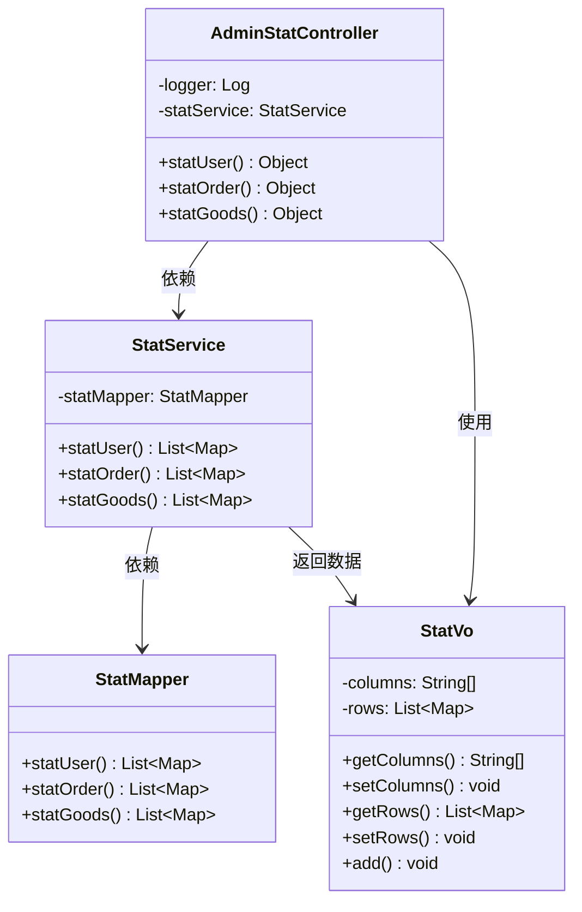
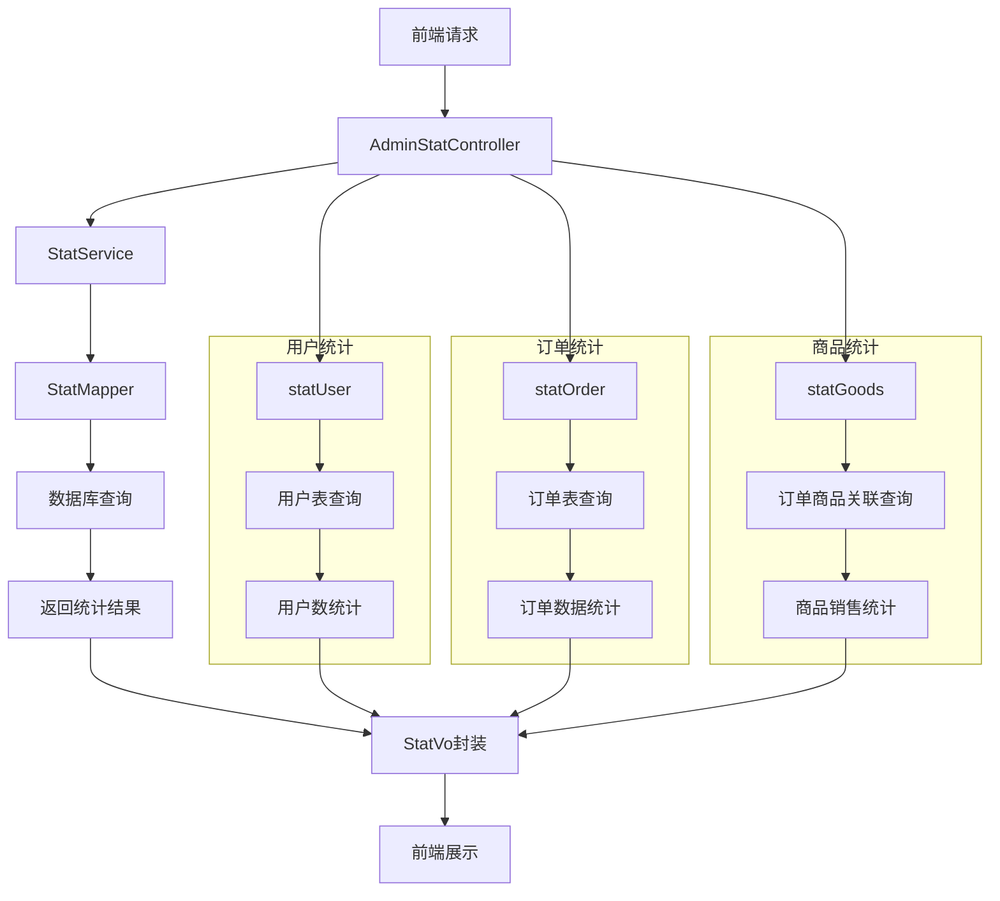

# 统计管理模块类图

## 模块概述
统计管理模块负责用户统计、订单统计、商品统计等数据分析功能，通过SQL查询生成统计报表。

## Mermaid类图



## 模块功能详细说明

### 控制器层 (AdminStatController) 详细功能

#### API接口设计规范
| 接口方法 | HTTP方法 | 路径 | 权限要求 | 请求参数 | 响应格式 |
|---------|---------|------|---------|---------|---------|
| statUser() | GET | /admin/stat/user | stat:user | 无 | StatVo对象 |
| statOrder() | GET | /admin/stat/order | stat:order | 无 | StatVo对象 |
| statGoods() | GET | /admin/stat/goods | stat:goods | 无 | StatVo对象 |

#### 权限控制机制
| 权限标识 | 权限描述 | 菜单关联 | 数据范围 | 访问频率 |
|---------|---------|---------|---------|---------|
| stat:user | 用户统计权限 | 统计管理菜单 | 全量用户数据 | 低频访问 |
| stat:order | 订单统计权限 | 统计管理菜单 | 全量订单数据 | 中频访问 |
| stat:goods | 商品统计权限 | 统计管理菜单 | 全量商品数据 | 中频访问 |

### 服务层 (StatService) 详细业务逻辑

#### 统计数据处理流程
| 处理步骤 | 业务逻辑 | 技术实现 | 数据转换 | 异常处理 |
|---------|---------|---------|---------|---------|
| 1. 参数验证 | 验证统计参数有效性 | 服务层验证 | 无 | 参数异常 |
| 2. 数据查询 | 调用Mapper执行SQL | MyBatis映射 | SQL结果集 | SQL异常 |
| 3. 数据封装 | 封装为StatVo对象 | Java对象转换 | Map到Vo | 数据转换异常 |
| 4. 结果返回 | 返回统计结果 | 直接返回 | Vo到JSON | 序列化异常 |

#### 统计维度扩展性设计
| 扩展维度 | 技术方案 | 数据源 | 计算复杂度 | 实施难度 |
|---------|---------|---------|---------|---------|
| 时间维度 | 日期分组统计 | 基础表时间字段 | 低 | 低 |
| 地域维度 | 按地区分组 | 用户地址信息 | 中 | 中 |
| 品类维度 | 按商品分类 | 商品分类表 | 中 | 中 |
| 用户维度 | 按用户属性 | 用户属性表 | 高 | 高 |

### 数据访问层 (StatMapper) SQL查询分析

#### 用户统计SQL详细分析
```sql
SELECT DATE(add_time) AS day, COUNT(*) AS users
FROM litemall_user
GROUP BY DATE(add_time)
ORDER BY day DESC
```

| SQL组件 | 作用说明 | 性能影响 | 优化建议 |
|---------|---------|---------|---------|
| DATE(add_time) | 日期格式化 | 中等 | 添加日期索引 |
| COUNT(*) | 计数统计 | 低 | 无优化需求 |
| GROUP BY | 分组统计 | 中等 | 确保分组字段有索引 |
| ORDER BY | 结果排序 | 低 | 无优化需求 |

#### 订单统计SQL详细分析
```sql
SELECT DATE(add_time) AS day, 
       COUNT(*) AS orders, 
       COUNT(DISTINCT user_id) AS customers, 
       SUM(actual_price) AS amount, 
       CASE WHEN COUNT(DISTINCT user_id) > 0 
            THEN SUM(actual_price) / COUNT(DISTINCT user_id) 
            ELSE 0 END AS pcr
FROM litemall_order
WHERE order_status IN (401, 402)
GROUP BY DATE(add_time)
ORDER BY day DESC
```

| SQL函数 | 计算逻辑 | 业务含义 | 性能考虑 |
|---------|---------|---------|---------|
| COUNT(*) | 订单总数 | 业务量指标 | 低开销 |
| COUNT(DISTINCT) | 去重计数 | 独立客户数 | 高开销 |
| SUM() | 金额汇总 | 营收指标 | 中等开销 |
| CASE WHEN | 条件计算 | 客单价计算 | 低开销 |

#### 商品统计SQL详细分析
```sql
SELECT DATE(o.add_time) AS day, 
       COUNT(*) AS orders, 
       SUM(og.number) AS products, 
       SUM(og.price * og.number) AS amount
FROM litemall_order o
JOIN litemall_order_goods og ON o.id = og.order_id
WHERE o.order_status IN (401, 402)
GROUP BY DATE(o.add_time)
ORDER BY day DESC
```

| 表关联 | 关联条件 | 数据量影响 | 优化策略 |
|---------|---------|---------|---------|
| litemall_order | 主订单表 | 中等数据量 | 订单状态索引 |
| litemall_order_goods | 订单商品表 | 较大数据量 | 订单ID索引 |
| JOIN操作 | 订单ID关联 | 关联查询开销 | 确保索引覆盖 |

### 视图对象 (StatVo) 数据结构详细分析

#### 数据字段定义
| 字段名 | 数据类型 | 是否必填 | 默认值 | 业务含义 |
|--------|---------|---------|-------|---------|
| columns | String[] | 是 | 无 | 统计维度列名 |
| rows | List<Map> | 是 | 空列表 | 统计数据行 |

#### 用户统计数据结构
| columns值 | 数据类型 | 统计含义 | 数据来源 | 展示格式 |
|-----------|---------|---------|---------|---------|
| "day" | String | 统计日期 | 用户注册时间 | YYYY-MM-DD |
| "users" | Integer | 用户数量 | 用户表计数 | 整数格式 |

#### 订单统计数据结构
| columns值 | 数据类型 | 统计含义 | 数据来源 | 展示格式 |
|-----------|---------|---------|---------|---------|
| "day" | String | 统计日期 | 订单创建时间 | YYYY-MM-DD |
| "orders" | Integer | 订单数量 | 订单表计数 | 整数格式 |
| "customers" | Integer | 客户数量 | 用户ID去重计数 | 整数格式 |
| "amount" | BigDecimal | 订单金额 | 实际价格汇总 | 货币格式 |
| "pcr" | BigDecimal | 客单价 | 金额/客户数 | 货币格式 |

#### 商品统计数据结构
| columns值 | 数据类型 | 统计含义 | 数据来源 | 展示格式 |
|-----------|---------|---------|---------|---------|
| "day" | String | 统计日期 | 订单创建时间 | YYYY-MM-DD |
| "orders" | Integer | 订单数量 | 订单表计数 | 整数格式 |
| "products" | Integer | 商品数量 | 订单商品数量汇总 | 整数格式 |
| "amount" | BigDecimal | 商品金额 | 商品价格×数量汇总 | 货币格式 |

## 统计查询性能优化分析

### 数据库索引设计建议
| 表名 | 索引字段 | 索引类型 | 适用场景 | 创建优先级 |
|------|---------|---------|---------|-----------|
| litemall_user | add_time | 普通索引 | 用户统计查询 | 高 |
| litemall_order | add_time, order_status | 复合索引 | 订单统计查询 | 高 |
| litemall_order | user_id, add_time | 复合索引 | 客户去重统计 | 中 |
| litemall_order_goods | order_id | 普通索引 | 商品统计关联 | 高 |

### 查询性能优化策略
| 优化策略 | 技术实现 | 预期效果 | 实施难度 | 风险控制 |
|---------|---------|---------|---------|---------|
| 数据预计算 | 定时任务生成统计表 | 查询性能提升90% | 中 | 数据同步风险 |
| 查询缓存 | Redis缓存统计结果 | 减少数据库压力 | 低 | 缓存更新策略 |
| 分表策略 | 按时间分表 | 解决单表过大 | 高 | 数据迁移风险 |
| 读写分离 | 主从数据库 | 提升并发能力 | 中 | 数据同步延迟 |

## 统计维度扩展方案

### 时间维度扩展
| 时间粒度 | SQL实现 | 前端展示 | 业务价值 | 实施优先级 |
|---------|---------|---------|---------|-----------|
| 按日统计 | GROUP BY DATE() | 折线图 | 日常监控 | 高 |
| 按周统计 | GROUP BY YEARWEEK() | 柱状图 | 周度分析 | 中 |
| 按月统计 | GROUP BY YEARMONTH() | 面积图 | 月度报告 | 中 |
| 按年统计 | GROUP BY YEAR() | 饼图 | 年度总结 | 低 |

### 业务维度扩展
| 业务维度 | 数据来源 | 统计指标 | 技术实现 | 业务意义 |
|---------|---------|---------|---------|---------|
| 商品分类 | 商品分类表 | 分类销售统计 | 多表关联 | 品类分析 |
| 用户等级 | 用户等级表 | 等级消费分析 | 用户关联 | 用户分层 |
| 地域分布 | 用户地址表 | 地域销售分析 | 地址解析 | 市场拓展 |
| 促销活动 | 活动记录表 | 活动效果统计 | 活动关联 | 营销评估 |

## 数据准确性保障措施

### 数据清洗规则
| 数据问题 | 清洗规则 | 处理时机 | 影响范围 | 监控指标 |
|---------|---------|---------|---------|---------|
| 重复数据 | 根据主键去重 | 统计前处理 | 计数准确性 | 重复率<0.1% |
| 异常数据 | 数值范围校验 | 统计前过滤 | 汇总准确性 | 异常数据率<0.5% |
| 缺失数据 | 默认值填充 | 统计时处理 | 完整性保障 | 缺失率<1% |
| 时间错误 | 时间格式校验 | 统计前校正 | 时间序列准确 | 时间错误率<0.01% |

### 统计一致性检查
| 检查项目 | 检查方法 | 检查频率 | 告警阈值 | 处理措施 |
|---------|---------|---------|---------|---------|
| 总数核对 | 与业务表总数对比 | 每日 | 差异>1% | 数据溯源 |
| 趋势异常 | 与历史数据对比 | 实时 | 波动>30% | 业务确认 |
| 逻辑校验 | 指标间逻辑关系 | 每次统计 | 逻辑错误 | 重新计算 |
| 数据时效 | 最后更新时间检查 | 每小时 | 延迟>1小时 | 告警通知 |

## SQL查询逻辑

### 用户统计 (statUser)
```sql
SELECT DATE(add_time) AS day, COUNT(*) AS users
FROM litemall_user
GROUP BY DATE(add_time)
```

### 订单统计 (statOrder)
```sql
SELECT DATE(add_time) AS day, 
       COUNT(*) AS orders, 
       COUNT(DISTINCT user_id) AS customers, 
       SUM(actual_price) AS amount,
       CASE WHEN COUNT(DISTINCT user_id) > 0 
            THEN SUM(actual_price) / COUNT(DISTINCT user_id) 
            ELSE 0 END AS pcr
FROM litemall_order
WHERE order_status IN (401, 402)
GROUP BY DATE(add_time)
```

### 商品统计 (statGoods)
```sql
SELECT DATE(o.add_time) AS day, 
       COUNT(*) AS orders, 
       SUM(og.number) AS products, 
       SUM(og.price * og.number) AS amount
FROM litemall_order o
JOIN litemall_order_goods og ON o.id = og.order_id
WHERE o.order_status IN (401, 402)
GROUP BY DATE(o.add_time)
```

## 数据流程图



## 统计维度说明

### 用户统计维度
- **day**: 统计日期
- **users**: 当日新增用户数

### 订单统计维度
- **day**: 统计日期
- **orders**: 当日订单数
- **customers**: 当日客户数
- **amount**: 当日订单金额
- **pcr**: 客单价（订单金额/客户数）

### 商品统计维度
- **day**: 统计日期
- **orders**: 当日订单数
- **products**: 当日销售商品数
- **amount**: 当日销售金额

## 权限控制
- 所有统计接口均使用`@RequiresPermissions`注解进行权限控制
- 对应权限标识：`admin:stat:user`、`admin:stat:order`、`admin:stat:goods`
- 菜单路径：统计管理 → 用户统计/订单统计/商品统计