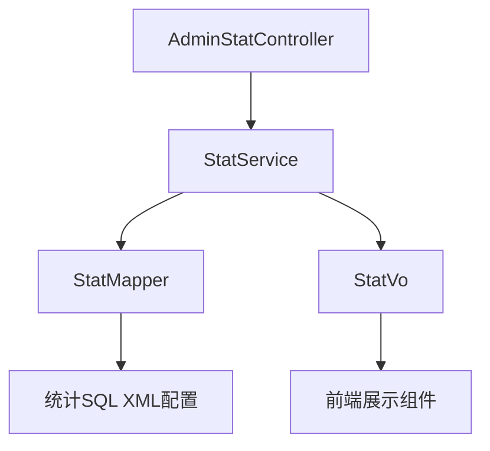
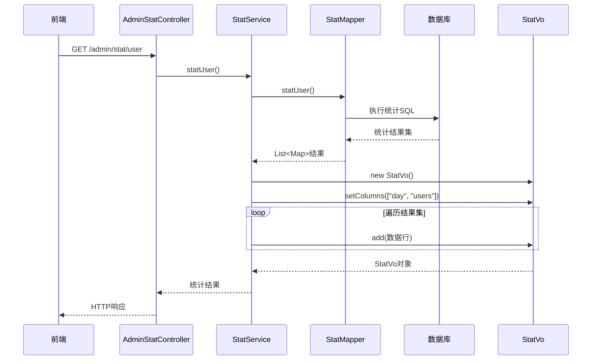

## 统计管理模块类设计

### 核心类结构

#### AdminStatController 类设计
```java
/**
 * 统计管理控制器类
 * 职责：处理统计相关的HTTP请求，包括用户统计、订单统计、商品统计
 */
@RestController
@RequestMapping("/admin/stat")
public class AdminStatController {
    
    @Autowired
    private StatService statService;
    
    @GetMapping("/user")
    public Object statUser() {
        return statService.statUser();
    }
    
    @GetMapping("/order")
    public Object statOrder() {
        return statService.statOrder();
    }
    
    @GetMapping("/goods")
    public Object statGoods() {
        return statService.statGoods();
    }
}
```

**设计特点：**
- **简洁性**：每个方法对应一个统计维度
- **统一性**：统一的响应格式和错误处理
- **可扩展性**：易于添加新的统计维度

#### StatService 类设计
```java
/**
 * 统计服务类
 * 职责：实现统计业务逻辑，调用Mapper执行SQL统计查询
 */
@Service
public class StatService {
    
    @Autowired
    private StatMapper statMapper;
    
    public StatVo statUser() {
        List<Map> statData = statMapper.statUser();
        return buildStatVo(statData, "day", "users");
    }
    
    public StatVo statOrder() {
        List<Map> statData = statMapper.statOrder();
        return buildStatVo(statData, "day", "orders", "customers", "amount", "pcr");
    }
    
    private StatVo buildStatVo(List<Map> statData, String... columns) {
        // 构建StatVo对象
    }
}
```

**设计特点：**
- **数据转换**：将数据库结果转换为前端需要的格式
- **业务封装**：隐藏复杂的SQL查询细节
- **结果标准化**：统一的统计结果格式

#### StatVo 类设计
```java
/**
 * 统计视图对象
 * 职责：封装统计结果，提供标准化的数据格式
 */
public class StatVo {
    
    private String[] columns;           // 统计维度列名
    private List<Map> rows;             // 统计数据行
    
    // 添加数据行的方法
    public void add(Map<String, Object> row) {
        rows.add(row);
    }
    
    // Getter/Setter方法
}
```

**设计特点：**
- **通用性**：适用于各种统计维度的数据封装
- **灵活性**：支持动态列和数据行
- **标准化**：统一的前端数据格式

### 类间关系分析

#### 依赖关系图


#### 调用关系分析
| 调用方 | 被调用方 | 调用方式 | 调用频率 | 数据流向 |
|--------|----------|----------|----------|----------|
| AdminStatController | StatService | 方法调用 | 中频 | 统计请求 → 统计结果 |
| StatService | StatMapper | 接口调用 | 中频 | 统计参数 → 数据库结果 |
| StatService | StatVo | 对象操作 | 高频 | 原始数据 → 标准化数据 |
| StatMapper | SQL XML | 配置调用 | 高频 | 查询条件 → SQL执行 |

### 设计模式应用

#### 模板方法模式 - 统计处理流程
```java
// 统计处理模板
public abstract class AbstractStatProcessor {
    
    // 模板方法
    public final StatVo process() {
        validateParameters();
        List<Map> rawData = executeQuery();
        StatVo result = transformData(rawData);
        return postProcess(result);
    }
    
    protected abstract void validateParameters();
    protected abstract List<Map> executeQuery();
    protected abstract StatVo transformData(List<Map> rawData);
    protected StatVo postProcess(StatVo result) {
        // 默认后处理逻辑
        return result;
    }
}

// 用户统计处理器
@Component
public class UserStatProcessor extends AbstractStatProcessor {
    @Override
    protected void validateParameters() {
        // 用户统计参数验证
    }
    
    @Override
    protected List<Map> executeQuery() {
        return statMapper.statUser();
    }
    
    @Override
    protected StatVo transformData(List<Map> rawData) {
        // 用户统计数据转换
    }
}
```

#### 装饰器模式 - 统计结果增强
```java
// 统计结果装饰器接口
public interface StatVoDecorator {
    StatVo decorate(StatVo original);
}

// 数据格式化装饰器
@Component
public class DataFormatDecorator implements StatVoDecorator {
    @Override
    public StatVo decorate(StatVo original) {
        // 对统计结果进行格式化处理
        return formattedStatVo;
    }
}

// 缓存装饰器
@Component
public class CacheDecorator implements StatVoDecorator {
    @Override
    public StatVo decorate(StatVo original) {
        // 添加缓存逻辑
        return cachedStatVo;
    }
}
```

## 模块间调用关系

### 跨模块调用分析

| 调用场景 | 目标模块 | 调用方式 | 数据依赖 | 耦合度 |
|----------|----------|----------|----------|--------|
| 用户数据统计 | 用户管理模块 | 直接SQL查询 | 用户表数据 | 高 |
| 订单数据统计 | 订单管理模块 | 直接SQL查询 | 订单表数据 | 高 |
| 商品销售统计 | 商品管理模块 | 关联查询 | 商品和订单关联数据 | 高 |

### 调用时序分析



## 设计原则遵循情况

### SOLID原则评估

#### 单一职责原则 (SRP)
| 类名 | 职责数量 | 符合程度 | 改进建议 |
|------|----------|----------|----------|
| AdminGoodsController | 1个（HTTP请求处理） | 优秀 | 无 |
| AdminGoodsService | 多个（业务逻辑处理） | 一般 | 按功能拆分 |
| GoodsAllinone | 1个（数据传输） | 优秀 | 无 |
| StatService | 多个（统计业务处理） | 一般 | 按统计维度拆分 |

#### 开闭原则 (OCP)
| 模块 | 扩展性 | 符合程度 | 改进建议 |
|------|--------|----------|----------|
| 商品管理模块 | 中等（通过服务扩展） | 良好 | 增加策略模式 |
| 统计管理模块 | 良好（易于添加新统计） | 优秀 | 无 |

#### 里氏替换原则 (LSP)
| 继承关系 | 替换性 | 符合程度 | 改进建议 |
|----------|--------|----------|----------|
| 暂无明显继承关系 | 不适用 | 优秀 | 无 |

#### 接口隔离原则 (ISP)
| 接口设计 | 客户端依赖 | 符合程度 | 改进建议 |
|----------|------------|----------|----------|
| Mapper接口 | 最小依赖 | 优秀 | 无 |
| Service接口 | 部分臃肿 | 一般 | 接口拆分 |

#### 依赖倒置原则 (DIP)
| 依赖关系 | 抽象程度 | 符合程度 | 改进建议 |
|----------|----------|----------|----------|
| Controller→Service | 依赖接口 | 优秀 | 无 |
| Service→Mapper | 依赖接口 | 优秀 | 无 |