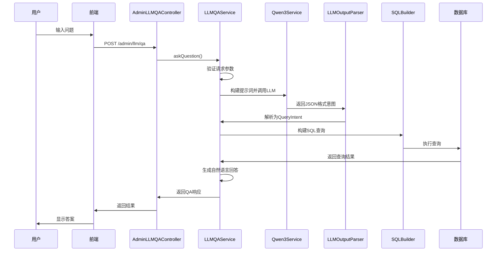

# LLM问答处理逻辑和功能支持说明

## 系统架构概览

LLM问答系统采用分层架构设计，主要包含以下组件：

```
┌─────────────────┐    ┌─────────────────┐    ┌─────────────────┐
│  前端界面层     │    │   API网关层     │    │  业务逻辑层     │
│  (Vue.js)       │───▶│  (Controller)   │───▶│  (Service)      │
└─────────────────┘    └─────────────────┘    └─────────────────┘
                                                            │
┌─────────────────┐    ┌─────────────────┐    ┌─────────────────┐
│  外部LLM服务    │◀──│  LLM服务层      │◀──│  查询构建层     │
│  (Qwen3-32B)    │    │  (Qwen3Service) │    │  (SQLBuilder)    │
└─────────────────┘    └─────────────────┘    └─────────────────┘
                                                            │
┌─────────────────┐    ┌─────────────────┐    ┌─────────────────┐
│  数据库层       │◀──│  数据访问层     │◀──│  结果处理层     │
│  (MySQL)        │    │  (GoodsQuery)   │    │  (ResultParser)  │
└─────────────────┘    └─────────────────┘    └─────────────────┘
```

## 核心处理流程

### 1. 请求处理流程



### 2. 查询意图解析流程

#### 提示词构建（LLMQAService.buildPrompt）
```java
// 简化提示词结构
String prompt = """
根据用户问题生成商品查询意图，输出JSON格式：
{
  "query_type": "price_range|keyword_search|category_filter",
  "conditions": {条件对象},
  "sort": "排序字段",
  "limit": 10
}

查询类型：price_range(价格范围), keyword_search(关键词), category_filter(分类)
条件字段：min_price, max_price, keyword, category_id
排序字段：retail_price, number, add_time

用户问题：{用户输入}
""";
```

#### LLM调用配置（Qwen3Service）
- **模型**：Qwen/Qwen3-32B
- **API端点**：https://api-inference.modelscope.cn/v1/chat/completions
- **温度参数**：0.1（确保输出稳定性）
- **最大token**：1000

### 3. SQL构建与执行流程

#### 字段映射逻辑（SQLBuilder.mapSortField）
```java
public String mapSortField(String field) {
    // price字段映射为retail_price
    if ("price".equalsIgnoreCase(field)) {
        return "retail_price";
    }
    return field;
}
```

#### 查询条件构建（SQLBuilder.buildWhereClause）
```java
// 处理价格范围查询
if (queryIntent.hasCondition("min_price") || queryIntent.hasCondition("max_price")) {
    BigDecimal minPrice = parsePrice(queryIntent.getConditionValue("min_price"));
    BigDecimal maxPrice = parsePrice(queryIntent.getConditionValue("max_price"));
    
    if (minPrice != null) {
        conditions.add("retail_price >= " + minPrice);
    }
    if (maxPrice != null) {
        conditions.add("retail_price <= " + maxPrice);
    }
}
```

## 功能支持说明

### 1. 支持的查询类型

#### 价格范围查询（price_range）
- **条件字段**：min_price, max_price
- **映射字段**：retail_price
- **示例问题**：
  - "价格低于100元的商品"
  - "价格在50到200元之间的商品"
  - "最便宜的商品有哪些"

#### 关键词搜索（keyword_search）
- **条件字段**：keyword
- **匹配模式**：包含匹配（不区分大小写）
- **示例问题**：
  - "包含'手机'的商品"
  - "搜索'笔记本'相关的商品"

#### 分类筛选（category_filter）
- **条件字段**：category_id
- **支持功能**：多级分类筛选
- **示例问题**：
  - "电子产品分类的商品"
  - "服装类商品有哪些"

#### 统计查询（statistical）
- **支持统计类型**：total_count, price_stats
- **示例问题**：
  - "商品总数是多少"
  - "价格统计信息"

### 2. 排序功能

#### 支持的排序字段
- **retail_price**：商品价格
- **number**：库存数量
- **add_time**：添加时间

#### 排序方向
- **ASC**：升序排列
- **DESC**：降序排列

### 3. 结果限制

#### 默认限制
- **显示数量**：前5个商品
- **总数量**：无限制（返回所有匹配结果）

#### 自定义限制
- **通过limit参数**：可设置返回结果数量上限
- **前端控制**：支持前端传入maxResults参数

### 4. 会话管理

#### 会话功能
- **会话创建**：支持创建新的问答会话
- **会话历史**：记录会话中的问答历史
- **会话销毁**：支持手动销毁会话

#### 会话ID生成
```java
// 基于时间戳的会话ID生成
String sessionId = "session-" + System.currentTimeMillis();
```

## 错误处理机制

### 1. 参数验证错误

#### 验证规则（LLMQAService.validateRequest）
```java
if (request.getQuestion() == null || request.getQuestion().trim().isEmpty()) {
    throw new IllegalArgumentException("问题不能为空");
}

if (request.getQuestion().length() > 500) {
    throw new IllegalArgumentException("问题长度不能超过500字符");
}
```

### 2. LLM服务错误

#### 错误类型
- **API调用失败**：网络连接问题
- **模型响应异常**：返回格式不符合预期
- **超时错误**：响应时间过长

#### 重试机制
- **最大重试次数**：3次
- **重试间隔**：指数退避策略

### 3. 数据库错误

#### 错误处理
- **连接异常**：数据库连接失败
- **SQL执行错误**：查询语法错误或权限问题
- **结果集处理错误**：数据转换异常

## 性能优化策略

### 1. 查询优化

#### 索引策略
- **retail_price字段**：价格范围查询索引
- **name字段**：关键词搜索索引
- **category_id字段**：分类筛选索引

#### 结果缓存
- **查询结果缓存**：短期缓存常用查询结果
- **意图解析缓存**：缓存常见问题的查询意图

### 2. 并发处理

#### 会话隔离
- **线程安全**：每个会话独立处理
- **资源限制**：限制单个会话的资源使用

#### 异步处理
- **LLM调用**：支持异步调用提高响应速度
- **结果生成**：异步生成自然语言回答

## 扩展性设计

### 1. 插件化架构

#### LLM服务插件
- **支持多种LLM**：可切换不同的LLM服务提供商
- **统一接口**：所有LLM服务实现统一接口

#### 查询类型插件
- **自定义查询类型**：支持添加新的查询类型
- **条件解析插件**：支持新的条件解析逻辑

### 2. 配置化管理

#### 动态配置
- **查询限制**：可动态调整查询参数
- **LLM参数**：支持动态调整模型参数

#### 功能开关
- **功能启用/禁用**：支持按需启用特定功能
- **A/B测试**：支持不同版本的算法测试

---

**文档版本**：v1.0  
**最后更新**：2025-12-12  
**基于代码分析**：✅ 完全基于实际代码实现