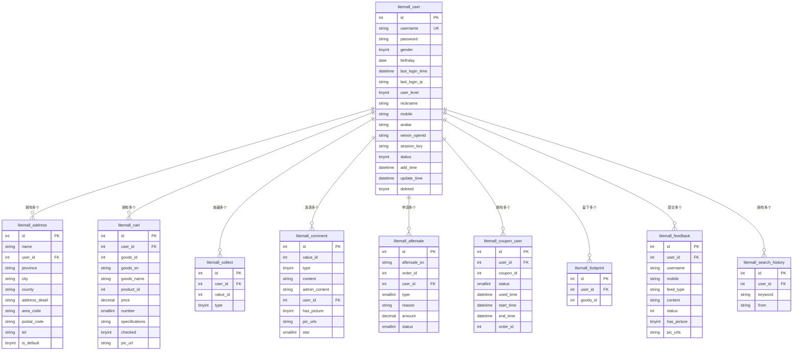

# 用户表E-R图

## 概述
本文档描述了litemall系统中用户表(`litemall_user`)的实体关系图，包括用户表本身的属性以及与其他表的关联关系。

## 用户表实体 (litemall_user)

### 基本属性
| 字段名 | 数据类型 | 约束 | 描述 |
|--------|----------|------|------|
| id | int(11) | PRIMARY KEY, AUTO_INCREMENT | 用户ID |
| username | varchar(63) | NOT NULL, UNIQUE | 用户名称 |
| password | varchar(63) | NOT NULL, DEFAULT '' | 用户密码 |
| gender | tinyint(3) | NOT NULL, DEFAULT 0 | 性别：0 未知，1 男，2 女 |
| birthday | date | NULLABLE | 生日 |
| last_login_time | datetime | NULLABLE | 最近一次登录时间 |
| last_login_ip | varchar(63) | NOT NULL, DEFAULT '' | 最近一次登录IP地址 |
| user_level | tinyint(3) | DEFAULT 0 | 用户等级：0 普通用户，1 VIP用户，2 高级VIP用户 |
| nickname | varchar(63) | NOT NULL, DEFAULT '' | 用户昵称或网络名称 |
| mobile | varchar(20) | NOT NULL, DEFAULT '' | 用户手机号码 |
| avatar | varchar(255) | NOT NULL, DEFAULT '' | 用户头像图片 |
| weixin_openid | varchar(63) | NOT NULL, DEFAULT '' | 微信登录openid |
| session_key | varchar(100) | NOT NULL, DEFAULT '' | 微信登录会话KEY |
| status | tinyint(3) | NOT NULL, DEFAULT 0 | 状态：0 可用，1 禁用，2 注销 |
| add_time | datetime | NULLABLE | 创建时间 |
| update_time | datetime | NULLABLE | 更新时间 |
| deleted | tinyint(1) | DEFAULT 0 | 逻辑删除标志 |

## 关联表及关系

### 1. 收货地址表 (litemall_address)
**关系类型**: 一对多 (1:N)  
**关联字段**: `user_id` → `litemall_user.id`

| 字段名 | 数据类型 | 描述 |
|--------|----------|------|
| id | int(11) | 地址ID |
| name | varchar(63) | 收货人名称 |
| user_id | int(11) | 用户ID (外键) |
| province | varchar(63) | 省ID |
| city | varchar(63) | 市ID |
| county | varchar(63) | 区县ID |
| address_detail | varchar(127) | 详细地址 |
| area_code | char(6) | 地区编码 |
| postal_code | char(6) | 邮政编码 |
| tel | varchar(20) | 手机号码 |
| is_default | tinyint(1) | 是否默认地址 |

### 2. 购物车表 (litemall_cart)
**关系类型**: 一对多 (1:N)  
**关联字段**: `user_id` → `litemall_user.id`

| 字段名 | 数据类型 | 描述 |
|--------|----------|------|
| id | int(11) | 购物车ID |
| user_id | int(11) | 用户ID (外键) |
| goods_id | int(11) | 商品ID |
| goods_sn | varchar(63) | 商品编号 |
| goods_name | varchar(127) | 商品名称 |
| product_id | int(11) | 货品ID |
| price | decimal(10,2) | 商品价格 |
| number | smallint(5) | 商品数量 |
| specifications | varchar(1023) | 商品规格 |
| checked | tinyint(1) | 是否选中 |
| pic_url | varchar(255) | 商品图片 |

### 3. 收藏表 (litemall_collect)
**关系类型**: 一对多 (1:N)  
**关联字段**: `user_id` → `litemall_user.id`

| 字段名 | 数据类型 | 描述 |
|--------|----------|------|
| id | int(11) | 收藏ID |
| user_id | int(11) | 用户ID (外键) |
| value_id | int(11) | 商品ID或专题ID |
| type | tinyint(3) | 收藏类型：0商品，1专题 |

### 4. 评论表 (litemall_comment)
**关系类型**: 一对多 (1:N)  
**关联字段**: `user_id` → `litemall_user.id`

| 字段名 | 数据类型 | 描述 |
|--------|----------|------|
| id | int(11) | 评论ID |
| value_id | int(11) | 商品ID或专题ID |
| type | tinyint(3) | 评论类型：0商品，1专题 |
| content | varchar(1023) | 评论内容 |
| admin_content | varchar(511) | 管理员回复 |
| user_id | int(11) | 用户ID (外键) |
| has_picture | tinyint(1) | 是否含有图片 |
| pic_urls | varchar(1023) | 图片地址列表 |
| star | smallint(6) | 评分 (1-5) |

### 5. 售后表 (litemall_aftersale)
**关系类型**: 一对多 (1:N)  
**关联字段**: `user_id` → `litemall_user.id`

| 字段名 | 数据类型 | 描述 |
|--------|----------|------|
| id | int(11) | 售后ID |
| aftersale_sn | varchar(63) | 售后编号 |
| order_id | int(11) | 订单ID |
| user_id | int(11) | 用户ID (外键) |
| type | smallint(6) | 售后类型 |
| reason | varchar(31) | 退款原因 |
| amount | decimal(10,2) | 退款金额 |
| status | smallint(6) | 售后状态 |

### 6. 优惠券用户使用表 (litemall_coupon_user)
**关系类型**: 一对多 (1:N)  
**关联字段**: `user_id` → `litemall_user.id`

| 字段名 | 数据类型 | 描述 |
|--------|----------|------|
| id | int(11) | 用户优惠券ID |
| user_id | int(11) | 用户ID (外键) |
| coupon_id | int(11) | 优惠券ID |
| status | smallint(6) | 使用状态 |
| used_time | datetime | 使用时间 |
| start_time | datetime | 有效期开始时间 |
| end_time | datetime | 有效期结束时间 |
| order_id | int(11) | 订单ID |

### 7. 用户足迹表 (litemall_footprint)
**关系类型**: 一对多 (1:N)  
**关联字段**: `user_id` → `litemall_user.id`

| 字段名 | 数据类型 | 描述 |
|--------|----------|------|
| id | int(11) | 足迹ID |
| user_id | int(11) | 用户ID (外键) |
| goods_id | int(11) | 商品ID |

### 8. 意见反馈表 (litemall_feedback)
**关系类型**: 一对多 (1:N)  
**关联字段**: `user_id` → `litemall_user.id`

| 字段名 | 数据类型 | 描述 |
|--------|----------|------|
| id | int(11) | 反馈ID |
| user_id | int(11) | 用户ID (外键) |
| username | varchar(63) | 用户名称 |
| mobile | varchar(20) | 手机号 |
| feed_type | varchar(63) | 反馈类型 |
| content | varchar(1023) | 反馈内容 |
| status | int(3) | 状态 |
| has_picture | tinyint(1) | 是否含有图片 |
| pic_urls | varchar(1023) | 图片地址列表 |

### 9. 搜索历史表 (litemall_search_history)
**关系类型**: 一对多 (1:N)  
**关联字段**: `user_id` → `litemall_user.id`

| 字段名 | 数据类型 | 描述 |
|--------|----------|------|
| id | int(11) | 搜索历史ID |
| user_id | int(11) | 用户ID (外键) |
| keyword | varchar(63) | 搜索关键字 |
| from | varchar(63) | 搜索来源 |

## E-R关系图

## 总结

用户表是litemall系统的核心实体之一，与多个业务表存在一对多的关联关系。主要包括：

1. **个人信息管理**: 用户基本信息、收货地址
2. **购物行为**: 购物车、收藏、浏览足迹、搜索历史
3. **交易相关**: 评论、售后、优惠券使用
4. **反馈互动**: 意见反馈

所有关联表都通过`user_id`字段与用户表建立外键关系，实现数据的完整性和一致性。