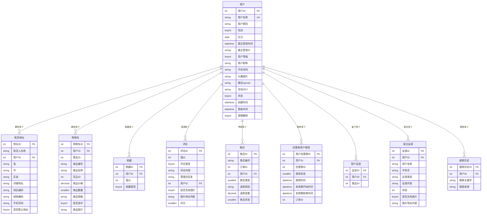

# 用户实体关系图（中文版）

## 概述
本文档描述了系统中用户实体的关系图，包括用户实体本身的属性以及与其他实体的关联关系。

## 用户实体

### 基本属性
| 字段名 | 数据类型 | 约束 | 描述 |
|--------|----------|------|------|
| 用户ID | int(11) | 主键, 自增 | 用户唯一标识 |
| 用户名称 | varchar(63) | 非空, 唯一 | 用户登录名称 |
| 用户密码 | varchar(63) | 非空, 默认空 | 用户登录密码 |
| 性别 | tinyint(3) | 非空, 默认0 | 性别：0 未知，1 男，2 女 |
| 生日 | date | 可空 | 用户生日 |
| 最近登录时间 | datetime | 可空 | 最近一次登录时间 |
| 最近登录IP | varchar(63) | 非空, 默认空 | 最近一次登录IP地址 |
| 用户等级 | tinyint(3) | 默认0 | 用户等级：0 普通用户，1 VIP用户，2 高级VIP用户 |
| 用户昵称 | varchar(63) | 非空, 默认空 | 用户昵称或网络名称 |
| 手机号码 | varchar(20) | 非空, 默认空 | 用户手机号码 |
| 头像图片 | varchar(255) | 非空, 默认空 | 用户头像图片 |
| 微信openid | varchar(63) | 非空, 默认空 | 微信登录openid |
| 会话KEY | varchar(100) | 非空, 默认空 | 微信登录会话KEY |
| 状态 | tinyint(3) | 非空, 默认0 | 状态：0 可用，1 禁用，2 注销 |
| 创建时间 | datetime | 可空 | 用户创建时间 |
| 更新时间 | datetime | 可空 | 用户信息更新时间 |
| 逻辑删除 | tinyint(1) | 默认0 | 逻辑删除标志 |

## 关联实体及关系

### 1. 收货地址实体
**关系类型**: 一对多 (1:N)  
**关联字段**: `用户ID` → `用户.用户ID`

| 字段名 | 数据类型 | 描述 |
|--------|----------|------|
| 地址ID | int(11) | 地址唯一标识 |
| 收货人名称 | varchar(63) | 收货人姓名 |
| 用户ID | int(11) | 用户ID (外键) |
| 省 | varchar(63) | 省份信息 |
| 市 | varchar(63) | 城市信息 |
| 区县 | varchar(63) | 区县信息 |
| 详细地址 | varchar(127) | 详细地址信息 |
| 地区编码 | char(6) | 地区编码 |
| 邮政编码 | char(6) | 邮政编码 |
| 手机号码 | varchar(20) | 联系电话 |
| 是否默认地址 | tinyint(1) | 是否为默认地址 |

### 2. 购物车实体
**关系类型**: 一对多 (1:N)  
**关联字段**: `用户ID` → `用户.用户ID`

| 字段名 | 数据类型 | 描述 |
|--------|----------|------|
| 购物车ID | int(11) | 购物车唯一标识 |
| 用户ID | int(11) | 用户ID (外键) |
| 商品ID | int(11) | 商品唯一标识 |
| 商品编号 | varchar(63) | 商品编号 |
| 商品名称 | varchar(127) | 商品名称 |
| 货品ID | int(11) | 货品唯一标识 |
| 商品价格 | decimal(10,2) | 商品价格 |
| 商品数量 | smallint(5) | 商品数量 |
| 商品规格 | varchar(1023) | 商品规格信息 |
| 是否选中 | tinyint(1) | 是否选中状态 |
| 商品图片 | varchar(255) | 商品图片地址 |

### 3. 收藏实体
**关系类型**: 一对多 (1:N)  
**关联字段**: `用户ID` → `用户.用户ID`

| 字段名 | 数据类型 | 描述 |
|--------|----------|------|
| 收藏ID | int(11) | 收藏唯一标识 |
| 用户ID | int(11) | 用户ID (外键) |
| 值ID | int(11) | 商品ID或专题ID |
| 收藏类型 | tinyint(3) | 收藏类型：0商品，1专题 |

### 4. 评论实体
**关系类型**: 一对多 (1:N)  
**关联字段**: `用户ID` → `用户.用户ID`

| 字段名 | 数据类型 | 描述 |
|--------|----------|------|
| 评论ID | int(11) | 评论唯一标识 |
| 值ID | int(11) | 商品ID或专题ID |
| 评论类型 | tinyint(3) | 评论类型：0商品，1专题 |
| 评论内容 | varchar(1023) | 评论内容 |
| 管理员回复 | varchar(511) | 管理员回复内容 |
| 用户ID | int(11) | 用户ID (外键) |
| 是否含有图片 | tinyint(1) | 是否包含图片 |
| 图片地址列表 | varchar(1023) | 图片地址列表 |
| 评分 | smallint(6) | 评分 (1-5) |

### 5. 售后实体
**关系类型**: 一对多 (1:N)  
**关联字段**: `用户ID` → `用户.用户ID`

| 字段名 | 数据类型 | 描述 |
|--------|----------|------|
| 售后ID | int(11) | 售后唯一标识 |
| 售后编号 | varchar(63) | 售后编号 |
| 订单ID | int(11) | 订单ID |
| 用户ID | int(11) | 用户ID (外键) |
| 售后类型 | smallint(6) | 售后类型 |
| 退款原因 | varchar(31) | 退款原因 |
| 退款金额 | decimal(10,2) | 退款金额 |
| 售后状态 | smallint(6) | 售后状态 |

### 6. 优惠券用户使用实体
**关系类型**: 一对多 (1:N)  
**关联字段**: `用户ID` → `用户.用户ID`

| 字段名 | 数据类型 | 描述 |
|--------|----------|------|
| 用户优惠券ID | int(11) | 用户优惠券唯一标识 |
| 用户ID | int(11) | 用户ID (外键) |
| 优惠券ID | int(11) | 优惠券ID |
| 使用状态 | smallint(6) | 使用状态 |
| 使用时间 | datetime | 使用时间 |
| 有效期开始时间 | datetime | 有效期开始时间 |
| 有效期结束时间 | datetime | 有效期结束时间 |
| 订单ID | int(11) | 订单ID |

### 7. 用户足迹实体
**关系类型**: 一对多 (1:N)  
**关联字段**: `用户ID` → `用户.用户ID`

| 字段名 | 数据类型 | 描述 |
|--------|----------|------|
| 足迹ID | int(11) | 足迹唯一标识 |
| 用户ID | int(11) | 用户ID (外键) |
| 商品ID | int(11) | 商品ID |

### 8. 意见反馈实体
**关系类型**: 一对多 (1:N)  
**关联字段**: `用户ID` → `用户.用户ID`

| 字段名 | 数据类型 | 描述 |
|--------|----------|------|
| 反馈ID | int(11) | 反馈唯一标识 |
| 用户ID | int(11) | 用户ID (外键) |
| 用户名称 | varchar(63) | 用户名称 |
| 手机号 | varchar(20) | 手机号 |
| 反馈类型 | varchar(63) | 反馈类型 |
| 反馈内容 | varchar(1023) | 反馈内容 |
| 状态 | int(3) | 状态 |
| 是否含有图片 | tinyint(1) | 是否包含图片 |
| 图片地址列表 | varchar(1023) | 图片地址列表 |

### 9. 搜索历史实体
**关系类型**: 一对多 (1:N)  
**关联字段**: `用户ID` → `用户.用户ID`

| 字段名 | 数据类型 | 描述 |
|--------|----------|------|
| 搜索历史ID | int(11) | 搜索历史唯一标识 |
| 用户ID | int(11) | 用户ID (外键) |
| 搜索关键字 | varchar(63) | 搜索关键字 |
| 搜索来源 | varchar(63) | 搜索来源 |

## E-R关系图

## 总结

用户实体是系统的核心实体之一，与多个业务实体存在一对多的关联关系。主要包括：

1. **个人信息管理**: 用户基本信息、收货地址
2. **购物行为**: 购物车、收藏、浏览足迹、搜索历史
3. **交易相关**: 评论、售后、优惠券使用
4. **反馈互动**: 意见反馈

所有关联实体都通过`用户ID`字段与用户实体建立外键关系，实现数据的完整性和一致性。