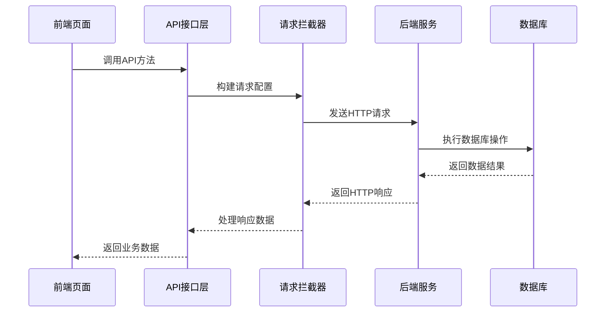
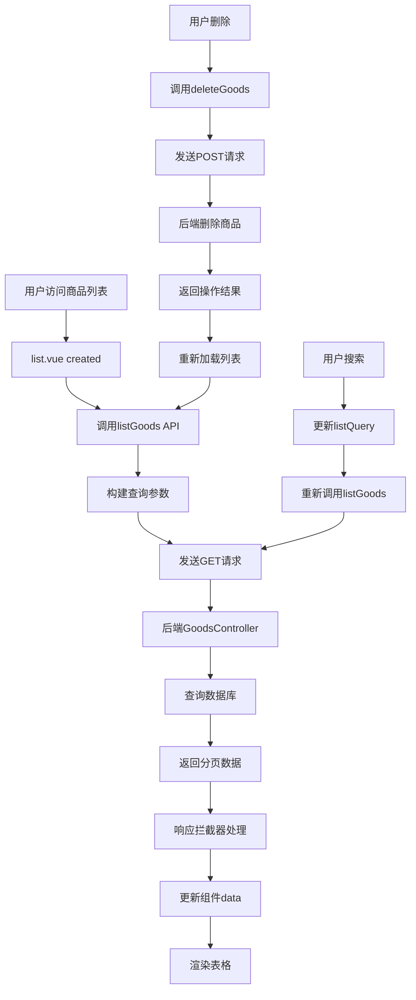
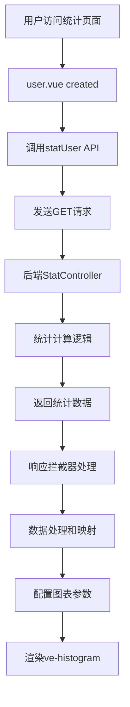

# 前后端API对应关系分析

## 概述

本文档详细分析litemall项目前端与后端在商品管理和统计管理模块中的API交互关系，包括接口定义、参数传递、响应处理等。

## 一、API架构概览

### 1.1 整体API交互流程



### 1.2 API分层架构

| 层级 | 组件 | 职责 | 示例 |
|------|------|------|------|
| **表现层** | Vue组件 | 用户交互、数据展示 | list.vue, user.vue |
| **接口层** | API模块 | 接口定义、参数处理 | goods.js, stat.js |
| **网络层** | 请求工具 | HTTP请求、拦截处理 | request.js |
| **服务层** | 后端Controller | 业务逻辑处理 | GoodsController.java |
| **数据层** | 数据库 | 数据持久化 | MySQL |

## 二、商品管理模块API分析

### 2.1 商品列表相关API

#### 2.1.1 前端API定义

```javascript
// src/api/goods.js - 商品列表接口
export function listGoods(query) {
  return request({
    url: '/goods/list',
    method: 'get',
    params: query
  })
}
```

#### 2.1.2 后端接口对应

| 前端调用 | 后端接口 | HTTP方法 | 参数说明 | 响应格式 |
|---------|---------|----------|----------|----------|
| `listGoods(query)` | `/goods/list` | GET | 分页查询参数 | 分页商品数据 |

#### 2.1.3 参数映射关系

```javascript
// 前端查询参数结构
const listQuery = {
  page: 1,        // 当前页码
  limit: 20,      // 每页数量
  goodsId: undefined,  // 商品ID筛选
  goodsSn: undefined,  // 商品编号筛选
  name: undefined,     // 商品名称筛选
  sort: '+id'          // 排序字段
}

// 后端接收参数结构
// GoodsController.java
@GetMapping("/list")
public Object list(
    @RequestParam(defaultValue = "1") Integer page,
    @RequestParam(defaultValue = "10") Integer limit,
    @RequestParam(required = false) String sort,
    @RequestParam(required = false) String order,
    @RequestParam(required = false) Integer goodsId,
    @RequestParam(required = false) String goodsSn,
    @RequestParam(required = false) String name
) {
    // 业务逻辑处理
}
```

#### 2.1.4 响应数据格式

```json
// 后端响应数据格式
{
  "errno": 0,
  "errmsg": "成功",
  "data": {
    "total": 100,
    "pages": 5,
    "limit": 20,
    "page": 1,
    "list": [
      {
        "id": 1,
        "name": "商品名称",
        "goodsSn": "G001",
        "categoryId": 1,
        "brandId": 1,
        "gallery": [],
        "keywords": "",
        "brief": "商品简介",
        "isOnSale": true,
        "picUrl": "",
        "shareUrl": "",
        "isNew": true,
        "isHot": false,
        "unit": "件",
        "counterPrice": 100.00,
        "retailPrice": 80.00,
        "detail": "商品详情",
        "addTime": "2023-01-01 00:00:00",
        "updateTime": "2023-01-01 00:00:00",
        "deleted": false
      }
    ]
  }
}
```

### 2.2 商品删除相关API

#### 2.2.1 前端API定义

```javascript
// src/api/goods.js - 商品删除接口
export function deleteGoods(data) {
  return request({
    url: '/goods/delete',
    method: 'post',
    data
  })
}
```

#### 2.2.2 后端接口对应

| 前端调用 | 后端接口 | HTTP方法 | 参数说明 | 响应格式 |
|---------|---------|----------|----------|----------|
| `deleteGoods(data)` | `/goods/delete` | POST | 商品ID | 操作结果 |

#### 2.2.3 参数传递示例

```javascript
// 前端调用示例
methods: {
  handleDelete(row) {
    deleteGoods({ id: row.id }).then(response => {
      // 处理删除成功逻辑
    })
  }
}

// 后端接收参数
// GoodsController.java
@PostMapping("/delete")
public Object delete(@RequestBody Goods goods) {
    // 根据goods.id执行删除逻辑
}
```

### 2.3 商品创建/编辑相关API

#### 2.3.1 前端API定义

```javascript
// src/api/goods.js - 商品创建接口
export function createGoods(data) {
  return request({
    url: '/goods/create',
    method: 'post',
    data
  })
}

// 商品编辑接口
export function updateGoods(data) {
  return request({
    url: '/goods/update',
    method: 'post',
    data
  })
}
```

#### 2.3.2 后端接口对应

| 前端调用 | 后端接口 | HTTP方法 | 参数说明 | 响应格式 |
|---------|---------|----------|----------|----------|
| `createGoods(data)` | `/goods/create` | POST | 商品完整数据 | 创建结果 |
| `updateGoods(data)` | `/goods/update` | POST | 商品更新数据 | 更新结果 |

#### 2.3.3 数据传递结构

```javascript
// 前端提交数据结构
const submitData = {
  goods: {
    name: "商品名称",
    goodsSn: "G001",
    categoryId: 1,
    // ... 其他商品字段
  },
  specifications: [
    {
      specification: "颜色",
      value: "红色",
      picUrl: ""
    }
  ],
  attributes: [
    {
      attribute: "材质",
      value: "棉"
    }
  ],
  products: [
    {
      id: 0,
      specifications: [],
      price: 100.00,
      number: 100,
      url: ""
    }
  ]
}
```

## 三、统计管理模块API分析

### 3.1 用户统计相关API

#### 3.1.1 前端API定义

```javascript
// src/api/stat.js - 用户统计接口
export function statUser() {
  return request({
    url: '/stat/user',
    method: 'get'
  })
}
```

#### 3.1.2 后端接口对应

| 前端调用 | 后端接口 | HTTP方法 | 参数说明 | 响应格式 |
|---------|---------|----------|----------|----------|
| `statUser()` | `/stat/user` | GET | 无参数 | 用户统计数据 |

#### 3.1.3 响应数据格式

```json
// 后端响应数据格式
{
  "errno": 0,
  "errmsg": "成功",
  "data": {
    "rows": [
      {
        "day": "2023-01-01",
        "users": 10
      },
      {
        "day": "2023-01-02", 
        "users": 15
      }
    ]
  }
}
```

#### 3.1.4 前端数据处理

```javascript
// 前端数据处理逻辑
methods: {
  getStatData() {
    statUser().then(response => {
      const data = response.data.data
      
      // 列名映射（英文转中文）
      const labelMap = {
        'day': '日期',
        'users': '用户数'
      }
      
      // 构建图表数据
      this.chartData = {
        columns: Object.keys(data.rows[0] || {}).map(key => labelMap[key] || key),
        rows: data.rows.map(row => {
          const newRow = {}
          Object.keys(row).forEach(key => {
            newRow[labelMap[key] || key] = row[key]
          })
          return newRow
        })
      }
    })
  }
}
```

### 3.2 订单统计相关API

#### 3.2.1 前端API定义

```javascript
// src/api/stat.js - 订单统计接口
export function statOrder() {
  return request({
    url: '/stat/order',
    method: 'get'
  })
}
```

#### 3.2.2 后端接口对应

| 前端调用 | 后端接口 | HTTP方法 | 参数说明 | 响应格式 |
|---------|---------|----------|----------|----------|
| `statOrder()` | `/stat/order` | GET | 无参数 | 订单统计数据 |

### 3.3 商品统计相关API

#### 3.3.1 前端API定义

```javascript
// src/api/stat.js - 商品统计接口
export function statGoods() {
  return request({
    url: '/stat/goods',
    method: 'get'
  })
}
```

#### 3.3.2 后端接口对应

| 前端调用 | 后端接口 | HTTP方法 | 参数说明 | 响应格式 |
|---------|---------|----------|----------|----------|
| `statGoods()` | `/stat/goods` | GET | 无参数 | 商品统计数据 |

## 四、请求拦截器分析

### 4.1 请求配置处理

```javascript
// utils/request.js - 请求拦截器
import axios from 'axios'
import { Message } from 'element-ui'
import store from '@/store'

// 创建axios实例
const service = axios.create({
  baseURL: process.env.VUE_APP_BASE_API, // 基础URL
  timeout: 5000 // 请求超时时间
})

// 请求拦截器
service.interceptors.request.use(
  config => {
    // 添加token到请求头
    if (store.getters.token) {
      config.headers['X-Litemall-Admin-Token'] = getToken()
    }
    return config
  },
  error => {
    console.log(error) // for debug
    return Promise.reject(error)
  }
)

// 响应拦截器
service.interceptors.response.use(
  response => {
    const res = response.data
    
    // 根据后端错误码处理
    if (res.errno === 501) {
      // token过期，跳转到登录页
      MessageBox.confirm('登录状态已过期，请重新登录', '确认登出', {
        confirmButtonText: '重新登录',
        cancelButtonText: '取消',
        type: 'warning'
      }).then(() => {
        store.dispatch('user/resetToken').then(() => {
          location.reload()
        })
      })
      return Promise.reject(new Error(res.errmsg || 'Error'))
    } else if (res.errno !== 0) {
      // 其他错误
      Message({
        message: res.errmsg || 'Error',
        type: 'error',
        duration: 5 * 1000
      })
      return Promise.reject(new Error(res.errmsg || 'Error'))
    } else {
      // 成功响应
      return res
    }
  },
  error => {
    console.log('err' + error) // for debug
    Message({
      message: error.message,
      type: 'error',
      duration: 5 * 1000
    })
    return Promise.reject(error)
  }
)

export default service
```

### 4.2 错误处理机制

| 错误类型 | 错误码 | 处理方式 | 用户提示 |
|---------|--------|----------|----------|
| **认证失败** | 501 | 跳转登录页 | "登录状态已过期，请重新登录" |
| **业务错误** | 非0 | 显示错误消息 | 后端返回的错误消息 |
| **网络错误** | - | 网络异常提示 | "网络连接异常，请检查网络" |
| **超时错误** | - | 重新请求或提示 | "请求超时，请稍后重试" |

## 五、API对应关系汇总表

### 5.1 商品管理模块API汇总

| 功能模块 | 前端API方法 | 后端接口路径 | HTTP方法 | 参数类型 | 负责文件 |
|---------|------------|-------------|----------|----------|----------|
| **商品列表** | `listGoods(query)` | `/goods/list` | GET | Query参数 | goods.js, list.vue |
| **商品删除** | `deleteGoods(data)` | `/goods/delete` | POST | Body参数 | goods.js, list.vue |
| **商品创建** | `createGoods(data)` | `/goods/create` | POST | Body参数 | goods.js, create.vue |
| **商品编辑** | `updateGoods(data)` | `/goods/update` | POST | Body参数 | goods.js, edit.vue |
| **商品详情** | `detailGoods(id)` | `/goods/detail` | GET | Path参数 | goods.js, detail.vue |
| **商品上架** | `onSaleGoods(data)` | `/goods/onSale` | POST | Body参数 | goods.js, list.vue |

### 5.2 统计管理模块API汇总

| 功能模块 | 前端API方法 | 后端接口路径 | HTTP方法 | 参数类型 | 负责文件 |
|---------|------------|-------------|----------|----------|----------|
| **用户统计** | `statUser()` | `/stat/user` | GET | 无参数 | stat.js, user.vue |
| **订单统计** | `statOrder()` | `/stat/order` | GET | 无参数 | stat.js, order.vue |
| **商品统计** | `statGoods()` | `/stat/goods` | GET | 无参数 | stat.js, goods.vue |

### 5.3 通用API汇总

| 功能模块 | 前端API方法 | 后端接口路径 | HTTP方法 | 参数类型 | 负责文件 |
|---------|------------|-------------|----------|----------|----------|
| **文件上传** | `uploadFile(data)` | `/storage/create` | POST | FormData | upload.js, 各组件 |
| **图片上传** | `uploadImage(data)` | `/storage/create` | POST | FormData | upload.js, 各组件 |

## 六、数据流分析

### 6.1 商品列表数据流



### 6.2 统计图表数据流



## 七、性能优化分析

### 7.1 API调用优化

#### 7.1.1 请求合并

```javascript
// 批量操作优化
methods: {
  // 批量删除商品
  handleBatchDelete() {
    const ids = this.multipleSelection.map(item => item.id)
    
    // 单个请求批量处理
    batchDeleteGoods({ ids: ids }).then(response => {
      this.$message.success(`成功删除${ids.length}个商品`)
      this.getList()
    })
  }
}
```

#### 7.1.2 防抖处理

```javascript
// 搜索框防抖处理
data() {
  return {
    searchTimer: null
  }
},

methods: {
  handleSearch() {
    // 清除之前的定时器
    if (this.searchTimer) {
      clearTimeout(this.searchTimer)
    }
    
    // 设置新的定时器
    this.searchTimer = setTimeout(() => {
      this.getList()
    }, 500) // 500ms防抖
  }
}
```

### 7.2 缓存策略

#### 7.2.1 API响应缓存

```javascript
// 简单的API缓存实现
const apiCache = new Map()

export function cachedListGoods(query) {
  const cacheKey = JSON.stringify(query)
  
  // 检查缓存
  if (apiCache.has(cacheKey)) {
    const cached = apiCache.get(cacheKey)
    if (Date.now() - cached.timestamp < 5 * 60 * 1000) { // 5分钟缓存
      return Promise.resolve(cached.data)
    }
  }
  
  // 无缓存或过期，重新请求
  return listGoods(query).then(response => {
    // 更新缓存
    apiCache.set(cacheKey, {
      data: response,
      timestamp: Date.now()
    })
    return response
  })
}
```

## 八、安全考虑

### 8.1 认证授权

#### 8.1.1 Token认证

```javascript
// 请求头添加认证token
service.interceptors.request.use(config => {
  if (store.getters.token) {
    config.headers['X-Litemall-Admin-Token'] = getToken()
  }
  return config
})
```

#### 8.1.2 权限验证

```javascript
// 接口权限验证
methods: {
  async checkPermission(apiName) {
    const permissions = store.getters.permissions
    if (!permissions.includes(apiName)) {
      this.$message.error('无权限访问此功能')
      return false
    }
    return true
  },
  
  async handleDelete(row) {
    if (!await this.checkPermission('goods:delete')) {
      return
    }
    
    // 执行删除操作
    deleteGoods({ id: row.id }).then(response => {
      // 处理结果
    })
  }
}
```

### 8.2 数据验证

#### 8.2.1 前端验证

```javascript
// 表单数据验证
rules: {
  name: [
    { required: true, message: '商品名称不能为空', trigger: 'blur' },
    { min: 2, max: 50, message: '长度在 2 到 50 个字符', trigger: 'blur' }
  ],
  goodsSn: [
    { required: true, message: '商品编号不能为空', trigger: 'blur' }
  ],
  retailPrice: [
    { type: 'number', min: 0, message: '价格必须大于0', trigger: 'blur' }
  ]
}
```

#### 8.2.2 后端验证

```java
// 后端数据验证示例
@PostMapping("/create")
public Object create(@Valid @RequestBody GoodsAllinone goodsAllinone) {
    // Spring Validation会自动验证
    // 如果验证失败，会抛出MethodArgumentNotValidException
}
```

## 九、总结

### 9.1 API设计特点

1. **RESTful风格**：接口设计符合RESTful原则
2. **统一响应格式**：所有接口使用统一的错误码和响应结构
3. **分层清晰**：前端API层、网络层、后端服务层职责分明
4. **错误处理完善**：完善的异常捕获和用户提示机制

### 9.2 交互流程优化

1. **请求拦截**：统一的认证和错误处理
2. **响应处理**：标准化的数据格式处理
3. **性能优化**：防抖、缓存等优化措施
4. **安全考虑**：认证授权和数据验证

### 9.3 改进建议

1. **API文档化**：可以考虑使用Swagger等工具生成API文档
2. **类型安全**：引入TypeScript增强类型安全
3. **Mock数据**：开发阶段可以使用Mock数据
4. **监控统计**：添加API调用统计和性能监控

通过以上分析，可以看出litemall项目的前后端API交互设计合理，具有良好的可维护性和扩展性。