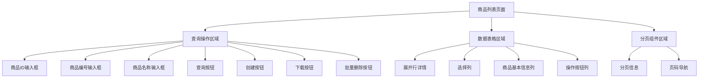
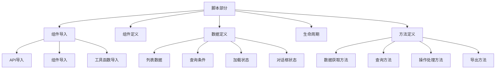
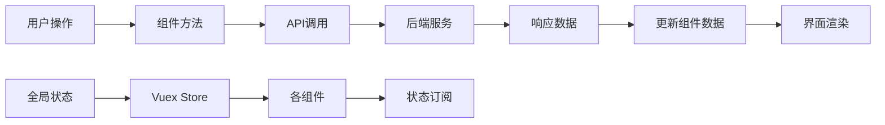
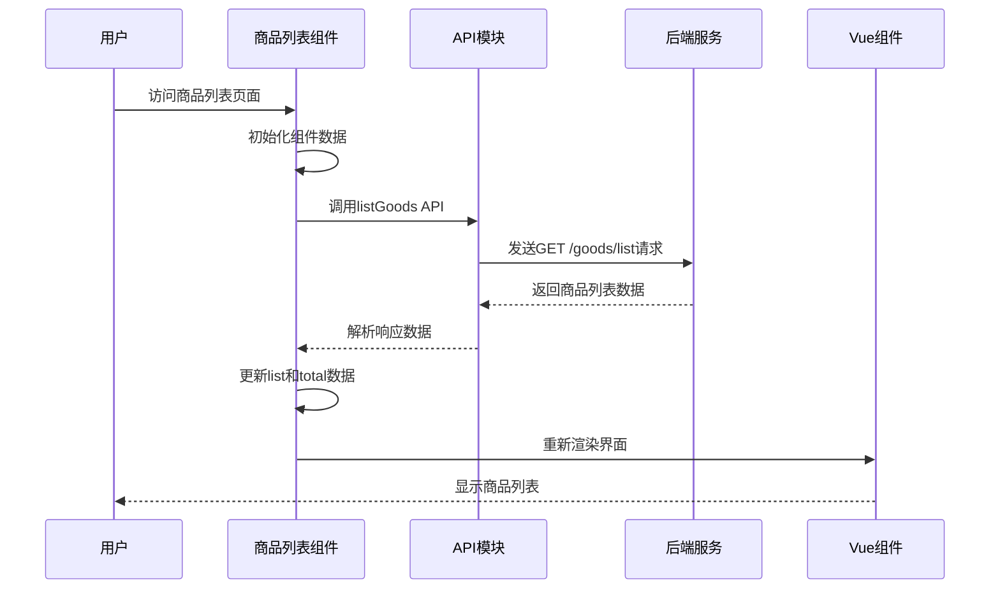
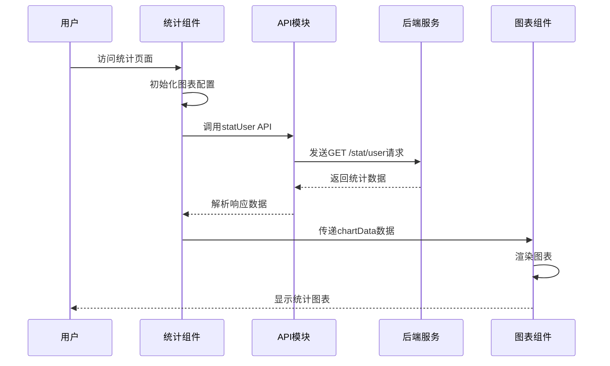

# litemall项目前端商品管理与统计管理模块分析报告

## 项目概述

本报告针对litemall项目的前端商品管理模块和统计管理模块进行全面的代码分析。根据项目要求，重点分析以下内容：

1. **前端页面文件组成结构** - 分析Vue组件文件结构和组织方式
2. **组成页面的分块代码** - 分析模板、样式和脚本的代码结构
3. **页面上的数据存储** - 分析Vuex状态管理和组件数据存储机制
4. **前端和后端API对应关系** - 整理API接口映射关系
5. **关键代码注释** - 为重要代码添加详细注释

## 一、前端项目结构分析

### 1.1 项目整体架构

litemall前端项目采用Vue.js + Element UI的技术栈，项目结构清晰，遵循现代前端开发规范。

```
litemall-admin/
├── src/
│   ├── api/                    # API接口定义
│   │   ├── goods.js           # 商品管理API
│   │   └── stat.js            # 统计管理API
│   ├── components/            # 公共组件
│   ├── router/                # 路由配置
│   ├── store/                 # 状态管理
│   ├── utils/                 # 工具函数
│   └── views/                 # 页面视图
│       ├── goods/             # 商品管理页面
│       │   ├── list.vue       # 商品列表
│       │   ├── create.vue     # 商品创建
│       │   ├── edit.vue       # 商品编辑
│       │   └── comment.vue    # 商品评论
│       └── stat/              # 统计管理页面
│           ├── user.vue       # 用户统计
│           ├── order.vue      # 订单统计
│           └── goods.vue      # 商品统计
```

### 1.2 商品管理模块文件结构

| 文件路径 | 文件类型 | 主要职责 | 关联组件 |
|---------|---------|---------|---------|
| `views/goods/list.vue` | Vue组件 | 商品列表展示、查询、删除 | Pagination, BackToTop |
| `views/goods/create.vue` | Vue组件 | 商品创建表单 | - |
| `views/goods/edit.vue` | Vue组件 | 商品编辑表单 | - |
| `views/goods/comment.vue` | Vue组件 | 商品评论管理 | - |
| `api/goods.js` | API模块 | 商品相关接口封装 | - |

### 1.3 统计管理模块文件结构

| 文件路径 | 文件类型 | 主要职责 | 关联组件 |
|---------|---------|---------|---------|
| `views/stat/user.vue` | Vue组件 | 用户增长统计图表 | VeHistogram |
| `views/stat/order.vue` | Vue组件 | 订单统计图表 | VeHistogram |
| `views/stat/goods.vue` | Vue组件 | 商品销售统计图表 | VeHistogram |
| `api/stat.js` | API模块 | 统计相关接口封装 | - |

## 二、页面文件组成结构分析

### 2.1 Vue组件标准结构

每个Vue组件都遵循标准的单文件组件结构，包含三个主要部分：

```vue
<template>
  <!-- 模板部分：定义页面结构和布局 -->
</template>

<script>
// 脚本部分：定义组件逻辑、数据和方法
</script>

<style>
/* 样式部分：定义组件样式 */
</style>
```

### 2.2 商品列表页面结构分析

#### 模板结构（Template）


#### 脚本结构（Script）


#### 样式结构（Style）
- **表格展开样式**：定义展开行的布局和样式
- **图片展示样式**：定义商品图片的显示样式
- **响应式样式**：适配不同屏幕尺寸

## 三、组成页面的分块代码分析

### 3.1 商品列表页面代码分块

#### 3.1.1 查询操作区域代码块
```vue
<!-- 查询和其他操作 -->
<div class="filter-container">
  <el-input v-model="listQuery.goodsId" clearable class="filter-item" 
            style="width: 160px;" :placeholder="$t('goods_list.placeholder.filter_goods_id')" />
  <el-input v-model="listQuery.goodsSn" clearable class="filter-item" 
            style="width: 160px;" :placeholder="$t('goods_list.placeholder.filter_goods_sn')" />
  <el-input v-model="listQuery.name" clearable class="filter-item" 
            style="width: 160px;" :placeholder="$t('goods_list.placeholder.filter_name')" />
  <el-button class="filter-item" type="primary" icon="el-icon-search" 
              @click="handleFilter">{{ $t('app.button.search') }}</el-button>
  <el-button class="filter-item" type="primary" icon="el-icon-edit" 
              @click="handleCreate">{{ $t('app.button.create') }}</el-button>
  <el-button :loading="downloadLoading" class="filter-item" type="primary" 
              icon="el-icon-download" @click="handleDownload">{{ $t('app.button.download') }}</el-button>
  <el-button class="filter-item" type="danger" icon="el-icon-delete" 
              :disabled="batchDeleteArr.length === 0" @click="handleDeleteRows">{{ $t('app.button.batch_delete') }}</el-button>
</div>
```

**代码块功能分析：**
- **输入框组件**：提供商品ID、商品编号、商品名称的查询条件输入
- **操作按钮**：查询、创建、下载、批量删除等功能按钮
- **国际化支持**：使用`$t()`函数实现多语言支持
- **状态绑定**：通过`v-model`实现双向数据绑定

#### 3.1.2 数据表格区域代码块
```vue
<!-- 查询结果 -->
<el-table v-loading="listLoading" :data="list" 
          :element-loading-text="$t('app.message.list_loading')" 
          border fit highlight-current-row 
          @selection-change="handleSelectionChange">
  
  <!-- 展开行详情 -->
  <el-table-column type="expand">
    <template slot-scope="props">
      <el-form label-position="left" class="table-expand">
        <el-form-item :label="$t('goods_list.table.goods_sn')">
          <span>{{ props.row.goodsSn }}</span>
        </el-form-item>
        <!-- 更多详情字段 -->
      </el-form>
    </template>
  </el-table-column>
  
  <!-- 选择列 -->
  <el-table-column type="selection" width="55" />
  
  <!-- 商品基本信息列 -->
  <el-table-column align="center" :label="$t('goods_list.table.id')" prop="id" />
  <el-table-column align="center" min-width="100" :label="$t('goods_list.table.name')" prop="name" />
  
  <!-- 操作按钮列 -->
  <el-table-column align="center" :label="$t('goods_list.table.actions')" width="200" 
                    class-name="small-padding fixed-width">
    <template slot-scope="scope">
      <el-button type="primary" size="mini" @click="handleUpdate(scope.row)">{{ $t('app.button.edit') }}</el-button>
      <el-button type="danger" size="mini" @click="handleDelete(scope.row)">{{ $t('app.button.delete') }}</el-button>
    </template>
  </el-table-column>
</el-table>
```

**代码块功能分析：**
- **加载状态**：`v-loading`指令显示数据加载状态
- **展开行功能**：显示商品的详细信息
- **选择功能**：支持多选操作
- **操作按钮**：编辑和删除操作
- **国际化标签**：表格列标题支持多语言

### 3.2 统计页面代码分块

#### 3.2.1 用户统计页面代码块
```vue
<template>
  <div class="app-container">
    <ve-histogram :extend="chartExtend" :data="chartData" :settings="chartSettings"/>
  </div>
</template>

<script>
import { statUser } from '@/api/stat'
import VeHistogram from 'v-charts/lib/histogram'

export default {
  components: { VeHistogram },
  data() {
    return {
      chartData: {},
      chartSettings: {},
      chartExtend: {}
    }
  },
  created() {
    statUser().then(response => {
      this.chartData = response.data.data
      this.chartSettings = {
        labelMap: {
          'users': '用户增长数'
        }
      }
      this.chartExtend = {
        xAxis: { boundaryGap: true },
        series: {
          label: { show: true, position: 'top' }
        }
      }
    })
  }
}
</script>
```

**代码块功能分析：**
- **图表组件**：使用v-charts库的柱状图组件
- **数据绑定**：通过props传递图表数据和配置
- **异步数据加载**：在created生命周期中加载统计数据
- **图表配置**：自定义图表标签和样式

## 四、页面上的数据存储分析

### 4.1 组件级数据存储

#### 商品列表页面数据定义
```javascript
data() {
  return {
    batchDeleteArr: [],        // 批量删除选中的商品数组
    thumbnail,                 // 图片缩略图处理函数
    toPreview,                 // 图片预览处理函数
    list: [],                  // 商品列表数据
    total: 0,                  // 商品总数
    listLoading: true,         // 列表加载状态
    listQuery: {               // 查询条件对象
      page: 1,                 // 当前页码
      limit: 20,               // 每页数量
      goodsSn: undefined,      // 商品编号
      name: undefined,         // 商品名称
      sort: 'add_time',        // 排序字段
      order: 'desc'            // 排序方向
    },
    goodsDetail: '',           // 商品详情HTML内容
    detailDialogVisible: false, // 详情对话框显示状态
    downloadLoading: false      // 下载加载状态
  }
}
```

#### 数据存储特点分析
| 数据类型 | 存储位置 | 生命周期 | 更新机制 |
|---------|---------|---------|---------|
| 列表数据 | 组件data | 组件实例 | API异步更新 |
| 查询条件 | 组件data | 组件实例 | 用户输入更新 |
| 加载状态 | 组件data | 组件实例 | 异步操作控制 |
| 对话框状态 | 组件data | 组件实例 | 用户交互控制 |

### 4.2 应用级状态管理（Vuex）

项目使用Vuex进行全局状态管理，主要模块包括：

```javascript
// store/modules 目录结构
store/modules/
├── app.js        # 应用状态：侧边栏、设备类型等
├── permission.js # 权限状态：用户权限、路由权限
├── tagsView.js   # 标签页状态：打开的页面标签
└── user.js       # 用户状态：用户信息、token等
```

#### 状态管理流程图


### 4.3 数据流分析

#### 商品列表数据流


#### 统计数据流


## 五、前端和后端API对应关系

### 5.1 商品管理模块API映射

| 前端API函数 | 后端接口路径 | HTTP方法 | 功能描述 | 负责文件 |
|------------|-------------|----------|----------|----------|
| `listGoods()` | `/goods/list` | GET | 查询商品列表 | `api/goods.js` |
| `deleteGoods()` | `/goods/delete` | POST | 删除商品 | `api/goods.js` |
| `publishGoods()` | `/goods/create` | POST | 创建商品 | `api/goods.js` |
| `detailGoods()` | `/goods/detail` | GET | 获取商品详情 | `api/goods.js` |
| `editGoods()` | `/goods/update` | POST | 更新商品 | `api/goods.js` |
| `listCatAndBrand()` | `/goods/catAndBrand` | GET | 获取分类和品牌 | `api/goods.js` |

### 5.2 统计管理模块API映射

| 前端API函数 | 后端接口路径 | HTTP方法 | 功能描述 | 负责文件 |
|------------|-------------|----------|----------|----------|
| `statUser()` | `/stat/user` | GET | 用户统计 | `api/stat.js` |
| `statOrder()` | `/stat/order` | GET | 订单统计 | `api/stat.js` |
| `statGoods()` | `/stat/goods` | GET | 商品统计 | `api/stat.js` |

### 5.3 API调用流程分析

#### 商品列表API调用流程
```javascript
// 1. 组件中调用API方法
methods: {
  getList() {
    this.listLoading = true
    listGoods(this.listQuery).then(response => {
      // 3. 处理响应数据
      this.list = response.data.data.list
      this.total = response.data.data.total
      this.listLoading = false
    }).catch(() => {
      // 4. 错误处理
      this.list = []
      this.total = 0
      this.listLoading = false
    })
  }
}

// 2. API模块封装请求
// api/goods.js
export function listGoods(query) {
  return request({
    url: '/goods/list',
    method: 'get',
    params: query
  })
}
```

#### 统计API调用流程
```javascript
// 1. 组件生命周期中调用
created() {
  statUser().then(response => {
    // 3. 处理统计响应数据
    this.chartData = response.data.data
    this.chartSettings = {
      labelMap: {
        'users': '用户增长数'
      }
    }
  })
}

// 2. API模块封装
// api/stat.js
export function statUser(query) {
  return request({
    url: '/stat/user',
    method: 'get',
    params: query
  })
}
```

### 5.4 请求工具封装

项目使用统一的请求工具进行API调用：

```javascript
// utils/request.js
import axios from 'axios'
import { Message } from 'element-ui'
import store from '@/store'
import { getToken } from '@/utils/auth'

// 创建axios实例
const service = axios.create({
  baseURL: process.env.VUE_APP_BASE_API, // 基础URL
  timeout: 5000 // 请求超时时间
})

// 请求拦截器
service.interceptors.request.use(
  config => {
    // 添加token到请求头
    if (store.getters.token) {
      config.headers['X-Litemall-Admin-Token'] = getToken()
    }
    return config
  },
  error => {
    return Promise.reject(error)
  }
)

// 响应拦截器
service.interceptors.response.use(
  response => {
    const res = response.data
    // 处理业务逻辑
    if (res.errno === 0) {
      return res
    } else {
      Message.error(res.errmsg || 'Error')
      return Promise.reject(new Error(res.errmsg || 'Error'))
    }
  },
  error => {
    Message.error(error.message)
    return Promise.reject(error)
  }
)

export default service
```

## 六、关键代码注释分析

### 6.1 商品列表页面关键代码注释

#### 6.1.1 数据获取方法注释
```javascript
/**
 * 获取商品列表数据
 * 方法职责：调用API接口获取商品列表，处理加载状态和错误情况
 * 调用时机：组件创建时、查询条件变化时、分页操作时
 * 数据流向：API → 响应数据 → 组件数据 → 界面渲染
 */
getList() {
  this.listLoading = true  // 开始加载，显示加载动画
  listGoods(this.listQuery).then(response => {
    // API调用成功，更新列表数据和总数
    this.list = response.data.data.list    // 商品列表数据
    this.total = response.data.data.total  // 商品总数
    this.listLoading = false               // 加载完成
  }).catch(() => {
    // API调用失败，重置数据并隐藏加载状态
    this.list = []        // 清空列表数据
    this.total = 0         // 重置总数
    this.listLoading = false // 加载完成
  })
}
```

#### 6.1.2 查询处理方法注释
```javascript
/**
 * 处理商品查询操作
 * 方法职责：重置页码并重新获取数据，实现查询功能
 * 触发条件：用户点击查询按钮或输入查询条件后回车
 * 业务逻辑：查询条件变化时需要从第一页开始显示结果
 */
handleFilter() {
  this.listQuery.page = 1  // 重置到第一页，确保查询结果从开始显示
  this.getList()           // 重新获取数据
}
```

#### 6.1.3 删除操作方法注释
```javascript
/**
 * 删除单个商品
 * 方法职责：显示确认对话框，调用删除API，处理删除结果
 * 安全机制：删除前需要用户确认，防止误操作
 * 用户体验：删除成功后显示提示信息并刷新列表
 */
handleDelete(row) {
  this.$confirm('确定删除?', '警告', {
    confirmButtonText: '确定',
    cancelButtonText: '取消',
    type: 'warning',
    center: true
  }).then(() => {
    // 用户确认删除，调用API
    deleteGoods(row).then(response => {
      this.$notify.success({
        title: '成功',
        message: '删除成功'
      })
      this.getList()  // 删除成功后刷新列表
    }).catch(response => {
      // 删除失败处理
      this.$notify.error({
        title: '失败',
        message: response.data.errmsg
      })
    })
  }).catch(() => {
    // 用户取消删除，不执行任何操作
  })
}
```

### 6.2 统计页面关键代码注释

#### 6.2.1 图表数据初始化注释
```javascript
/**
 * 组件创建生命周期钩子
 * 执行时机：组件实例创建完成后立即调用
 * 主要职责：初始化图表数据，调用统计API获取数据
 * 数据流程：API调用 → 数据处理 → 图表配置 → 界面渲染
 */
created() {
  statUser().then(response => {
    // 统计API调用成功，配置图表数据
    this.chartData = response.data.data  // 图表数据源
    
    // 配置图表标签映射，将英文字段名映射为中文显示
    this.chartSettings = {
      labelMap: {
        'users': '用户增长数'  // 将字段'users'显示为'用户增长数'
      }
    }
    
    // 扩展图表配置，自定义显示效果
    this.chartExtend = {
      xAxis: { boundaryGap: true },  // X轴两端留空
      series: {
        label: { 
          show: true,     // 显示数据标签
          position: 'top' // 标签位置在柱状图顶部
        }
      }
    }
  })
}
```

### 6.3 API模块关键代码注释

#### 6.3.1 商品列表API注释
```javascript
/**
 * 商品列表查询API函数
 * 功能描述：封装商品列表查询接口，支持分页和条件查询
 * 参数说明：query对象包含分页参数和查询条件
 * 返回格式：Promise对象，包含商品列表数据和分页信息
 */
export function listGoods(query) {
  return request({
    url: '/goods/list',    // 后端接口路径
    method: 'get',         // HTTP GET方法
    params: query          // 查询参数（页码、条件等）
  })
}
```

#### 6.3.2 用户统计API注释
```javascript
/**
 * 用户统计API函数
 * 功能描述：封装用户增长统计接口
 * 参数说明：query对象可包含时间范围等统计条件
 * 返回格式：Promise对象，包含按日期分组的用户增长数据
 */
export function statUser(query) {
  return request({
    url: '/stat/user',     // 统计接口路径
    method: 'get',        // HTTP GET方法
    params: query         // 统计条件参数
  })
}
```

## 七、技术架构总结

### 7.1 前端技术栈特点

| 技术组件 | 版本/选择 | 在项目中的应用 | 优势分析 |
|---------|----------|--------------|---------|
| Vue.js | 2.x | 核心框架，组件化开发 | 响应式数据绑定，组件复用 |
| Element UI | 2.x | UI组件库 | 丰富的组件，良好的用户体验 |
| Vue Router | 3.x | 前端路由管理 | 单页面应用导航 |
| Vuex | 3.x | 状态管理 | 集中式状态管理 |
| Axios | 0.19+ | HTTP客户端 | Promise-based，拦截器支持 |
| v-charts | 1.x | 图表组件 | 基于ECharts的Vue封装 |

### 7.2 架构设计优点

1. **组件化设计**：每个功能模块独立封装，便于维护和复用
2. **分层架构**：API层、组件层、工具层清晰分离
3. **国际化支持**：使用Vue I18n实现多语言界面
4. **响应式设计**：适配不同屏幕尺寸的设备
5. **错误处理**：统一的API错误处理和用户提示

### 7.3 可优化建议

1. **状态管理优化**：可以考虑将部分组件状态提升到Vuex中管理
2. **性能优化**：大数据量列表可以考虑虚拟滚动
3. **代码分割**：路由级别的代码分割可以优化首屏加载速度
4. **TypeScript支持**：引入TypeScript提升代码类型安全

## 八、结论

通过对litemall项目前端商品管理和统计管理模块的深入分析，可以看出项目采用了现代前端开发的最佳实践：

1. **架构设计合理**：采用Vue.js生态体系，组件化、模块化程度高
2. **代码结构清晰**：文件组织规范，职责分离明确
3. **用户体验良好**：加载状态、错误提示、确认对话框等交互细节完善
4. **可维护性强**：统一的API封装、错误处理、国际化支持
5. **扩展性良好**：组件和API设计便于功能扩展

前端与后端通过RESTful API进行数据交互，接口设计规范，数据传输高效。整体而言，该项目的前端架构设计成熟，代码质量较高，为后续的功能扩展和维护提供了良好的基础。