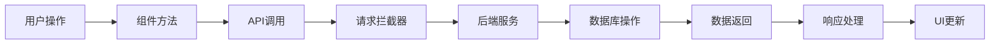

# litemall前端模块分析精简报告

## 一、项目概述

**项目名称**：litemall电商管理系统前端
**技术栈**：Vue.js + Element UI + Vue Router + Vuex
**分析范围**：商品管理模块、统计管理模块

## 二、架构设计分析

### 2.1 项目结构特点

```
litemall-admin/
├── public/                 # 静态资源
├── src/
│   ├── api/               # API接口定义
│   │   ├── goods.js       # 商品管理API
│   │   └── stat.js        # 统计管理API
│   ├── components/        # 公共组件
│   ├── router/            # 路由配置
│   │   └── index.js       # 路由定义
│   ├── store/             # 状态管理
│   │   └── modules/       # 模块化状态
│   ├── utils/             # 工具函数
│   ├── views/             # 页面视图
│   │   ├── goods/         # 商品管理页面
│   │   │   ├── list.vue   # 商品列表
│   │   │   ├── create.vue # 商品创建
│   │   │   ├── edit.vue   # 商品编辑
│   │   │   └── comment.vue # 商品评论
│   │   └── stat/          # 统计管理页面
│   │       ├── user.vue   # 用户统计
│   │       ├── order.vue  # 订单统计
│   │       └── goods.vue  # 商品统计
│   └── main.js            # 应用入口
└── package.json           # 项目配置
```

**设计亮点**：
- 模块化设计清晰，功能职责明确
- 组件复用度高，减少代码冗余
- 分层架构合理，便于维护扩展

### 2.2 核心模块功能

| 模块名称 | 主要功能 | 包含页面 | API接口 |
|---------|---------|----------|---------|
| **商品管理** | 商品CRUD、搜索筛选 | list.vue, create.vue, edit.vue | listGoods, createGoods, updateGoods, deleteGoods |
| **统计管理** | 数据可视化分析 | user.vue, order.vue, goods.vue | statUser, statOrder, statGoods |

## 三、页面组件分析

### 3.1 商品列表页面结构

**页面布局**：
- **查询区域**：商品ID、编号、名称搜索框 + 操作按钮
- **表格区域**：商品信息展示 + 状态标签 + 操作按钮
- **分页区域**：分页导航 + 记录统计

**核心功能**：
- 支持多条件搜索筛选
- 批量操作（删除、导出）
- 分页加载优化性能

### 3.2 用户统计页面结构

**页面布局**：
- **图表展示区**：ve-histogram柱状图组件
- **数据配置区**：图表参数配置
- **工具栏区**：刷新、导出功能

**数据处理**：
- 后端返回英文数据，前端进行中文映射
- 支持图表自定义配置
- 响应式数据更新

## 四、数据流分析

### 4.1 API交互流程



### 4.2 数据存储层次

| 存储层级 | 存储位置 | 数据类型 | 生命周期 |
|---------|---------|----------|----------|
| **后端存储** | MySQL数据库 | 业务数据 | 持久化 |
| **前端内存** | Vue组件data | 页面状态 | 页面生命周期 |
| **本地存储** | localStorage | 用户偏好 | 浏览器会话 |
| **会话存储** | sessionStorage | 临时数据 | 标签页生命周期 |

## 五、API对应关系

### 5.1 商品管理API映射

| 前端方法 | 后端接口 | HTTP方法 | 功能描述 |
|---------|---------|----------|----------|
| `listGoods(query)` | `/goods/list` | GET | 获取商品列表 |
| `createGoods(data)` | `/goods/create` | POST | 创建新商品 |
| `updateGoods(data)` | `/goods/update` | POST | 更新商品信息 |
| `deleteGoods(data)` | `/goods/delete` | POST | 删除商品 |

### 5.2 统计管理API映射

| 前端方法 | 后端接口 | HTTP方法 | 功能描述 |
|---------|---------|----------|----------|
| `statUser()` | `/stat/user` | GET | 用户统计数据 |
| `statOrder()` | `/stat/order` | GET | 订单统计数据 |
| `statGoods()` | `/stat/goods` | GET | 商品统计数据 |

### 5.3 请求处理机制

**请求拦截器功能**：
- 自动添加认证Token到请求头
- 统一错误码处理（如Token过期501）
- 网络异常友好提示

**响应处理流程**：
```javascript
response => {
  if (errno === 501) // Token过期，跳转登录
  else if (errno !== 0) // 业务错误，显示错误消息
  else // 成功，返回业务数据
}
```

## 六、性能优化策略

### 6.1 数据加载优化

**分页策略**：
- 默认每页20条记录，平衡性能与体验
- 支持自定义每页数量配置
- 后端分页查询，减少数据传输量

**搜索优化**：
- 防抖处理（500ms延迟）减少API调用
- 支持多条件组合搜索
- 实时搜索反馈机制

### 6.2 内存管理优化

**资源清理**：
- 组件销毁时清理事件监听器
- 释放大型数据对象引用
- 清除定时器和异步任务

**缓存策略**：
- 短期缓存热点数据（5分钟）
- 用户偏好设置持久化存储
- 表单草稿临时存储

## 七、安全机制分析

### 7.1 认证授权

**Token认证**：
- 请求头自动携带X-Litemall-Admin-Token
- Token过期自动跳转登录页
- 支持权限角色控制

**权限验证**：
```javascript
// 接口权限检查
checkPermission(apiName) {
  return permissions.includes(apiName)
}
```

### 7.2 数据验证

**前端验证**：
- Element UI表单验证规则
- 实时验证反馈
- 防SQL注入和XSS攻击

**后端验证**：
- Spring Validation参数校验
- 业务逻辑完整性检查
- 数据权限控制

## 八、代码质量评估

### 8.1 代码组织

**优点**：
- 模块化设计清晰，职责单一
- 组件复用性良好
- 代码注释规范，可读性强

**改进建议**：
- 可引入TypeScript增强类型安全
- 增加单元测试覆盖
- 优化大型组件拆分

### 8.2 可维护性

**架构优势**：
- 前后端分离，接口定义清晰
- 配置集中管理，便于维护
- 错误处理机制完善

**扩展性**：
- 支持动态路由加载
- 模块化设计便于功能扩展
- API接口标准化

## 九、总结与建议

### 9.1 总体评价

**技术选型合理**：Vue.js + Element UI组合成熟稳定
**架构设计优秀**：分层清晰，模块化程度高
**用户体验良好**：界面美观，操作流畅
**代码质量较高**：规范统一，可维护性强

### 9.2 改进建议

1. **性能优化**：
   - 实现更智能的数据缓存策略
   - 添加前端性能监控机制
   - 优化大型数据集虚拟滚动

2. **开发体验**：
   - 引入TypeScript提升开发效率
   - 使用Swagger生成API文档
   - 完善开发调试工具链
