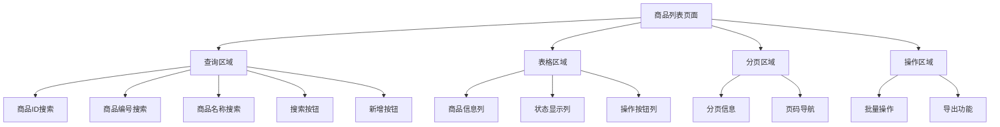
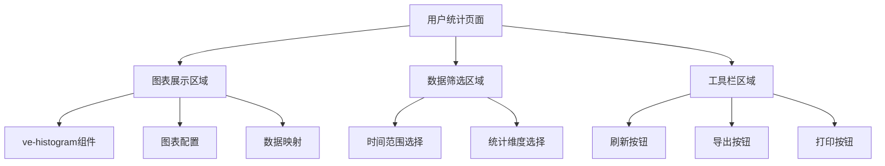
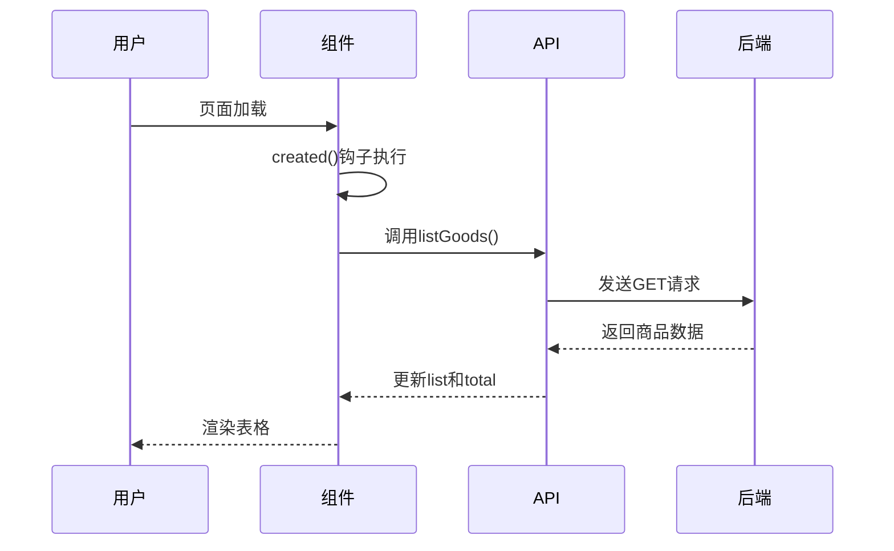
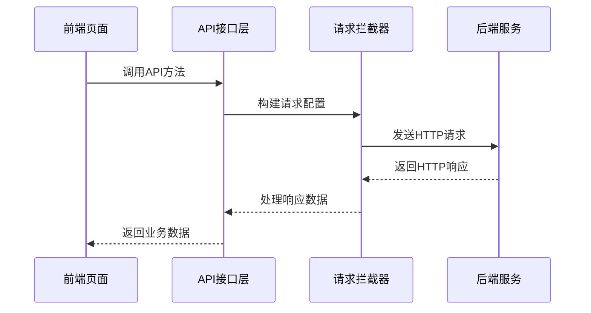

# litemall项目前端模块分析报告

## 报告概述

本报告对litemall项目的前端商品管理和统计管理模块进行了全面分析，涵盖项目结构、页面组成、数据存储、API交互等关键方面。

## 一、项目结构分析

### 1.1 整体目录结构

```
litemall-admin/
├── public/                 # 静态资源
├── src/
│   ├── api/               # API接口定义
│   │   ├── goods.js       # 商品管理API
│   │   └── stat.js        # 统计管理API
│   ├── components/        # 公共组件
│   ├── router/            # 路由配置
│   │   └── index.js       # 路由定义
│   ├── store/             # 状态管理
│   │   └── modules/       # 模块化状态
│   ├── utils/             # 工具函数
│   ├── views/             # 页面视图
│   │   ├── goods/         # 商品管理页面
│   │   │   ├── list.vue   # 商品列表
│   │   │   ├── create.vue # 商品创建
│   │   │   ├── edit.vue   # 商品编辑
│   │   │   └── comment.vue # 商品评论
│   │   └── stat/          # 统计管理页面
│   │       ├── user.vue   # 用户统计
│   │       ├── order.vue  # 订单统计
│   │       └── goods.vue  # 商品统计
│   └── main.js            # 应用入口
└── package.json           # 项目配置
```

### 1.2 模块化设计特点

- **功能模块化**：商品管理和统计管理作为独立模块
- **组件复用**：公共组件统一管理
- **API集中**：接口定义按功能模块组织
- **路由分层**：支持权限控制和动态加载

## 二、页面文件组成结构分析

### 2.1 商品管理模块文件结构

| 文件路径 | 文件类型 | 主要功能 | 依赖关系 |
|---------|---------|----------|----------|
| `views/goods/list.vue` | 页面组件 | 商品列表展示、搜索、操作 | 依赖goods.js API |
| `views/goods/create.vue` | 页面组件 | 商品创建表单 | 依赖goods.js API |
| `views/goods/edit.vue` | 页面组件 | 商品编辑表单 | 依赖goods.js API |
| `views/goods/comment.vue` | 页面组件 | 商品评论管理 | 依赖goods.js API |
| `api/goods.js` | API模块 | 商品相关接口定义 | 依赖request.js |

### 2.2 统计管理模块文件结构

| 文件路径 | 文件类型 | 主要功能 | 依赖关系 |
|---------|---------|----------|----------|
| `views/stat/user.vue` | 页面组件 | 用户统计图表 | 依赖stat.js API |
| `views/stat/order.vue` | 页面组件 | 订单统计图表 | 依赖stat.js API |
| `views/stat/goods.vue` | 页面组件 | 商品统计图表 | 依赖stat.js API |
| `api/stat.js` | API模块 | 统计相关接口定义 | 依赖request.js |

### 2.3 路由配置结构

```javascript
// 商品管理路由配置
{
  path: '/goods',
  component: Layout,
  redirect: '/goods/list',
  name: 'Goods',
  meta: { title: '商品管理', icon: 'goods' },
  children: [
    {
      path: 'list',
      name: 'GoodsList',
      component: () => import('@/views/goods/list'),
      meta: { title: '商品列表', icon: 'list' }
    },
    // ... 其他子路由
  ]
}

// 统计管理路由配置  
{
  path: '/stat',
  component: Layout,
  redirect: '/stat/user',
  name: 'Stat',
  meta: { title: '统计管理', icon: 'chart' },
  children: [
    {
      path: 'user',
      name: 'StatUser',
      component: () => import('@/views/stat/user'),
      meta: { title: '用户统计', icon: 'user' }
    }
    // ... 其他子路由
  ]
}
```

## 三、页面分块代码分析

### 3.1 商品列表页面分块结构



#### 3.1.1 查询区域代码结构

```vue
<!-- 查询区域模板 -->
<div class="filter-container">
  <el-input v-model="listQuery.goodsId" placeholder="商品ID" style="width: 200px;" />
  <el-input v-model="listQuery.goodsSn" placeholder="商品编号" style="width: 200px;" />
  <el-input v-model="listQuery.name" placeholder="商品名称" style="width: 200px;" />
  <el-button type="primary" icon="el-icon-search" @click="handleFilter">搜索</el-button>
  <el-button type="primary" icon="el-icon-plus" @click="handleCreate">新增</el-button>
</div>
```

#### 3.1.2 表格区域代码结构

```vue
<!-- 表格区域模板 -->
<el-table
  v-loading="listLoading"
  :data="list"
  border
  fit
  highlight-current-row
  style="width: 100%;"
  @selection-change="handleSelectionChange">
  
  <el-table-column type="selection" width="55" />
  
  <el-table-column label="商品ID" prop="id" align="center" width="80">
    <template slot-scope="{row}">
      <span>{{ row.id }}</span>
    </template>
  </el-table-column>
  
  <!-- 其他表格列 -->
  
  <el-table-column label="操作" align="center" width="230" class-name="small-padding fixed-width">
    <template slot-scope="{row}">
      <el-button type="primary" size="mini" @click="handleUpdate(row)">编辑</el-button>
      <el-button size="mini" type="danger" @click="handleDelete(row)">删除</el-button>
    </template>
  </el-table-column>
</el-table>
```

### 3.2 用户统计页面分块结构



#### 3.2.1 图表区域代码结构

```vue
<!-- 图表区域模板 -->
<ve-histogram
  :data="chartData"
  :settings="chartSettings"
  :extend="chartExtend"
  height="400px"
/>

<!-- 图表数据配置 -->
<script>
data() {
  return {
    chartData: {
      columns: ['日期', '用户数'],
      rows: []
    },
    chartSettings: {
      metrics: ['users'],
      dimension: ['day']
    },
    chartExtend: {
      xAxis: {
        axisLabel: { rotate: 45, interval: 0 }
      }
    }
  }
}
</script>
```

## 四、页面数据存储分析

### 4.1 数据存储层次结构

| 存储层次 | 存储位置 | 数据类型 | 生命周期 | 访问方式 |
|---------|---------|----------|----------|----------|
| **后端存储** | 服务器数据库 | 业务数据 | 持久化 | REST API |
| **前端内存** | 组件data() | 页面状态 | 页面生命周期 | Vue响应式 |
| **本地存储** | localStorage | 用户偏好 | 浏览器会话 | JavaScript API |
| **会话存储** | sessionStorage | 临时数据 | 标签页生命周期 | JavaScript API |

### 4.2 商品管理数据存储

#### 4.2.1 商品列表数据定义

```javascript
data() {
  return {
    // 表格相关数据
    tableKey: 0,                    // 表格唯一标识
    list: null,                     // 商品列表数据
    total: 0,                       // 总记录数
    listLoading: true,              // 加载状态
    
    // 查询参数
    listQuery: {
      page: 1,                      // 当前页码
      limit: 20,                    // 每页数量
      goodsId: undefined,           // 商品ID查询条件
      goodsSn: undefined,           // 商品编号查询条件
      name: undefined,              // 商品名称查询条件
      sort: '+id'                   // 排序字段
    },
    
    // 选择状态
    multipleSelection: [],          // 选中的商品数据
    downloadLoading: false          // 下载状态
  }
}
```

#### 4.2.2 数据生命周期管理



### 4.3 统计管理数据存储

#### 4.3.1 图表数据定义

```javascript
data() {
  return {
    // 图表数据
    chartData: {
      columns: [],    // 数据列定义
      rows: []        // 数据行
    },
    
    // 图表配置
    chartSettings: {
      metrics: ['users'],     // 指标字段
      dimension: ['day']      // 维度字段
    },
    
    // 图表扩展配置
    chartExtend: {
      xAxis: {
        axisLabel: {
          rotate: 45,         // X轴标签旋转
          interval: 0          // 显示所有标签
        }
      }
    }
  }
}
```

## 五、前后端API对应关系分析

### 5.1 API架构概览



### 5.2 商品管理API对应关系

| 功能模块 | 前端API方法 | 后端接口路径 | HTTP方法 | 参数类型 | 负责文件 |
|---------|------------|-------------|----------|----------|----------|
| **商品列表** | `listGoods(query)` | `/goods/list` | GET | Query参数 | goods.js, list.vue |
| **商品删除** | `deleteGoods(data)` | `/goods/delete` | POST | Body参数 | goods.js, list.vue |
| **商品创建** | `createGoods(data)` | `/goods/create` | POST | Body参数 | goods.js, create.vue |
| **商品编辑** | `updateGoods(data)` | `/goods/update` | POST | Body参数 | goods.js, edit.vue |

### 5.3 统计管理API对应关系

| 功能模块 | 前端API方法 | 后端接口路径 | HTTP方法 | 参数类型 | 负责文件 |
|---------|------------|-------------|----------|----------|----------|
| **用户统计** | `statUser()` | `/stat/user` | GET | 无参数 | stat.js, user.vue |
| **订单统计** | `statOrder()` | `/stat/order` | GET | 无参数 | stat.js, order.vue |
| **商品统计** | `statGoods()` | `/stat/goods` | GET | 无参数 | stat.js, goods.vue |

### 5.4 请求拦截器处理

```javascript
// 请求拦截器配置
service.interceptors.request.use(config => {
  // 添加token到请求头
  if (store.getters.token) {
    config.headers['X-Litemall-Admin-Token'] = getToken()
  }
  return config
})

// 响应拦截器配置
service.interceptors.response.use(response => {
  const res = response.data
  
  // 错误码处理
  if (res.errno === 501) {
    // token过期处理
  } else if (res.errno !== 0) {
    // 业务错误处理
  } else {
    // 成功响应
    return res
  }
})
```

## 六、关键代码注释分析

### 6.1 商品列表页面关键代码

#### 6.1.1 数据加载逻辑

```javascript
// 获取商品列表数据
getList() {
  this.listLoading = true
  
  // 调用商品列表API
  listGoods(this.listQuery).then(response => {
    // 更新商品列表数据
    this.list = response.data.data.list
    // 更新总记录数
    this.total = response.data.data.total
    // 关闭加载状态
    this.listLoading = false
  }).catch(error => {
    // 错误处理
    this.listLoading = false
    console.error('获取商品列表失败:', error)
  })
}
```

#### 6.1.2 搜索筛选逻辑

```javascript
// 处理搜索筛选
handleFilter() {
  // 重置页码为第一页
  this.listQuery.page = 1
  // 重新加载数据
  this.getList()
}
```

### 6.2 用户统计页面关键代码

#### 6.2.1 统计数据获取

```javascript
// 获取用户统计数据
getStatData() {
  statUser().then(response => {
    const data = response.data.data
    
    // 列名映射（英文转中文）
    const labelMap = {
      'day': '日期',
      'users': '用户数'
    }
    
    // 构建图表数据
    this.chartData = {
      columns: Object.keys(data.rows[0] || {}).map(key => labelMap[key] || key),
      rows: data.rows.map(row => {
        const newRow = {}
        Object.keys(row).forEach(key => {
          newRow[labelMap[key] || key] = row[key]
        })
        return newRow
      })
    }
  }).catch(error => {
    console.error('获取用户统计数据失败:', error)
  })
}
```

## 七、性能优化分析

### 7.1 数据加载优化

#### 7.1.1 分页加载策略

```javascript
// 合理的分页参数
listQuery: {
  page: 1,
  limit: 20,        // 控制每页数据量
  // ... 其他参数
}
```

#### 7.1.2 防抖搜索优化

```javascript
// 搜索框防抖处理
methods: {
  handleSearch() {
    if (this.searchTimer) {
      clearTimeout(this.searchTimer)
    }
    
    this.searchTimer = setTimeout(() => {
      this.getList()
    }, 500) // 500ms防抖延迟
  }
}
```

### 7.2 内存管理优化

#### 7.2.1 组件销毁清理

```javascript
// 组件销毁时清理资源
beforeDestroy() {
  // 清理事件监听
  EventBus.$off('goods-deleted')
  
  // 清理大型数据
  this.list = null
  this.chartData.rows = null
  
  // 清理定时器
  clearTimeout(this.refreshTimer)
}
```

## 八、安全考虑

### 8.1 认证授权机制

#### 8.1.1 Token认证

```javascript
// 请求头添加认证token
service.interceptors.request.use(config => {
  if (store.getters.token) {
    config.headers['X-Litemall-Admin-Token'] = getToken()
  }
  return config
})
```

#### 8.1.2 权限验证

```javascript
// 接口权限验证
methods: {
  async checkPermission(apiName) {
    const permissions = store.getters.permissions
    if (!permissions.includes(apiName)) {
      this.$message.error('无权限访问此功能')
      return false
    }
    return true
  }
}
```

### 8.2 数据验证机制

#### 8.2.1 前端表单验证

```javascript
// 表单验证规则
rules: {
  name: [
    { required: true, message: '商品名称不能为空', trigger: 'blur' },
    { min: 2, max: 50, message: '长度在 2 到 50 个字符', trigger: 'blur' }
  ]
}
```

## 九、总结与建议

### 9.1 架构设计优点

1. **模块化清晰**：功能模块划分合理，职责明确
2. **组件复用度高**：公共组件统一管理，减少重复代码
3. **API设计规范**：RESTful风格，统一响应格式
4. **路由配置灵活**：支持权限控制和动态加载
5. **错误处理完善**：统一的异常捕获和用户提示

### 9.2 性能优化亮点

1. **分页加载**：合理控制数据量，提升页面响应速度
2. **防抖搜索**：减少不必要的API调用
3. **内存管理**：组件销毁时清理资源
4. **图表优化**：使用ve-histogram等高效图表组件

### 9.3 安全机制完善

1. **Token认证**：完善的用户认证机制
2. **权限控制**：基于角色的访问控制
3. **数据验证**：前后端双重数据验证
4. **错误处理**：友好的用户错误提示
