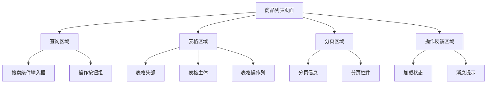
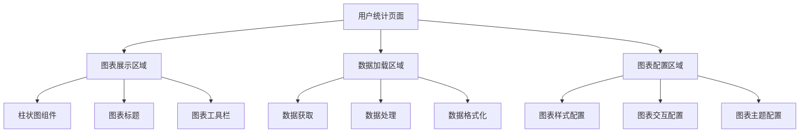

# 页面分块代码分析

## 概述

本文档详细分析litemall项目前端商品管理和统计管理模块的页面分块代码结构，包括功能区域划分、组件拆分、代码组织方式等。

## 一、商品列表页面分块分析

### 1.1 页面整体布局结构



### 1.2 查询区域代码分块

#### 1.2.1 搜索条件输入框组

```vue
<!-- 搜索条件区域 -->
<div class="filter-container">
  <!-- 商品ID搜索框 -->
  <el-input 
    v-model="listQuery.goodsId" 
    placeholder="商品ID" 
    style="width: 200px;" 
    class="filter-item" 
    @keyup.enter.native="handleFilter" />
  
  <!-- 商品编号搜索框 -->
  <el-input 
    v-model="listQuery.goodsSn" 
    placeholder="商品编号" 
    style="width: 200px;" 
    class="filter-item" 
    @keyup.enter.native="handleFilter" />
  
  <!-- 商品名称搜索框 -->
  <el-input 
    v-model="listQuery.name" 
    placeholder="商品名称" 
    style="width: 200px;" 
    class="filter-item" 
    @keyup.enter.native="handleFilter" />
```

**功能说明：**
- **商品ID搜索**：精确匹配商品ID
- **商品编号搜索**：模糊匹配商品编号
- **商品名称搜索**：模糊匹配商品名称
- **回车搜索**：支持回车键快速搜索

#### 1.2.2 操作按钮组

```vue
<!-- 操作按钮组 -->
<el-button class="filter-item" type="primary" icon="el-icon-search" @click="handleFilter">
  搜索
</el-button>

<el-button class="filter-item" style="margin-left: 10px;" type="primary" icon="el-icon-edit" @click="handleCreate">
  新增
</el-button>

<el-button v-waves :loading="downloadLoading" class="filter-item" type="primary" icon="el-icon-download" @click="handleDownload">
  导出
</el-button>

<el-button v-waves :loading="downloadLoading" class="filter-item" type="danger" icon="el-icon-delete" @click="handleBatchDelete">
  批量删除
</el-button>
```

**功能说明：**
- **搜索按钮**：执行条件搜索
- **新增按钮**：跳转到商品创建页面
- **导出按钮**：导出商品数据到Excel
- **批量删除按钮**：删除选中的多个商品

### 1.3 表格区域代码分块

#### 1.3.1 表格配置

```vue
<!-- 商品列表表格 -->
<el-table
  :key="tableKey"                    <!-- 表格唯一标识 -->
  v-loading="listLoading"           <!-- 加载状态 -->
  :data="list"                       <!-- 表格数据 -->
  border                             <!-- 边框样式 -->
  fit                                <!-- 自适应宽度 -->
  highlight-current-row             <!-- 高亮当前行 -->
  style="width: 100%;"               <!-- 宽度设置 -->
  @sort-change="sortChange"          <!-- 排序变化事件 -->
  @selection-change="handleSelectionChange">  <!-- 选择变化事件 -->
```

#### 1.3.2 表格列定义

```vue
<!-- 选择列 -->
<el-table-column type="selection" width="55" align="center" />

<!-- 商品ID列 -->
<el-table-column label="商品ID" prop="id" sortable="custom" align="center" width="80">
  <template slot-scope="{row}">
    <span>{{ row.id }}</span>
  </template>
</el-table-column>

<!-- 商品名称列 -->
<el-table-column label="商品名称" min-width="150px">
  <template slot-scope="{row}">
    <span class="link-type" @click="handleUpdate(row)">{{ row.name }}</span>
  </template>
</el-table-column>

<!-- 商品编号列 -->
<el-table-column label="商品编号" width="120px" align="center">
  <template slot-scope="{row}">
    <span>{{ row.goodsSn }}</span>
  </template>
</el-table-column>

<!-- 零售价格列 -->
<el-table-column label="零售价" width="95px" align="center">
  <template slot-scope="{row}">
    <span>¥{{ row.retailPrice }}</span>
  </template>
</el-table-column>

<!-- 是否上架状态列 -->
<el-table-column label="是否上架" class-name="status-col" width="100">
  <template slot-scope="{row}">
    <el-tag :type="row.isOnSale | statusFilter">
      {{ row.isOnSale ? '上架' : '下架' }}
    </el-tag>
  </template>
</el-table-column>
```

#### 1.3.3 操作列

```vue
<!-- 操作列 -->
<el-table-column label="操作" align="center" width="230" class-name="small-padding fixed-width">
  <template slot-scope="{row}">
    <!-- 编辑按钮 -->
    <el-button type="primary" size="mini" @click="handleUpdate(row)">
      编辑
    </el-button>
    
    <!-- 删除按钮 -->
    <el-button v-if="row.status!='deleted'" size="mini" type="danger" @click="handleDelete(row)">
      删除
    </el-button>
  </template>
</el-table-column>
```

### 1.4 分页区域代码分块

```vue
<!-- 分页组件 -->
<pagination 
  v-show="total>0"                   <!-- 有数据时显示 -->
  :total="total"                    <!-- 总记录数 -->
  :page.sync="listQuery.page"       <!-- 当前页码 -->
  :limit.sync="listQuery.limit"     <!-- 每页数量 -->
  @pagination="getList" />          <!-- 分页变化事件 -->
```

## 二、用户统计页面分块分析

### 2.1 页面整体布局结构



### 2.2 图表展示区域

```vue
<!-- 统计图表容器 -->
<ve-histogram
  :data="chartData"           <!-- 图表数据 -->
  :settings="chartSettings"    <!-- 图表配置 -->
  :extend="chartExtend"        <!-- 图表扩展配置 -->
  height="400px"               <!-- 图表高度 -->
/>
```

### 2.3 数据配置区域

#### 2.3.1 数据定义

```javascript
// 图表数据对象
data() {
  return {
    // 图表数据
    chartData: {
      columns: [],    // 数据列定义
      rows: []        // 数据行
    },
    
    // 图表配置
    chartSettings: {
      metrics: ['users'],     // 指标字段
      dimension: ['day']      // 维度字段
    },
    
    // 图表扩展配置
    chartExtend: {
      // X轴配置
      xAxis: {
        axisLabel: {
          rotate: 45,         // X轴标签旋转角度
          interval: 0          // 显示所有标签
        }
      },
      
      // 图例配置
      legend: {
        show: true             // 显示图例
      },
      
      // 工具栏配置
      toolbox: {
        feature: {
          saveAsImage: {       // 保存为图片功能
            show: true
          }
        }
      }
    }
  }
}
```

#### 2.3.2 数据获取与处理

```javascript
methods: {
  /**
   * 获取统计数据
   */
  getStatData() {
    // 调用用户统计API
    statUser().then(response => {
      // 请求成功处理
      const data = response.data.data
      
      // 处理列名映射（英文转中文）
      const labelMap = {
        'day': '日期',      // 日期列
        'users': '用户数'   // 用户数列
      }
      
      // 更新图表数据
      this.chartData = {
        columns: Object.keys(data.rows[0] || {}).map(key => labelMap[key] || key),
        rows: data.rows.map(row => {
          const newRow = {}
          Object.keys(row).forEach(key => {
            newRow[labelMap[key] || key] = row[key]
          })
          return newRow
        })
      }
    }).catch(error => {
      // 错误处理
      console.error('获取用户统计数据失败:', error)
      this.$message({
        type: 'error',
        message: '获取统计数据失败'
      })
    })
  }
}
```

## 三、代码组织方式分析

### 3.1 模板代码组织特点

#### 3.1.1 区块化组织

```vue
<!-- 查询区域 -->
<div class="filter-container">
  <!-- 搜索条件 -->
  <el-input ... />
  <el-input ... />
  
  <!-- 操作按钮 -->
  <el-button ...>搜索</el-button>
  <el-button ...>新增</el-button>
</div>

<!-- 表格区域 -->
<el-table ...>
  <!-- 表格列定义 -->
  <el-table-column ... />
  <el-table-column ... />
</el-table>

<!-- 分页区域 -->
<pagination ... />
```

**特点分析：**
- **功能区块清晰**：查询、表格、分页功能分离
- **样式类名统一**：使用BEM命名规范
- **组件化思维**：每个区块都是独立的UI组件

#### 3.1.2 事件处理组织

```vue
<!-- 搜索按钮 -->
<el-button @click="handleFilter">搜索</el-button>

<!-- 编辑按钮 -->
<el-button @click="handleUpdate(row)">编辑</el-button>

<!-- 删除按钮 -->
<el-button @click="handleDelete(row)">删除</el-button>
```

**特点分析：**
- **事件命名规范**：handle前缀表示事件处理
- **参数传递清晰**：row参数传递当前行数据
- **方法职责单一**：每个方法处理单一功能

### 3.2 脚本代码组织特点

#### 3.2.1 数据定义组织

```javascript
data() {
  return {
    // 表格相关数据
    tableKey: 0,
    list: null,
    total: 0,
    listLoading: true,
    
    // 查询参数
    listQuery: {
      page: 1,
      limit: 20,
      goodsId: undefined,
      goodsSn: undefined,
      name: undefined,
      sort: '+id'
    },
    
    // 选择状态
    multipleSelection: [],
    downloadLoading: false
  }
}
```

**特点分析：**
- **数据分类明确**：表格数据、查询参数、状态数据分离
- **默认值设置**：为重要数据设置合理的默认值
- **状态管理**：使用布尔值管理加载和下载状态

#### 3.2.2 方法组织

```javascript
methods: {
  // 数据获取方法
  getList() {
    // 获取列表数据逻辑
  },
  
  // 用户交互方法
  handleFilter() {
    // 筛选处理逻辑
  },
  
  handleUpdate(row) {
    // 编辑处理逻辑
  },
  
  handleDelete(row) {
    // 删除处理逻辑
  },
  
  // 工具方法
  formatJson(filterVal, jsonData) {
    // 数据格式化逻辑
  }
}
```

**特点分析：**
- **方法分类清晰**：数据获取、用户交互、工具方法分离
- **命名规范统一**：get前缀表示数据获取，handle前缀表示事件处理
- **参数设计合理**：必要参数通过参数传递

### 3.3 样式代码组织特点

#### 3.3.1 作用域样式

```vue
<style scoped>
.filter-container {
  padding-bottom: 10px;
  .filter-item {
    display: inline-block;
    vertical-align: middle;
    margin-bottom: 10px;
  }
}

.link-type {
  color: #1890ff;
  cursor: pointer;
  &:hover {
    color: #40a9ff;
  }
}
</style>
```

**特点分析：**
- **作用域限制**：使用scoped避免样式污染
- **嵌套结构**：使用Sass/Less嵌套语法
- **状态样式**：使用伪类处理交互状态

## 四、组件拆分策略分析

### 4.1 公共组件拆分

#### 4.1.1 分页组件 (Pagination)

```vue
<!-- 分页组件使用 -->
<pagination 
  v-show="total>0"
  :total="total"
  :page.sync="listQuery.page"
  :limit.sync="listQuery.limit"
  @pagination="getList" />
```

**拆分策略：**
- **功能独立**：分页逻辑与业务逻辑分离
- **接口统一**：通过props和events与父组件通信
- **复用性强**：可在多个列表页面使用

#### 4.1.2 图表组件 (v-charts)

```vue
<!-- 图表组件使用 -->
<ve-histogram
  :data="chartData"
  :settings="chartSettings"
  :extend="chartExtend"
  height="400px" />
```

**拆分策略：**
- **配置驱动**：通过配置对象控制图表行为
- **数据绑定**：响应式数据更新自动刷新图表
- **类型丰富**：支持多种图表类型

### 4.2 业务组件拆分

#### 4.2.1 商品表格组件

```vue
<!-- 商品表格组件（潜在拆分） -->
<goods-table
  :data="list"
  :loading="listLoading"
  @edit="handleEdit"
  @delete="handleDelete"
  @selection-change="handleSelectionChange" />
```

**拆分建议：**
- **表格逻辑封装**：将表格渲染逻辑封装为独立组件
- **事件代理**：通过事件向上传递用户操作
- **配置化**：支持通过props自定义列配置

#### 4.2.2 查询表单组件

```vue
<!-- 查询表单组件（潜在拆分） -->
<goods-filter
  :query="listQuery"
  @search="handleFilter"
  @create="handleCreate"
  @export="handleDownload"
  @batch-delete="handleBatchDelete" />
```

**拆分建议：**
- **表单逻辑封装**：将查询条件封装为独立组件
- **操作聚合**：将相关操作按钮聚合在一起
- **状态管理**：管理查询条件的本地状态

## 五、代码复用性分析

### 5.1 可复用代码块

#### 5.1.1 API调用模式

```javascript
// 通用的API调用模式
getListData() {
  this.loading = true
  apiFunction(this.queryParams)
    .then(response => {
      this.data = response.data.data.list
      this.total = response.data.data.total
      this.loading = false
    })
    .catch(error => {
      this.$message.error('获取数据失败')
      this.loading = false
    })
}
```

**复用性：** 可在所有列表页面复用此模式

#### 5.1.2 删除确认模式

```javascript
// 通用的删除确认模式
handleDelete(item) {
  this.$confirm('确认删除吗?', '提示', {
    confirmButtonText: '确定',
    cancelButtonText: '取消',
    type: 'warning'
  }).then(() => {
    deleteApi({ id: item.id }).then(() => {
      this.$message.success('删除成功')
      this.getListData()
    })
  })
}
```

**复用性：** 可在所有删除操作中复用此模式

### 5.2 可提取的公共方法

#### 5.2.1 数据格式化方法

```javascript
// 通用的数据格式化方法
export function formatTableData(rawData, columnMap) {
  return {
    columns: Object.keys(rawData[0] || {}).map(key => columnMap[key] || key),
    rows: rawData.map(row => {
      const formattedRow = {}
      Object.keys(row).forEach(key => {
        formattedRow[columnMap[key] || key] = row[key]
      })
      return formattedRow
    })
  }
}
```

**复用性：** 可在所有需要数据格式化的场景使用

#### 5.2.2 错误处理方法

```javascript
// 通用的错误处理方法
export function handleApiError(error, defaultMessage = '操作失败') {
  console.error('API调用错误:', error)
  this.$message({
    type: 'error',
    message: error.message || defaultMessage
  })
}
```

**复用性：** 可在所有API调用错误处理中使用

## 六、总结

通过对litemall项目前端页面分块代码的分析，可以看出以下特点：

### 6.1 代码组织优点
1. **功能区块清晰**：页面功能划分明确，代码结构合理
2. **组件化程度高**：大量使用第三方组件，减少重复代码
3. **事件处理规范**：事件命名和处理方式统一规范
4. **样式管理有序**：使用作用域样式，避免样式冲突

### 6.2 可改进之处
1. **组件拆分不足**：部分业务逻辑可进一步组件化
2. **代码重复存在**：相似功能存在代码重复
3. **工具方法缺失**：通用工具方法提取不足

### 6.3 最佳实践建议
1. **进一步组件化**：将通用业务逻辑封装为可复用组件
2. **提取公共方法**：将重复代码提取为工具函数
3. **统一错误处理**：建立统一的错误处理机制
4. **优化性能**：考虑使用虚拟滚动等性能优化技术

这种分块代码组织方式为项目的可维护性和可扩展性奠定了良好基础。