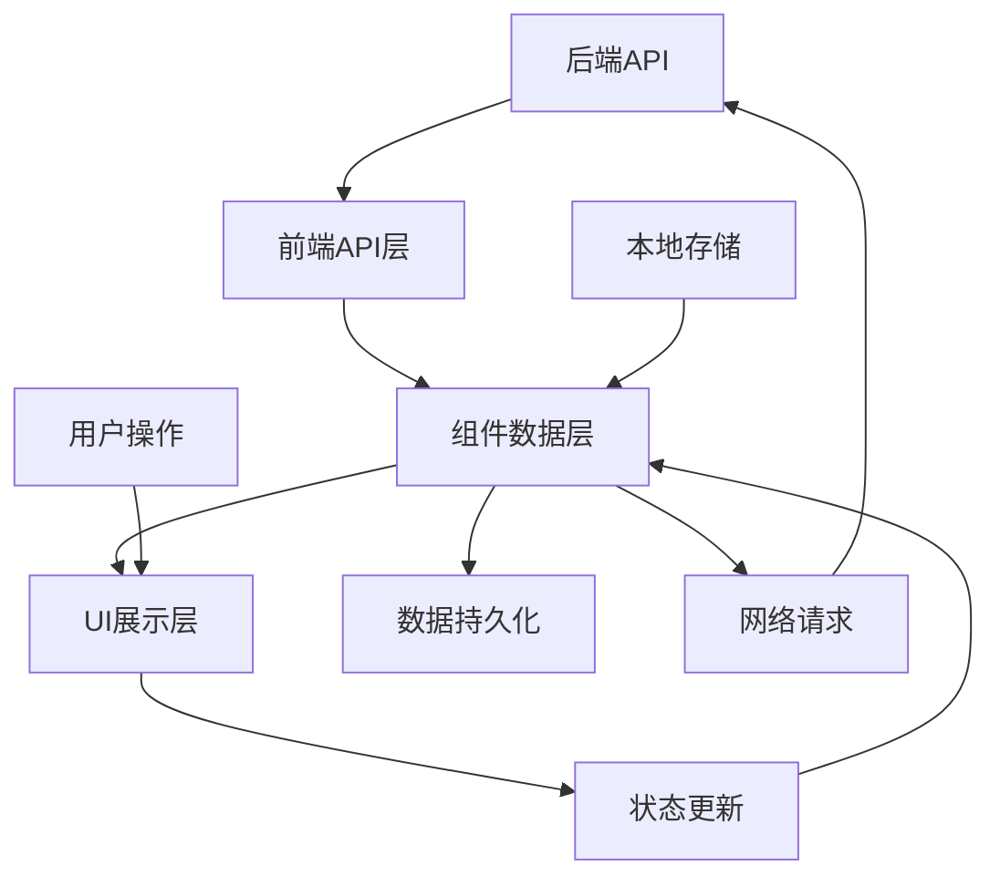
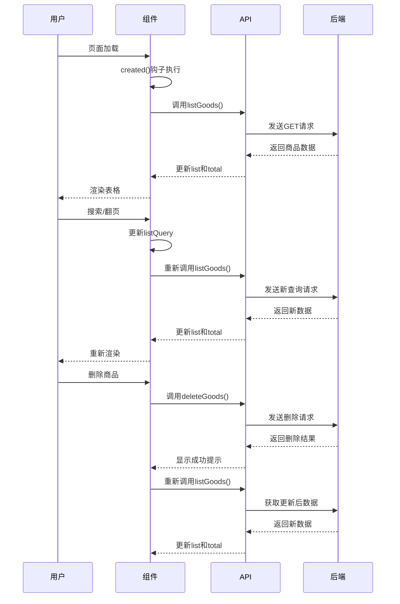

# 页面数据存储分析

## 概述

本文档详细分析litemall项目前端商品管理和统计管理模块的页面数据存储机制，包括数据来源、存储方式、生命周期管理等。

## 一、数据存储架构分析

### 1.1 整体数据流架构



### 1.2 数据存储层次结构

| 存储层次 | 存储位置 | 数据类型 | 生命周期 | 访问方式 |
|---------|---------|----------|----------|----------|
| **后端存储** | 服务器数据库 | 业务数据 | 持久化 | REST API |
| **前端内存** | 组件data() | 页面状态 | 页面生命周期 | Vue响应式 |
| **本地存储** | localStorage | 用户偏好 | 浏览器会话 | JavaScript API |
| **会话存储** | sessionStorage | 临时数据 | 标签页生命周期 | JavaScript API |

## 二、商品管理模块数据存储分析

### 2.1 商品列表页面数据存储

#### 2.1.1 数据定义结构

```javascript
// 商品列表页面数据定义
data() {
  return {
    // 表格相关数据
    tableKey: 0,                    // 表格唯一标识（用于强制刷新）
    list: null,                     // 商品列表数据（数组）
    total: 0,                       // 总记录数
    listLoading: true,              // 加载状态
    
    // 查询参数
    listQuery: {
      page: 1,                      // 当前页码
      limit: 20,                    // 每页数量
      goodsId: undefined,           // 商品ID查询条件
      goodsSn: undefined,           // 商品编号查询条件
      name: undefined,              // 商品名称查询条件
      sort: '+id'                   // 排序字段和方向
    },
    
    // 选择状态
    multipleSelection: [],          // 选中的商品数据
    downloadLoading: false          // 下载状态
  }
}
```

#### 2.1.2 数据生命周期管理



#### 2.1.3 数据更新策略

| 操作类型 | 数据更新方式 | 用户体验 | 数据一致性 |
|---------|-------------|----------|------------|
| **页面加载** | 从服务器获取最新数据 | 加载等待 | 强一致性 |
| **搜索查询** | 重新请求服务器数据 | 实时响应 | 强一致性 |
| **删除操作** | 先删除后重新加载 | 确认提示 | 最终一致性 |
| **批量操作** | 批量处理+重新加载 | 批量确认 | 最终一致性 |

### 2.2 商品创建/编辑页面数据存储

#### 2.2.1 表单数据定义

```javascript
// 商品表单数据定义
data() {
  return {
    // 表单数据
    form: {
      id: undefined,                 // 商品ID（编辑时使用）
      name: '',                     // 商品名称
      goodsSn: '',                  // 商品编号
      categoryId: undefined,        // 分类ID
      brandId: undefined,           // 品牌ID
      gallery: [],                  // 商品图片库
      keywords: '',                 // 关键词
      brief: '',                    // 商品简介
      isOnSale: true,               // 是否上架
      picUrl: '',                   // 主图URL
      shareUrl: '',                 // 分享URL
      isNew: true,                  // 是否新品
      isHot: false,                 // 是否热销
      unit: '',                     // 单位
      counterPrice: 0,              // 标准价格
      retailPrice: 0,               // 零售价格
      detail: ''                    // 商品详情
    },
    
    // 规格数据
    specifications: [],
    
    // 属性数据
    attributes: [],
    
    // 货品数据
    products: [],
    
    // 表单状态
    loading: false,                 // 提交加载状态
    rules: { ... }                  // 表单验证规则
  }
}
```

#### 2.2.2 数据持久化策略

```javascript
// 商品创建数据提交
methods: {
  submitForm() {
    this.$refs.form.validate(valid => {
      if (valid) {
        this.loading = true
        
        // 构建提交数据
        const submitData = {
          goods: this.form,
          specifications: this.specifications,
          attributes: this.attributes,
          products: this.products
        }
        
        // 调用创建API
        publishGoods(submitData).then(response => {
          this.$message.success('创建成功')
          this.loading = false
          this.$router.push('/goods/list')  // 跳转到列表页
        }).catch(error => {
          this.$message.error('创建失败')
          this.loading = false
        })
      }
    })
  }
}
```

## 三、统计管理模块数据存储分析

### 3.1 用户统计页面数据存储

#### 3.1.1 图表数据定义

```javascript
// 用户统计页面数据定义
data() {
  return {
    // 图表数据
    chartData: {
      columns: [],    // 数据列定义 ['日期', '用户数']
      rows: []        // 数据行 [{日期: '2023-01-01', 用户数: 10}]
    },
    
    // 图表配置
    chartSettings: {
      metrics: ['users'],     // 指标字段
      dimension: ['day']      // 维度字段
    },
    
    // 图表扩展配置
    chartExtend: {
      xAxis: {
        axisLabel: {
          rotate: 45,         // X轴标签旋转
          interval: 0          // 显示所有标签
        }
      },
      legend: { show: true },  // 显示图例
      toolbox: {              // 工具栏
        feature: {
          saveAsImage: { show: true }  // 保存图片功能
        }
      }
    }
  }
}
```

#### 3.1.2 统计数据获取与处理

```javascript
methods: {
  getStatData() {
    statUser().then(response => {
      const data = response.data.data
      
      // 列名映射（英文转中文）
      const labelMap = {
        'day': '日期',
        'users': '用户数'
      }
      
      // 数据处理
      this.chartData = {
        columns: Object.keys(data.rows[0] || {}).map(key => labelMap[key] || key),
        rows: data.rows.map(row => {
          const newRow = {}
          Object.keys(row).forEach(key => {
            newRow[labelMap[key] || key] = row[key]
          })
          return newRow
        })
      }
    })
  }
}
```

### 3.2 统计数据缓存策略

#### 3.2.1 缓存机制分析

| 缓存层级 | 缓存策略 | 更新时机 | 适用场景 |
|---------|----------|----------|----------|
| **内存缓存** | 组件data()中存储 | 页面刷新时重新获取 | 短期数据展示 |
| **本地存储** | localStorage | 手动设置过期时间 | 用户偏好设置 |
| **服务端缓存** | 后端缓存机制 | 定时更新 | 热点数据 |

#### 3.2.2 缓存实现示例

```javascript
// 带缓存的统计数据获取
methods: {
  async getStatDataWithCache() {
    const cacheKey = 'user_stat_cache'
    const cacheExpire = 5 * 60 * 1000 // 5分钟缓存
    
    // 检查缓存
    const cachedData = this.getCachedData(cacheKey, cacheExpire)
    if (cachedData) {
      this.chartData = cachedData
      return
    }
    
    // 无缓存或过期，重新获取
    try {
      const response = await statUser()
      const data = response.data.data
      
      // 处理数据
      const processedData = this.processStatData(data)
      
      // 更新缓存
      this.setCachedData(cacheKey, processedData)
      
      // 更新图表
      this.chartData = processedData
    } catch (error) {
      console.error('获取统计数据失败:', error)
    }
  },
  
  // 获取缓存数据
  getCachedData(key, expireTime) {
    const cached = localStorage.getItem(key)
    if (!cached) return null
    
    const { data, timestamp } = JSON.parse(cached)
    const now = Date.now()
    
    if (now - timestamp > expireTime) {
      localStorage.removeItem(key) // 清除过期缓存
      return null
    }
    
    return data
  },
  
  // 设置缓存数据
  setCachedData(key, data) {
    const cacheData = {
      data: data,
      timestamp: Date.now()
    }
    localStorage.setItem(key, JSON.stringify(cacheData))
  }
}
```

## 四、本地存储机制分析

### 4.1 localStorage使用分析

#### 4.1.1 存储内容分析

| 存储键名 | 存储内容 | 用途 | 更新频率 |
|---------|----------|------|----------|
| `vuex` | Vuex状态数据 | 状态持久化 | 状态变化时 |
| `ACCESS_TOKEN` | 访问令牌 | 用户认证 | 登录/登出时 |
| `userInfo` | 用户信息 | 用户数据缓存 | 用户信息更新时 |
| `sidebarStatus` | 侧边栏状态 | UI偏好设置 | 用户操作时 |

#### 4.1.2 存储实现代码

```javascript
// utils/auth.js - 认证相关存储
export function getToken() {
  return localStorage.getItem('ACCESS_TOKEN')
}

export function setToken(token) {
  localStorage.setItem('ACCESS_TOKEN', token)
}

export function removeToken() {
  localStorage.removeItem('ACCESS_TOKEN')
}

// utils/storage.js - 通用存储工具
export const Storage = {
  get(key) {
    const value = localStorage.getItem(key)
    try {
      return JSON.parse(value)
    } catch {
      return value
    }
  },
  
  set(key, value) {
    if (typeof value === 'object') {
      localStorage.setItem(key, JSON.stringify(value))
    } else {
      localStorage.setItem(key, value)
    }
  },
  
  remove(key) {
    localStorage.removeItem(key)
  },
  
  clear() {
    localStorage.clear()
  }
}
```

### 4.2 sessionStorage使用分析

#### 4.2.1 适用场景

| 场景 | 使用sessionStorage原因 | 示例数据 |
|------|----------------------|----------|
| **表单草稿** | 标签页关闭后自动清除 | 未提交的表单数据 |
| **临时状态** | 不需要持久化的状态 | 临时筛选条件 |
| **页面间传递** | 替代URL参数传递复杂数据 | 复杂对象数据 |

#### 4.2.2 实现示例

```javascript
// 表单草稿保存
methods: {
  saveDraft() {
    const draftData = {
      form: this.form,
      specifications: this.specifications,
      timestamp: Date.now()
    }
    sessionStorage.setItem('goods_form_draft', JSON.stringify(draftData))
  },
  
  loadDraft() {
    const draft = sessionStorage.getItem('goods_form_draft')
    if (draft) {
      const draftData = JSON.parse(draft)
      // 检查草稿是否过期（比如1小时内）
      if (Date.now() - draftData.timestamp < 60 * 60 * 1000) {
        this.form = draftData.form
        this.specifications = draftData.specifications
      } else {
        sessionStorage.removeItem('goods_form_draft')
      }
    }
  },
  
  clearDraft() {
    sessionStorage.removeItem('goods_form_draft')
  }
}
```

## 五、数据同步与一致性分析

### 5.1 多页面数据同步

#### 5.1.1 Vuex状态管理

```javascript
// store/modules/goods.js - 商品模块状态管理
const goods = {
  state: {
    goodsList: [],           // 商品列表缓存
    currentGoods: null,      // 当前查看的商品
    searchCondition: {}      // 搜索条件缓存
  },
  
  mutations: {
    SET_GOODS_LIST(state, list) {
      state.goodsList = list
    },
    
    SET_CURRENT_GOODS(state, goods) {
      state.currentGoods = goods
    },
    
    UPDATE_GOODS(state, updatedGoods) {
      const index = state.goodsList.findIndex(item => item.id === updatedGoods.id)
      if (index !== -1) {
        state.goodsList.splice(index, 1, updatedGoods)
      }
    }
  },
  
  actions: {
    async fetchGoodsList({ commit }, condition) {
      const response = await listGoods(condition)
      commit('SET_GOODS_LIST', response.data.data.list)
      return response
    }
  }
}
```

#### 5.1.2 事件总线通信

```javascript
// utils/event-bus.js - 事件总线
import Vue from 'vue'
export const EventBus = new Vue()

// 商品列表页面 - 发布删除事件
methods: {
  handleDelete(row) {
    deleteGoods({ id: row.id }).then(() => {
      this.$message.success('删除成功')
      
      // 发布商品删除事件
      EventBus.$emit('goods-deleted', row.id)
      
      this.getList()
    })
  }
}

// 其他页面 - 监听商品删除事件
created() {
  EventBus.$on('goods-deleted', (goodsId) => {
    // 更新本地数据
    this.updateLocalData(goodsId)
  })
}
```

### 5.2 数据一致性保障

#### 5.2.1 乐观更新策略

```javascript
// 商品编辑的乐观更新
methods: {
  async updateGoods(formData) {
    // 先更新本地数据（乐观更新）
    const originalData = this.findGoodsById(formData.id)
    const updatedData = { ...originalData, ...formData }
    this.updateLocalGoods(updatedData)
    
    try {
      // 再提交到服务器
      await updateGoods(formData)
      this.$message.success('更新成功')
    } catch (error) {
      // 如果失败，回滚到原始数据
      this.updateLocalGoods(originalData)
      this.$message.error('更新失败')
    }
  }
}
```

#### 5.2.2 数据版本控制

```javascript
// 带版本控制的数据更新
data() {
  return {
    goodsList: [],
    dataVersion: 0  // 数据版本号
  }
},

methods: {
  async syncData() {
    const currentVersion = this.dataVersion
    
    try {
      const response = await listGoods(this.listQuery)
      const serverData = response.data.data
      
      // 检查数据版本（假设后端返回版本号）
      if (serverData.version > currentVersion) {
        this.goodsList = serverData.list
        this.dataVersion = serverData.version
      }
    } catch (error) {
      console.error('数据同步失败:', error)
    }
  }
}
```

## 六、性能优化分析

### 6.1 数据加载优化

#### 6.1.1 分页加载

```javascript
// 分页参数优化
listQuery: {
  page: 1,
  limit: 20,        // 合理的每页数量
  // ... 其他参数
}
```

#### 6.1.2 懒加载策略

```javascript
// 图片懒加载
<el-image
  :src="row.picUrl"
  lazy               <!-- 启用懒加载 -->
  :preview-src-list="[row.picUrl]">
</el-image>

// 表格虚拟滚动（大型数据集）
<el-table
  v-if="list.length > 100"
  use-virtual        <!-- 启用虚拟滚动 -->
  :data="list">
  <!-- 表格列 -->
</el-table>
```

### 6.2 内存管理优化

#### 6.2.1 数据清理策略

```javascript
// 组件销毁时清理数据
beforeDestroy() {
  // 清理事件监听
  EventBus.$off('goods-deleted')
  
  // 清理大型数据
  this.list = null
  this.chartData.rows = null
  
  // 清理定时器
  clearTimeout(this.refreshTimer)
}
```

#### 6.2.2 数据缓存策略

```javascript
// 智能缓存策略
const cacheStrategy = {
  // 商品列表：短期缓存（1分钟）
  'goods_list': { ttl: 60 * 1000 },
  
  // 统计数据：中期缓存（5分钟）
  'user_stat': { ttl: 5 * 60 * 1000 },
  
  // 配置数据：长期缓存（1小时）
  'system_config': { ttl: 60 * 60 * 1000 }
}
```

## 七、总结

通过对litemall项目前端页面数据存储机制的深入分析，可以得出以下结论：

### 7.1 存储架构优点
1. **层次清晰**：后端存储、前端内存、本地存储分工明确
2. **生命周期管理**：不同类型数据有合理的生命周期管理
3. **一致性保障**：通过多种策略保障数据一致性
4. **性能优化**：合理的缓存和懒加载策略

### 7.2 可改进之处
1. **缓存策略可优化**：可引入更智能的缓存失效策略
2. **离线支持有限**：对离线场景的支持不够完善
3. **数据同步复杂**：多页面数据同步逻辑较复杂

### 7.3 最佳实践建议
1. **引入状态管理库**：考虑使用Pinia等现代状态管理库
2. **优化缓存机制**：实现更精细的缓存控制
3. **加强错误处理**：完善网络异常时的数据恢复机制
4. **考虑离线场景**：为重要功能添加离线支持

这种数据存储架构为项目的稳定运行和良好用户体验提供了坚实基础。