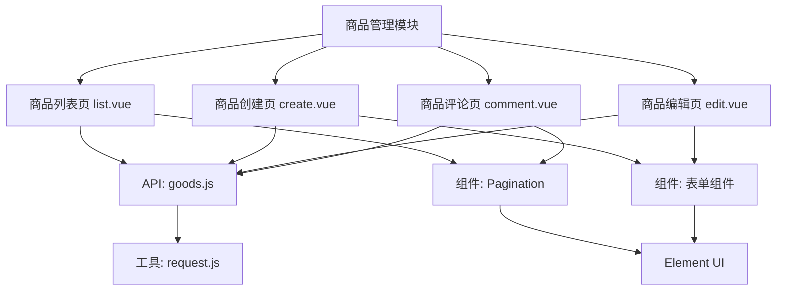
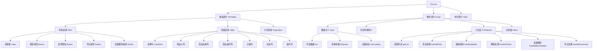
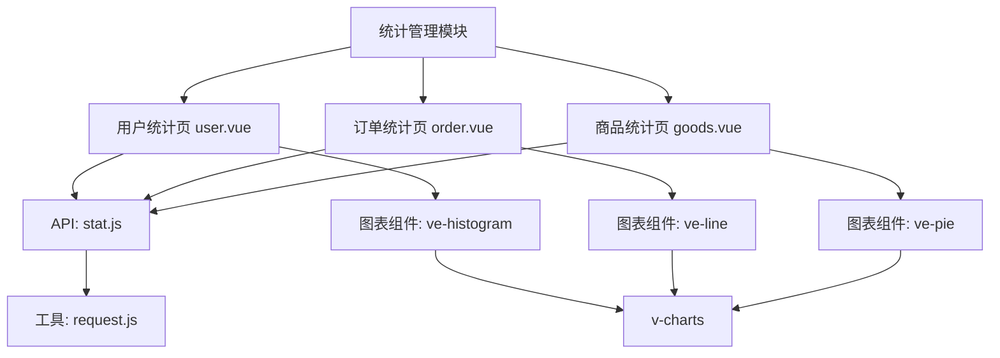
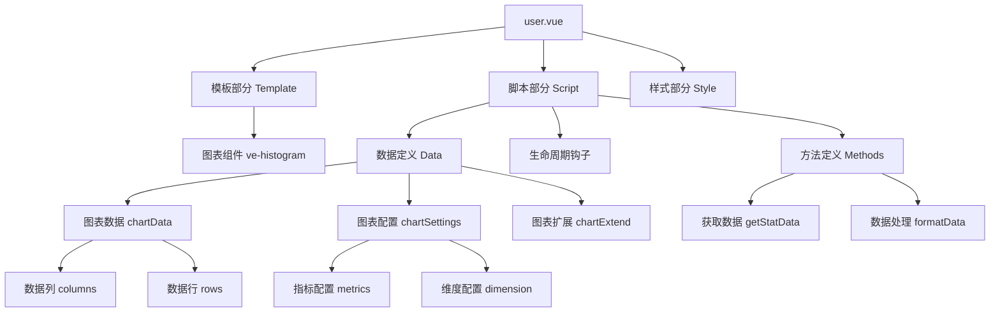
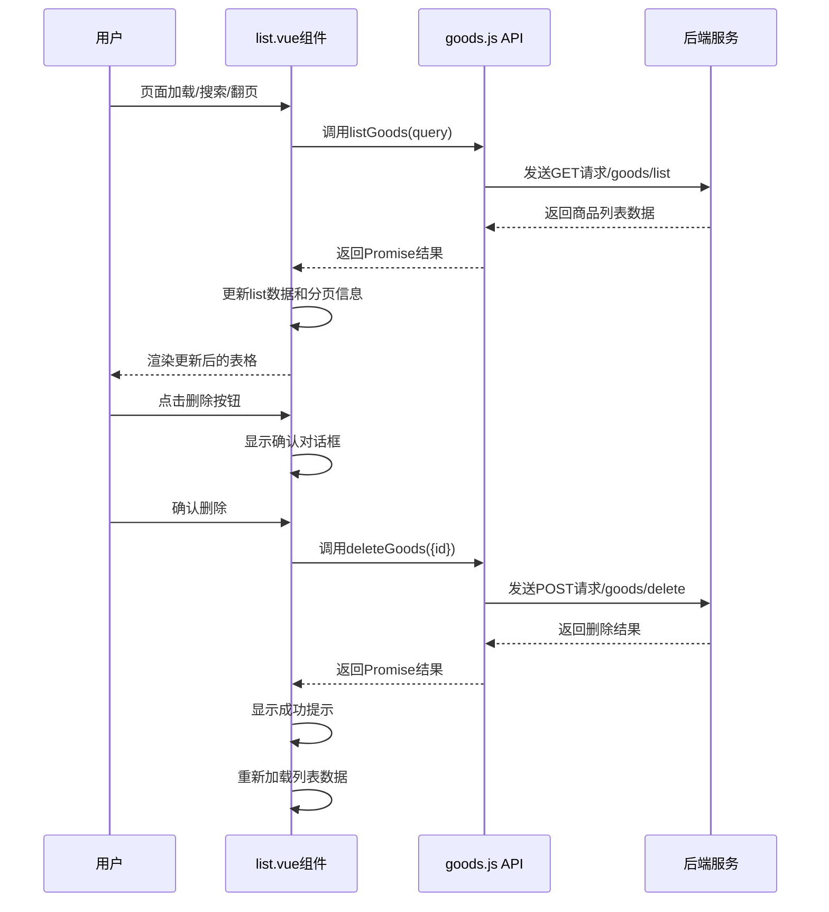
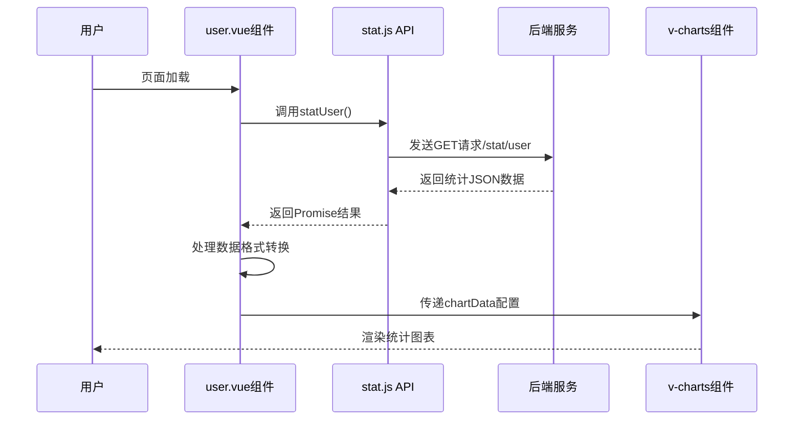

# 前端页面文件组成结构分析

## 概述

本文档详细分析litemall项目前端商品管理和统计管理模块的页面文件组成结构，包括目录结构、文件关系、组件依赖等。

## 一、项目整体目录结构

```
litemall-admin/
├── public/                    # 静态资源目录
├── src/
│   ├── api/                   # API接口定义
│   │   ├── goods.js           # 商品管理API
│   │   └── stat.js            # 统计管理API
│   ├── components/            # 公共组件
│   │   └── Pagination/        # 分页组件
│   ├── router/               # 路由配置
│   │   └── index.js          # 路由主文件
│   ├── store/                # Vuex状态管理
│   │   └── modules/          # 状态模块
│   ├── utils/                # 工具函数
│   │   └── request.js        # 请求封装
│   ├── views/                # 页面视图
│   │   ├── goods/            # 商品管理页面
│   │   │   ├── list.vue      # 商品列表页
│   │   │   ├── create.vue    # 商品创建页
│   │   │   ├── edit.vue      # 商品编辑页
│   │   │   └── comment.vue   # 商品评论页
│   │   └── stat/             # 统计管理页面
│   │       ├── user.vue      # 用户统计页
│   │       ├── order.vue     # 订单统计页
│   │       └── goods.vue     # 商品统计页
│   └── main.js               # 应用入口
└── package.json              # 项目配置
```

## 二、商品管理模块文件结构

### 2.1 商品管理页面文件组成



### 2.2 商品列表页面 (list.vue) 详细结构



### 2.3 商品管理API接口文件 (goods.js)

| 接口函数 | 功能描述 | HTTP方法 | 后端路径 | 参数说明 |
|---------|---------|----------|----------|----------|
| `listGoods(query)` | 获取商品列表 | GET | `/goods/list` | 分页查询参数 |
| `deleteGoods(data)` | 删除商品 | POST | `/goods/delete` | 商品ID |
| `publishGoods(data)` | 创建商品 | POST | `/goods/create` | 商品完整数据 |
| `updateGoods(data)` | 更新商品 | POST | `/goods/update` | 商品更新数据 |
| `getGoods(id)` | 获取商品详情 | GET | `/goods/detail/{id}` | 商品ID |
| `listComment(query)` | 获取商品评论 | GET | `/goods/comment` | 查询参数 |

## 三、统计管理模块文件结构

### 3.1 统计管理页面文件组成



### 3.2 用户统计页面 (user.vue) 详细结构



### 3.3 统计管理API接口文件 (stat.js)

| 接口函数 | 功能描述 | HTTP方法 | 后端路径 | 返回数据结构 |
|---------|---------|----------|----------|--------------|
| `statUser(query)` | 用户统计 | GET | `/stat/user` | 日期、用户数 |
| `statOrder(query)` | 订单统计 | GET | `/stat/order` | 日期、订单数、金额等 |
| `statGoods(query)` | 商品统计 | GET | `/stat/goods` | 日期、商品销售数据 |

## 四、路由配置结构

### 4.1 商品管理路由配置

```javascript
// 商品管理路由结构
{
  path: '/goods',           // 一级路由路径
  component: Layout,        // 布局组件
  redirect: '/goods/list',  // 默认重定向
  name: 'Goods',           // 路由名称
  meta: {
    title: '商品管理',      // 菜单标题
    icon: 'goods',         // 菜单图标
    permissions: ['GET /admin/goods/list']  // 权限要求
  },
  children: [              // 子路由数组
    {
      path: 'list',        // 商品列表
      component: () => import('@/views/goods/list'),
      name: 'GoodsList',
      meta: { title: '商品列表', permissions: ['GET /admin/goods/list'] }
    },
    {
      path: 'create',      // 商品创建
      component: () => import('@/views/goods/create'),
      name: 'CreateGoods',
      meta: { title: '添加商品', permissions: ['POST /admin/goods/create'] }
    },
    {
      path: 'edit/:id',    // 商品编辑（带参数）
      component: () => import('@/views/goods/edit'),
      name: 'EditGoods',
      meta: { title: '编辑商品', permissions: ['GET /admin/goods/detail', 'POST /admin/goods/update'] },
      hidden: true         // 隐藏菜单
    },
    {
      path: 'comment',     // 商品评论
      component: () => import('@/views/goods/comment'),
      name: 'GoodsComment',
      meta: { title: '商品评论', permissions: ['GET /admin/goods/comment'] }
    }
  ]
}
```

### 4.2 统计管理路由配置

```javascript
// 统计管理路由结构
{
  path: '/stat',           // 一级路由路径
  component: Layout,       // 布局组件
  redirect: '/stat/user',  // 默认重定向
  name: 'Stat',           // 路由名称
  meta: {
    title: '统计管理',     // 菜单标题
    icon: 'stat',         // 菜单图标
    permissions: ['GET /admin/stat/user']  // 权限要求
  },
  children: [             // 子路由数组
    {
      path: 'user',       // 用户统计
      component: () => import('@/views/stat/user'),
      name: 'UserStat',
      meta: { title: '用户统计', permissions: ['GET /admin/stat/user'] }
    },
    {
      path: 'order',      // 订单统计
      component: () => import('@/views/stat/order'),
      name: 'OrderStat',
      meta: { title: '订单统计', permissions: ['GET /admin/stat/order'] }
    },
    {
      path: 'goods',      // 商品统计
      component: () => import('@/views/stat/goods'),
      name: 'GoodsStat',
      meta: { title: '商品统计', permissions: ['GET /admin/stat/goods'] }
    }
  ]
}
```

## 五、组件依赖关系

### 5.1 商品管理模块组件依赖

| 页面组件 | 依赖的公共组件 | 依赖的第三方组件 | 依赖的API |
|---------|---------------|-----------------|-----------|
| list.vue | Pagination | Element UI Table, Button, Input, Tag | goods.js |
| create.vue | - | Element UI Form, Input, Button | goods.js |
| edit.vue | - | Element UI Form, Input, Button | goods.js |
| comment.vue | Pagination | Element UI Table, Button | goods.js |

### 5.2 统计管理模块组件依赖

| 页面组件 | 依赖的公共组件 | 依赖的第三方组件 | 依赖的API |
|---------|---------------|-----------------|-----------|
| user.vue | - | v-charts Histogram | stat.js |
| order.vue | - | v-charts Line | stat.js |
| goods.vue | - | v-charts Pie | stat.js |

## 六、数据流分析

### 6.1 商品列表页面数据流



### 6.2 用户统计页面数据流



## 七、文件组织结构特点

### 7.1 模块化设计
- **功能模块分离**：商品管理和统计管理作为独立模块
- **页面组件化**：每个功能页面都是独立的Vue组件
- **API集中管理**：所有接口统一在api目录下管理

### 7.2 路由配置规范
- **层级清晰**：一级路由对应主菜单，二级路由对应功能页面
- **权限控制**：每个路由都配置了对应的权限要求
- **动态导入**：使用懒加载优化性能

### 7.3 组件复用策略
- **公共组件**：Pagination等通用组件可复用
- **业务组件**：特定功能组件在views目录下组织
- **第三方组件**：统一使用Element UI和v-charts

### 7.4 数据管理方式
- **API封装**：统一的请求拦截和响应处理
- **状态管理**：使用Vuex管理全局状态
- **本地状态**：页面级状态在组件内部管理

## 八、总结

litemall项目前端页面文件组成结构具有以下优点：

1. **结构清晰**：目录组织合理，功能模块明确分离
2. **组件化程度高**：每个页面都是独立的Vue组件
3. **路由配置规范**：支持权限控制和懒加载
4. **API管理集中**：接口统一管理，便于维护
5. **依赖关系明确**：组件间依赖关系清晰
6. **数据流可控**：数据传递路径明确，便于调试

这种文件组织结构使得项目具有良好的可维护性和可扩展性，新功能可以按照相同的模式进行开发。