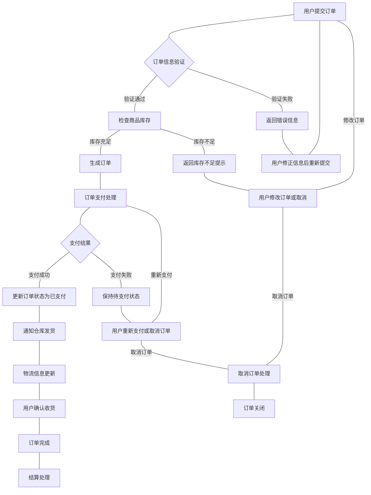

# litemall系统主要功能流程图

系统中订单处理流程如图1所示。

## 订单处理流程说明

订单处理是litemall系统的核心业务流程之一，涉及用户下单、支付、发货、收货等多个环节。该流程确保了从用户下单到订单完成的完整业务闭环。

图1 订单处理流程图

## 流程步骤详解

### 1. 用户提交订单
用户在前端选择商品并提交订单，系统接收订单信息，包括商品信息、收货地址、联系方式等。

### 2. 订单信息验证
系统对用户提交的订单信息进行验证，包括：
- 收货地址有效性检查
- 联系方式格式验证
- 商品信息完整性检查

### 3. 商品库存检查
验证通过后，系统检查订单中各商品的库存情况：
- 检查每种商品的库存数量是否满足订单需求
- 对于库存不足的商品，系统会给出提示

### 4. 订单生成
当所有验证通过且库存充足时，系统生成正式订单，并将订单状态设置为"待支付"。

### 5. 订单支付处理
系统跳转到支付页面，用户选择支付方式进行支付：
- 微信支付（小程序用户）
- 其他支付方式（H5用户）

### 6. 支付结果处理
系统接收支付结果通知：
- 支付成功：更新订单状态为"已支付"
- 支付失败：保持订单"待支付"状态，用户可重新支付或取消订单

### 7. 订单发货处理
支付成功后，系统通知仓库进行发货处理：
- 生成发货单
- 更新订单状态为"已发货"
- 关联物流信息

### 8. 物流信息更新
系统持续跟踪物流状态，并向用户推送物流更新信息。

### 9. 用户确认收货
用户收到商品后，在系统中确认收货，订单状态更新为"已完成"。

### 10. 订单完成与结算
订单完成后，系统进行相关结算处理：
- 商家结算
- 积分发放
- 优惠券核销等

## 异常处理流程

流程中还考虑了多种异常情况的处理：

1. **订单信息验证失败**：用户需要修正错误信息后重新提交订单
2. **商品库存不足**：用户可以选择修改订单或取消订单
3. **支付失败**：用户可以重新支付或取消订单
4. **订单取消**：在不同阶段都可以取消订单，系统会进行相应的处理

图1展示了litemall系统中订单处理的完整流程，涵盖了正常流程和异常处理，体现了系统对电商核心业务的完整支持。