# litemall系统功能模块结构图

系统具体的功能模块结构如图1所示。

## 功能模块结构描述

litemall系统采用分层架构设计，整体分为四个子系统，每个子系统包含相应的功能模块和子模块。系统严格按照模块层次分级组织，确保结构清晰、职责明确。最上方为litemall系统，第二层为子系统，后面为功能模块、子模块。

图1 系统功能模块结构图

```mermaid
graph TD
    A[litemall系统] --> B[基础系统子系统<br/>platform]
    A --> C[小商场子系统<br/>wxmall]
    A --> D[轻商城子系统<br/>mobmall]
    A --> E[管理后台子系统<br/>admin]
    
    %% 基础系统子系统
    B --> B1[系统核心模块]
    B1 --> B11[litemall-core]
    B1 --> B12[litemall-db]
    B1 --> B13[litemall-all]
    
    %% 小商场子系统
    C --> C1[用户功能模块]
    C --> C2[商品功能模块]
    C --> C3[订单功能模块]
    C --> C4[营销功能模块]
    
    C1 --> C11[用户注册登录]
    C1 --> C12[个人信息管理]
    C1 --> C13[收货地址管理]
    C1 --> C14[收藏与足迹]
    
    C2 --> C21[商品浏览]
    C2 --> C22[商品搜索]
    C2 --> C23[商品详情]
    C2 --> C24[商品评价]
    
    C3 --> C31[购物车管理]
    C3 --> C32[订单创建]
    C3 --> C33[订单支付]
    C3 --> C34[订单查询]
    
    C4 --> C41[优惠券]
    C4 --> C42[团购活动]
    C4 --> C43[广告展示]
    
    %% 轻商城子系统
    D --> D1[用户功能模块]
    D --> D2[商品功能模块]
    D --> D3[订单功能模块]
    D --> D4[营销功能模块]
    
    D1 --> D11[用户注册登录]
    D1 --> D12[个人信息管理]
    D1 --> D13[收货地址管理]
    D1 --> D14[收藏与足迹]
    
    D2 --> D21[商品浏览]
    D2 --> D22[商品搜索]
    D2 --> D23[商品详情]
    D2 --> D24[商品评价]
    
    D3 --> D31[购物车管理]
    D3 --> D32[订单创建]
    D3 --> D33[订单支付]
    D3 --> D34[订单查询]
    
    D4 --> D41[优惠券]
    D4 --> D42[团购活动]
    D4 --> D43[广告展示]
    
    %% 管理后台子系统
    E --> E1[会员管理模块]
    E --> E2[商城管理模块]
    E --> E3[商品管理模块]
    E --> E4[推广管理模块]
    E --> E5[系统管理模块]
    E --> E6[配置管理模块]
    E --> E7[统计报表模块]
    
    E1 --> E11[会员信息管理]
    E1 --> E12[收货地址管理]
    E1 --> E13[会员收藏管理]
    E1 --> E14[会员足迹管理]
    E1 --> E15[搜索历史管理]
    E1 --> E16[意见反馈管理]
    
    E2 --> E21[行政区域管理]
    E2 --> E22[品牌制造商管理]
    E2 --> E23[订单管理]
    E2 --> E24[商品类目管理]
    E2 --> E25[通用问题管理]
    E2 --> E26[关键词管理]
    
    E3 --> E31[商品列表管理]
    E3 --> E32[商品上架管理]
    E3 --> E33[商品编辑管理]
    E3 --> E34[用户评论管理]
    
    E4 --> E41[广告管理]
    E4 --> E42[专题管理]
    E4 --> E43[团购规则管理]
    E4 --> E44[团购活动管理]
    
    E5 --> E51[管理员管理]
    E5 --> E52[通知管理]
    E5 --> E53[对象存储管理]
    E5 --> E54[权限管理]
    E5 --> E55[操作日志管理]
    
    E6 --> E61[商场配置管理]
    E6 --> E62[小程序配置管理]
    E6 --> E63[运费配置管理]
    E6 --> E64[订单配置管理]
    
    E7 --> E71[用户统计]
    E7 --> E72[订单统计]
    E7 --> E73[商品统计]
```

## 模块详细说明

### 1. 基础系统子系统(platform)
基础系统子系统是整个litemall系统的核心支撑，包含以下技术模块：
- **litemall-core**: 系统核心服务层，提供系统配置管理、第三方服务集成、通用工具类等
- **litemall-db**: 数据库访问和ORM层，负责数据实体定义、MyBatis Mapper接口等
- **litemall-all**: 单体应用聚合部署模块，整合所有后端模块为单一应用

### 2. 小商场子系统(wxmall)
小商场子系统面向微信小程序用户，按照业务功能划分为多个功能模块：
- **用户功能模块**: 处理用户注册登录、个人信息管理、收货地址管理等
- **商品功能模块**: 处理商品浏览、搜索、详情展示、评价等
- **订单功能模块**: 处理购物车管理、订单创建、支付、查询等
- **营销功能模块**: 处理优惠券、团购活动、广告展示等

### 3. 轻商城子系统(mobmall)
轻商城子系统面向移动端H5用户，功能结构与小商场子系统类似：
- **用户功能模块**: 处理用户注册登录、个人信息管理、收货地址管理等
- **商品功能模块**: 处理商品浏览、搜索、详情展示、评价等
- **订单功能模块**: 处理购物车管理、订单创建、支付、查询等
- **营销功能模块**: 处理优惠券、团购活动、广告展示等

### 4. 管理后台子系统(admin)
管理后台子系统为系统管理员提供管理界面，按照业务功能划分为多个管理模块：
- **会员管理模块**: 管理会员信息、收货地址、收藏、足迹等
- **商城管理模块**: 管理行政区域、品牌制造商、订单、商品类目等
- **商品管理模块**: 管理商品列表、上架、编辑、用户评论等
- **推广管理模块**: 管理广告、专题、团购规则和活动等
- **系统管理模块**: 管理员、通知、对象存储、权限、操作日志等
- **配置管理模块**: 商场配置、小程序配置、运费配置、订单配置等
- **统计报表模块**: 用户统计、订单统计、商品统计等

图1展示了litemall系统的整体功能模块结构，严格按照模块层次分级。最上方为litemall系统，第二层为四个子系统，后面为各子系统的功能模块和子模块。该结构图参考了doc/project.md中的子系统划分，体现了系统的模块化设计理念和清晰的业务功能划分。