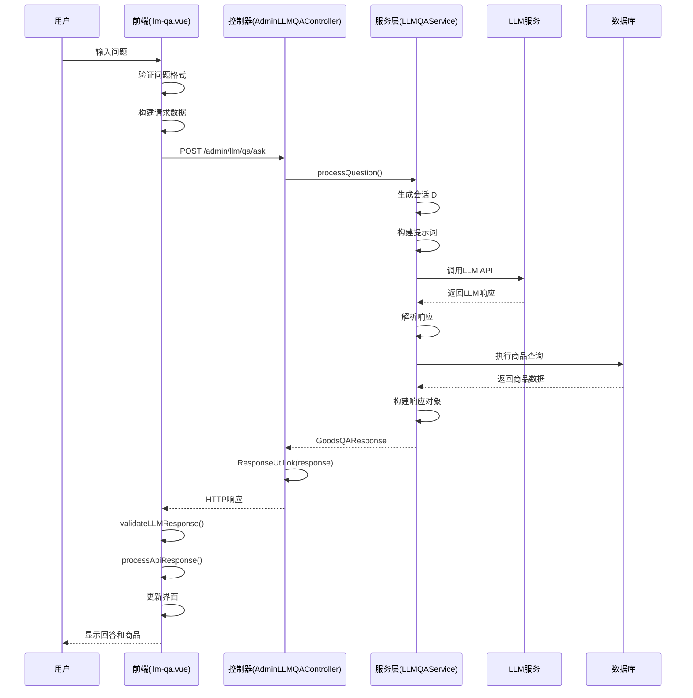

# LLMQA模块前后端交互文档

## 概述

LLMQA（Large Language Model Question Answering）模块是一个基于大语言模型的智能问答系统，专门用于处理商品相关的自然语言查询。该模块采用前后端分离架构，通过RESTful API进行通信。

## 系统架构

### 前端组件
- **llm-qa.vue**: 主界面组件，负责用户交互和界面展示
- **llm-logic.js**: 业务逻辑mixin，处理API调用和响应处理
- **llm-utils.js**: 工具函数，包含响应验证和数据处理

### 后端组件
- **AdminLLMQAController.java**: 控制器层，处理HTTP请求
- **LLMQAService.java**: 服务层，处理业务逻辑
- **GoodsQAResponse.java**: 响应模型，定义返回数据结构
- **ResponseUtil.java**: 响应工具类，统一响应格式

## 核心交互流程

### 1. 用户提问流程



## 请求/响应格式规范

### 前端请求格式

```javascript
// POST /admin/llm/qa/ask
{
  "question": "用户输入的问题",
  "sessionId": "会话ID（可选）",
  "context": "上下文历史（可选）"
}
```

### 后端响应格式

#### 外层响应格式（ResponseUtil包装）
```javascript
{
  "errno": 0,           // 0表示成功
  "errmsg": "成功",     // 成功消息
  "data": {             // 实际业务数据
    "code": 200,        // 业务状态码（200=成功）
    "message": "success", // 业务消息
    "answer": "自然语言回答",
    "goods": [          // 商品列表
      {
        "id": 1,
        "name": "商品名称",
        "price": 99.9,
        // ... 其他商品字段
      }
    ],
    "sessionId": "会话ID",
    "queryTime": 150,   // 查询耗时（毫秒）
    "timestamp": "2024-01-01T10:00:00",
    "fromCache": false, // 是否来自缓存
    "queryIntent": {    // 查询意图（调试用）
      "type": "PRICE_RANGE",
      "confidence": 0.95
    }
  }
}
```

#### 错误响应格式
```javascript
{
  "errno": 500,         // 错误码
  "errmsg": "系统内部错误",
  "data": null
}
```

## 关键代码实现

### 前端关键方法

#### 1. sendMessage (llm-qa.vue)
```javascript
// 发送用户消息的核心方法
async sendMessage(question, isQuickQuestion = false) {
  // 构建请求数据
  const requestData = {
    question: question,
    sessionId: this.currentSessionId,
    context: this.buildContext()
  }
  
  // 调用API
  const response = await askQuestion(requestData)
  
  // 处理响应
  const result = this.processApiResponse(response)
  
  if (result.success) {
    // 更新会话和界面
    this.updateContextHistory(question, result.answer)
    this.currentSessionId = result.sessionId
  }
}
```

#### 2. validateLLMResponse (llm-utils.js)
```javascript
// 响应验证函数（已修复）
export function validateLLMResponse(response) {
  // 检查外层结构
  if (response.errno !== 0) {
    return { valid: false, error: response.errmsg || '请求失败' }
  }
  
  // 检查data结构
  if (!response.data || typeof response.data !== 'object') {
    return { valid: false, error: '服务器返回数据格式错误' }
  }
  
  // 注意：后端实际返回code=200, message="success"
  // 前端应该兼容后端的实际格式
  
  // 提取关键字段
  const answer = response.data.answer
  const goods = response.data.goods || []
  const sessionId = response.data.sessionId
  
  if (!answer || typeof answer !== 'string') {
    return { valid: false, error: '服务器返回数据格式错误：缺少answer字段' }
  }
  
  return { 
    valid: true, 
    data: { 
      answer: answer.trim(),
      goods: goods,
      sessionId: sessionId
    } 
  }
}
```

### 后端关键方法

#### 1. askQuestion (AdminLLMQAController.java)
```java
@PostMapping("/ask")
public Object askQuestion(@RequestBody LLMQARequest request) {
    try {
        GoodsQAResponse response = llmqaService.processQuestion(
            request.getQuestion(), 
            request.getSessionId(), 
            request.getContext()
        );
        return ResponseUtil.ok(response);
    } catch (Exception e) {
        log.error("LLMQA处理失败", e);
        return ResponseUtil.fail(500, "系统内部错误");
    }
}
```

#### 2. processQuestion (LLMQAService.java)
```java
public GoodsQAResponse processQuestion(String question, String sessionId, String context) {
    // 参数验证
    validateQuestion(question);
    
    // 会话管理
    if (sessionId == null || sessionId.trim().isEmpty()) {
        sessionId = generateSessionId();
    }
    
    // 构建提示词
    String prompt = buildEnhancedPrompt(question, context);
    
    // 调用LLM
    String llmResponse = qwen3Service.callLLM(prompt);
    
    // 解析响应
    if (containsJSONQuery(llmResponse)) {
        // 执行商品查询
        List<LitemallGoods> goods = executeGoodsQuery(llmResponse);
        return GoodsQAResponse.success(buildAnswer(goods), goods);
    } else {
        // 直接返回LLM回答
        return GoodsQAResponse.success(llmResponse, Collections.emptyList());
    }
}
```

## 会话管理机制

### 会话ID生成
- 前端：`session_${timestamp}_${random}`
- 后端：UUID或时间戳+随机数

### 上下文历史
- 最大历史记录数：5条
- 格式："用户：问题\n回答：答案"
- 用于多轮对话的连贯性

## 错误处理机制

### 前端错误处理
```javascript
// processApiResponse方法
try {
  const validation = validateLLMResponse(response);
  if (!validation.valid) {
    console.error('API响应验证失败:', validation.error);
    return { success: false, error: validation.error };
  }
  
  // 处理成功响应
  return { 
    success: true, 
    answer: validation.data.answer,
    goods: validation.data.goods,
    sessionId: validation.data.sessionId
  };
} catch (error) {
  console.error('处理API响应时出错:', error);
  return { success: false, error: '处理响应数据时出错' };
}
```

### 后端错误处理
```java
// 统一异常处理
@ExceptionHandler(Exception.class)
public Object handleException(Exception e) {
    log.error("系统异常", e);
    return ResponseUtil.fail(500, "系统内部错误");
}
```

## 调试和监控

### 调试接口
- `GET /admin/llm/qa/debug/config`: 获取调试配置
- `POST /admin/llm/qa/debug/test-call`: 测试LLM API调用

### 日志记录
- 后端日志：`litemall-all/logs/log.log`
- 前端日志：浏览器开发者工具Console

## 性能优化

### 缓存机制
- 查询结果缓存
- 会话上下文缓存
- LLM响应缓存

### 异步处理
- 长耗时操作异步执行
- 响应式界面更新

## 常见问题排查

### 问题1：前端显示"请求失败"但后端成功
**原因**：前后端响应格式不匹配
**解决方案**：确保前端validateLLMResponse函数兼容后端实际返回的格式

### 问题2：会话ID不匹配
**原因**：前后端会话ID生成逻辑不一致
**解决方案**：统一会话ID生成规则

### 问题3：上下文历史丢失
**原因**：前端历史记录限制过小
**解决方案**：调整context.maxHistoryLength配置

## 部署和配置

### 后端配置
```properties
# LLM服务配置
llm.service.url=http://localhost:8080
llm.service.timeout=30000

# 数据库配置
spring.datasource.url=jdbc:mysql://localhost:3306/litemall
spring.datasource.username=root
spring.datasource.password=root
```

### 前端配置
```javascript
// llm-constants.js
export const LLM_CONFIG = {
  apiBaseUrl: 'http://localhost:8080/admin/llm/qa',
  timeout: 30000,
  maxHistoryLength: 5,
  autoScrollThreshold: 100
};
```

## 版本兼容性

### 当前版本
- 前端：Vue 2.x + Element UI
- 后端：Spring Boot 3.5.6
- 数据库：MySQL 5.7+

### 向后兼容
- 保持API接口稳定性
- 新增字段设置为可选
- 废弃功能标记为deprecated

---

*文档最后更新：2024年12月*  
*维护者：系统开发团队*